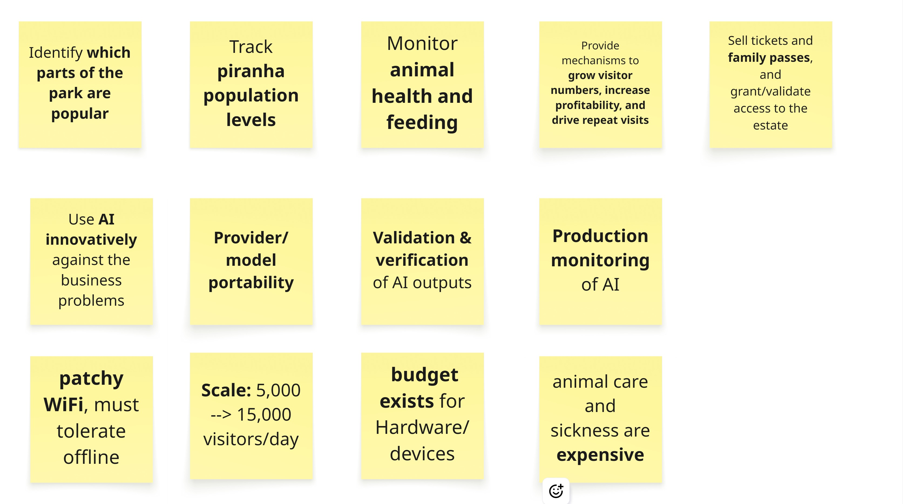
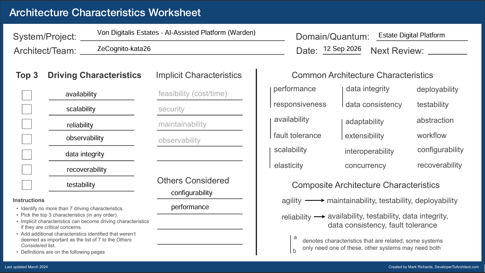
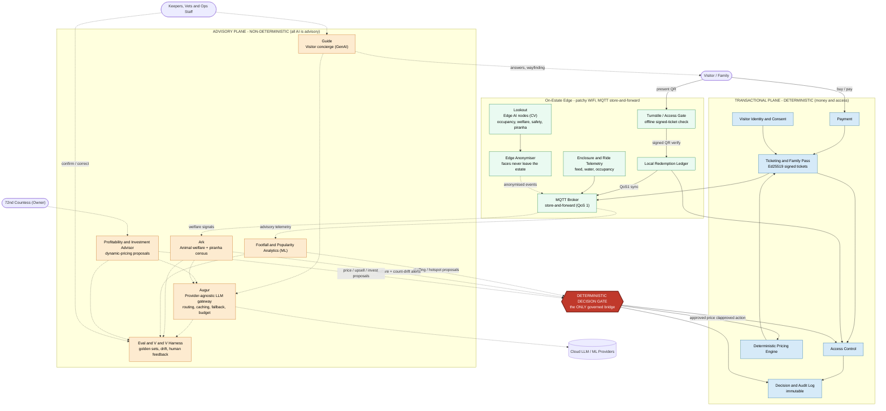
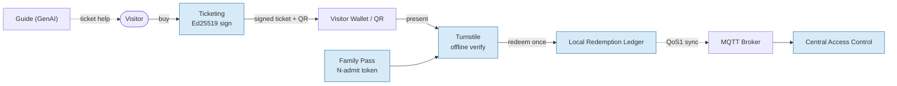
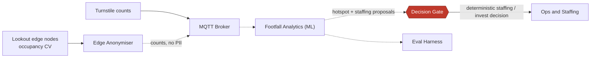
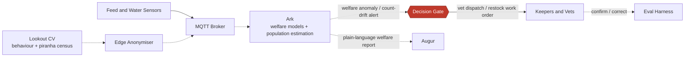
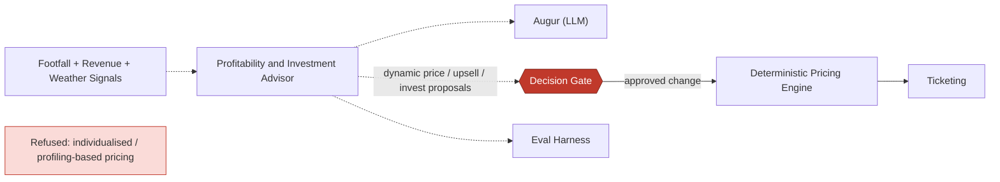
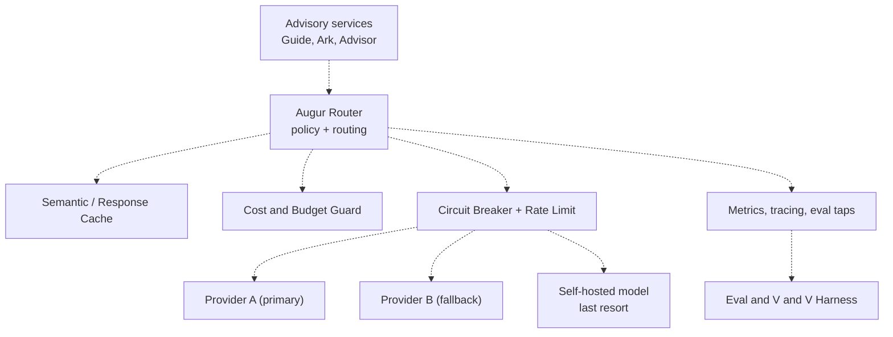

# The Warden Platform
#### An AI-assisted architecture for the Von Digitalis Estates

A newly-appointed Countess, a patchy WiFi signal, and 200+ animals, waiting for visitors. Here's the architecture we built for her.

---

## 0. The ZeCognito Team

* [Ramanjaneya Ambati](https://in.linkedin.com/in/ramanjaneya-reddy-ambati)
* [Shravan Vemula](https://www.linkedin.com/in/shravanvemula007)
* [Siddharth Shankar Paul](https://www.linkedin.com/in/siddharth-shankar-paul/)
* [Vivek Shekar](https://www.linkedin.com/in/vivek-shekar/)
* [Yashwant Jadhav](https://www.linkedin.com/in/yashwant-jadhav-230210/)

---

## The Walkthrough

| | Section | What's in it |
|---|---|---|
| 1 | [Problem Background](#1-problem-background) | Who the Countess is, and what she's asking for |
| 2 | [Architectural "-ility"](#2-architectural--ility) | What must never break, and what answers it |
| 3 | [Solution Background](#3-solution-background) | The Warden Platform, its named parts, and the two-plane model |
| 4 | [Master architecture view](#4-master-architecture-view-c4-container) | The whole estate, drawn as one system |
| 5 | [The sub-problems](#5-the-sub-problems) | Ticketing, footfall, animal welfare, growth, each with its own AI |
| 6 | [AI as a load-bearing concern](#6-ai-as-a-load-bearing-concern) | Where AI does real work |
| 7 | [Validation & verification](#7-validation--verification-of-non-deterministic-ai) | How we know the AI hasn't quietly gone wrong |
| 8 | [Dealing with uncertainty in AI](#8-dealing-with-uncertainty-in-ai-answering-the-brief-directly) | Provider churn, price hikes, shutdowns |
| 9 | [Compliance, privacy & ethics](#9-compliance-privacy--ethics) | What we refuse to build, and why |
| 10 | [Architecture Decision Records](#10-architecture-decision-records-decision-log) | The full decision log |
| 11 | [Deployment view](#11-deployment-view) | Edge, core and cloud, and what runs where |
| 12 | [CI/CD](#12-cicd) | The deployment pipeline |
| 13 | [Traceability matrix](#13-traceability-matrix-brief--criterion--where-its-answered) | Every brief requirement, and where it's answered |
| 14 | [Assumptions](#14-assumptions) | What we took on faith, and how to check it |

---

## 1. Problem Background

The 72nd Countess Von Digitalis inherited a large, sprawling estate that must become profitable now that the family's explosive garden-gnome business is defunct. Three revenue-bearing assets are opening to the public: a 40-ride 18th-century amusement park, a 55-enclosure exotic and poisonous animal collection, and family ticketing across both. She needs 5,000 daily visitors to grow to 15,000 within three years, over patchy WiFi, with a budget for MQTT hardware and no in-house AI team.

Her full ask, as we distilled it from the brief:

---

## 2. Architectural "-ility"

**Priorities, the concrete scenario, and the architectural response behind each one is explained here:** [docs/quality-attributes.md](docs/quality-attributes.md)

---

## 3. Solution Background

#### 3.1 The spine: a two-plane model

| Element | Nature | What it covers |
|---|---|---|
| **Transactional plane** | Deterministic | Ticketing, payments, family-pass entitlement, access control, audit. Governed, testable, repeatable. |
| **Advisory plane** | Non-deterministic | *All* AI lives here.|
| **Deterministic Decision Gate** | Deterministic | The **only** bridge between the two: advice enters as a proposal, the gate applies deterministic rules/policy, and an approved, audited action is emitted into the transactional plane. |

#### 3.2 The Warden Platform
**The Warden Platform** is the estate's nervous system: cheap MQTT sensors and edge AI nodes throughout the grounds feed a resilient, offline-first core, with AI woven into every sub-problem but always *advisory*.

**Named components**, each placed on the spine above:

| Component | Role | Plane | Physical location |
|---|---|---|---|
| **Lookout** | Edge AI nodes: computer vision for occupancy, animal behaviour, piranha census, safety | Advisory | On-estate edge |
| **Ark** | Animal-welfare bounded context: welfare models, feeding/water analysis, population estimation | Advisory | Estate core |
| **Augur** | Provider-agnostic LLM gateway: routing, caching, fallback, cost/budget guard | Advisory | Estate core (routes out to Cloud) |
| **Guide** | Visitor concierge (GenAI): answers, wayfinding, ticket help | Advisory | Estate core |
| **Edge Anonymiser** | Strips identity at the edge so **no faces leave the estate** | *n/a, privacy gate ahead of the Advisory plane, not part of it* | On-estate edge |
| **Decision & Audit Log** | Immutable record of every gate decision and its inputs | Transactional | Estate core |

#### 3.3 Principles we hold throughout
- **AI is load-bearing, not decorative**: every sub-problem has a substantive AI element (§5, §6).
- **"Why not" is documented as carefully as "why"**: individualised pricing, for example, is explicitly refused with regulatory grounding ([docs/adrs/visitor_growth_profitability/002](docs/adrs/visitor_growth_profitability/002-adr-refusal-of-individualised-pricing.md)).
- **We cite techniques, not products**: commercial SaaS appears only inside build-vs-buy ADRs as due-diligence evidence.
- **Humans stay in the loop**: wherever the stakes are real, vet dispatch, price changes, investment.

---

## 4. Master architecture view (C4 Container)

### Legend / Key

| Symbol | Meaning |
|---|---|
| **Solid arrow** `——▶` | **Deterministic** path, money, access, approved actions. Governed, testable, repeatable. |
| **Dotted arrow** `----▶` | **Advisory / AI** non-deterministic path. **Never** directly touches money or access. |
| **Blue node** | Transactional plane (deterministic) |
| **Amber node** | Advisory plane (AI, non-deterministic) |
| **Green node** | On-estate edge (MQTT, offline-first) |
| **Red hexagon** | The Deterministic Decision Gate, the single governed bridge from advice to action |

This is the summary view. For the full C4 Level 2 container diagram, every container's legend, and a per-sub-problem traceability table: [docs/warden-C4-container-diagram.md](docs/warden-C4-container-diagram.md)

---

## 5. The sub-problems

Each sub-problem below gives the context, a **targeted view**, a **2–3 line solution**, the **AI role**, and links to the governing ADRs.

---

### 5.1 Ticketing, family passes & access control

**Solution (2–3 lines):** Tickets are **Ed25519-signed** so a turnstile can verify them **fully offline**; a **local redemption ledger** prevents double-entry when WiFi is down and reconciles via **MQTT QoS 1** on reconnect. Family passes are an **N-admit token** with a **distributed counter**, so a family of *N* can enter through any gate without a duplicate admit.
**AI role:** deliberately **none in the money/access path** (it stays deterministic). AI appears only as **Guide**, a GenAI concierge that helps visitors *choose* the right ticket advisory, never transacting.
**Cryptographic verification:** [docs/adrs/platform/ADR-002-offline-ticket-signing.md](docs/adrs/platform/ADR-002-offline-ticket-signing.md) · **Full ADR set for this sub-problem** (service architecture, revocation, re-entry & gate connectivity): [docs/adrs/ticketing_and_access_control](docs/adrs/ticketing_and_access_control)

---

### 5.2 Footfall & popularity analytics

**Solution (2–3 lines):** Cheap edge nodes and turnstile counts produce **privacy-preserving occupancy counts** (identities stripped by the Anonymiser before anything leaves the enclosure). An **ML analytics** service turns the MQTT event stream into **popularity heatmaps and staffing/hotspot proposals**, which the estate acts on through the gate.
**AI role:** ML pattern-detection over occupancy time-series → *proposals only*. Humans/ops own the staffing decision; every proposal is tapped into the Eval harness for drift.
**Full ADR set for this sub-problem** (sensing, phased rollout, C4 diagrams, confidence calibration): [docs/adrs/footfall_and_popularity](docs/adrs/footfall_and_popularity)

---

### 5.3 Animal welfare & piranha census (Ark)

**Solution (2–3 lines):** Across the **55 enclosures**, feed/water sensors and **Lookout CV** feed **Ark**, which runs welfare-anomaly models and for the jumping piranha, a **population-estimation** model that flags **count drift** (predation, breeding, escape). Alerts become **deterministic work orders** (vet dispatch, restock) only via the gate; **keepers confirm or correct**, feeding the eval loop.
**AI role:** the richest AI surface: CV counting/behaviour, anomaly detection, and Augur-generated welfare summaries. **Human-in-the-loop** is mandatory before any welfare action, because both the AI *and* the animals are non-deterministic.
**Full ADR set for this sub-problem** (sensing, learning normal, alerting, piranha vision, population estimation, retrieval): [docs/adrs/animal_monitoring](docs/adrs/animal_monitoring)

---

### 5.4 Visitor growth & profitability

**Solution (2–3 lines):** A **Profitability & Investment Advisor** fuses footfall, revenue and context (season, weather, capacity) into **dynamic-pricing, upsell and investment proposals**. Prices only change through a **deterministic pricing engine** behind the gate, within pre-set floors/ceilings.
**AI role:** ML + LLM reasoning to *propose* where to price, upsell and invest: the growth engine. **Individualised or profiling-based pricing is deliberately refused** (see ADRs below) on EU AI Act / Digital Fairness Act grounds: pricing varies by *segment/time/demand*, never by *who you are*.
**Full ADR set for this sub-problem** (pricing advisor, pricing-refusal, retention, experiment design): [docs/adrs/visitor_growth_profitability](docs/adrs/visitor_growth_profitability) · Augur (the LLM gateway it routes through): [docs/adrs/platform/ADR-AI-001](docs/adrs/platform/ADR-AI-001-provider-and-model-portability.md)

---

## 6. AI as a load-bearing concern

| AI element | Sub-problem | What it does | Why it's load-bearing |
|---|---|---|---|
| **Lookout** | 2, 3 | Occupancy, behaviour, piranha counting | Without it there is no footfall or welfare signal at all |
| **Ark** models | 3 | Welfare anomalies + population estimation | Directly attacks the biggest cost driver (sick animals) |
| **Footfall Analytics** | 2 | Popularity/hotspot inference | Tells the estate where to invest and deploy staff |
| **Advisor** | 4 | Pricing/upsell/investment proposals | The growth-and-profit engine |
| **Guide** | 1, all | GenAI concierge | Improves the visitor experience and conversion |
| **Augur** | all | Provider-agnostic LLM gateway | Makes every LLM use survivable and affordable |

### 6.1 Augur: provider-agnostic LLM gateway (resilience zoom-in)

Augur is the single choke-point through which **every** LLM call passes. It gives us caching (cost + latency), a **budget guard** (hard spend ceilings), **circuit-breaking with fallback** across providers, and a **self-hosted last resort** so a provider price hike, outage, or shutdown becomes a *config change*, not a re-architecture. **ADR:** [docs/adrs/platform/ADR-AI-001](docs/adrs/platform/ADR-AI-001-provider-and-model-portability.md)

---

## 7. Validation & verification of non-deterministic AI

Deterministic code is tested the classic way. The **Advisory plane is verified continuously** by the **Eval & V&V Harness**:

- **Golden datasets** per AI capability (welfare cases, piranha counts, concierge Q&A, pricing scenarios) with expected/acceptable ranges.
- **Fitness functions** run in CI *and* in production: e.g. *piranha count estimate within ±X% of monthly manual audit*; *concierge answer grounded / refusal-rate within band*; *pricing proposal never outside floor/ceiling*.
- **Drift monitoring** on live advisory telemetry: flags when model behaviour shifts from the golden baseline.
- **Human feedback loops** keeper/vet confirmations and ops overrides flow back as labelled data.
- **Shadow + canary** for any advisory model change before it can influence the gate.

**"How will we know if the AI misbehaves in production?"** The same harness that gates deployment watches production; the gate + immutable audit log mean a bad *proposal* is caught before it becomes a bad *action*, and every decision is replayable. **Guardrails and eval gating before ship:** [docs/adrs/platform/ADR-AI-002-validation-and-verification.md](docs/adrs/platform/ADR-AI-002-validation-and-verification.md) · **Production monitoring after ship:** [docs/adrs/platform/ADR-AI-003-production-monitoring.md](docs/adrs/platform/ADR-AI-003-production-monitoring.md)

---

## 8. Dealing with uncertainty in AI (answering the brief directly)

| Brief question | Our answer |
|---|---|
| *Best model/provider changes tomorrow* | Augur routes by policy; swapping models is config, validated by golden-set evals before promotion ([ADR-AI-001](docs/adrs/platform/ADR-AI-001-provider-and-model-portability.md), [ADR-AI-003](docs/adrs/platform/ADR-AI-003-production-monitoring.md)) |
| *Provider changes prices on us* | Budget guard enforces spend ceilings; router can re-route to a cheaper provider or the self-hosted model automatically |
| *Provider suddenly shuts down* | Circuit-breaker → fallback provider → self-hosted last resort; no single-provider lock-in anywhere in the platform |
| *Non-deterministic output* | Contained to the Advisory plane; the deterministic gate + audit log make outcomes safe and replayable |

---

## 9. Compliance, privacy & ethics

- **Edge Anonymiser** identity is stripped **at the edge**; no faces or raw identifiable frames ever leave the estate ([docs/adrs/platform/ADR-006](docs/adrs/platform/ADR-006-edge-anonymiser.md)).
- **Visitor Identity & Consent**: explicit consent captured and honoured in the transactional plane, and it's the same consent record return-visit personalisation checks before every use ([docs/adrs/visitor_growth_profitability/003](docs/adrs/visitor_growth_profitability/003-adr-consent-gated-personalisation.md)).
- **No individualised / profiling-based pricing**: refused as a deliberate architectural decision ([docs/adrs/visitor_growth_profitability/002](docs/adrs/visitor_growth_profitability/002-adr-refusal-of-individualised-pricing.md)), grounded in the **EU AI Act** and **Digital Fairness Act**.
- **Immutable Decision & Audit Log**: every gate decision and its inputs are recorded for accountability and regulator review.

---

## 10. Architecture Decision Records (decision log)

| ID | Title | Status | Summary | Link |
|---|---|---|---|---|
| **ADR-004** (platform) | Architecture Style, Service-Based Core with Event-Driven Edge and CQRS | Accepted | A service-based transactional core, an event-driven MQTT edge, and CQRS read models for analytics. Fits a small ops team, scales 5k→15k/day, and cleanly separates write-side integrity from read-side popularity queries. | [docs/adrs/platform/ADR-004-architecture-style.md](docs/adrs/platform/ADR-004-architecture-style.md) |
| **ADR-003** (platform) | The Two-Plane Safety Model, Deterministic Transactional vs Non-Deterministic Advisory | Accepted | Establishes the spine: money/access are deterministic; all AI is advisory; a single deterministic decision gate is the only bridge. Contains non-determinism by design. | [docs/adrs/platform/ADR-003-two-plane-safety-model.md](docs/adrs/platform/ADR-003-two-plane-safety-model.md) |
| **ADR-001** (platform) | MQTT Store-and-Forward for Offline-First Edge Connectivity | Accepted | Chooses MQTT with QoS 1 store-and-forward so the estate keeps operating over patchy WiFi and reconciles on reconnect. Fits the funded hardware budget. | [docs/adrs/platform/ADR-001-store-and-forward-mqtt%20.md](docs/adrs/platform/ADR-001-store-and-forward-mqtt%20.md) |
| **ADR-AI-001** | Augur: A Provider-Agnostic LLM Gateway | Accepted | All LLM calls pass through Augur: routing, caching, budget guard, circuit-breaker, multi-provider fallback, self-hosted last resort. Directly answers AI-provider churn/pricing/shutdown. | [docs/adrs/platform/ADR-AI-001-provider-and-model-portability.md](docs/adrs/platform/ADR-AI-001-provider-and-model-portability.md) |
| **ADR-AI-002** | Validation and Verification of AI Outputs Through Guardrails and Evals | Proposed | Deterministic guardrails run in code on every request; evals gate every versioned artefact (prompts, models, thresholds, indexes) before it ships. The pre-ship half of the V&V answer for non-deterministic AI. | [docs/adrs/platform/ADR-AI-002-validation-and-verification.md](docs/adrs/platform/ADR-AI-002-validation-and-verification.md) |
| **ADR-001** (growth) | Hybrid ML+LLM Pricing and Investment Advisor Behind a Deterministic Gate | Accepted | Classical ML scores demand/opportunity, an LLM drafts the rationale, and only a deterministic pricing engine can change a live price, within pre-set floors/ceilings. | [docs/adrs/visitor_growth_profitability/001-adr-pricing-and-investment-advisor.md](docs/adrs/visitor_growth_profitability/001-adr-pricing-and-investment-advisor.md) |
| **ADR-005** (platform) | Edge-vs-Cloud Computer-Vision Inference Placement | Accepted | Latency/privacy/cost-sensitive CV (counting, safety) runs at the edge on Lookout; heavier/batch analysis runs in cloud. Anonymised data only leaves the estate. | [docs/adrs/platform/ADR-005-edge-vs-cloud-cv-placement.md](docs/adrs/platform/ADR-005-edge-vs-cloud-cv-placement.md) |
| **ADR-006** (platform) | Edge Anonymiser, No Faces Leave the Estate | Accepted | Identity stripped at the edge before any event is published; privacy-by-design for footfall and welfare CV. EU AI Act aligned. | [docs/adrs/platform/ADR-006-edge-anonymiser.md](docs/adrs/platform/ADR-006-edge-anonymiser.md) |
| **ADR-AI-003** | Production Monitoring of AI Behaviour | Proposed | Every signal has a threshold, window, named responder, and response; hard signals (minutes) vs. statistical signals (7-14 days); canary prompts catch a silent provider model swap; one drilled fallback path plus a kill switch. | [docs/adrs/platform/ADR-AI-003-production-monitoring.md](docs/adrs/platform/ADR-AI-003-production-monitoring.md) |
| **ADR-002** (platform) | Asymmetric Cryptography for Offline-Verifiable Ticketing | Accepted | Ed25519 signing with the private key held only in cloud KMS, self-contained signed payloads verified offline at the turnstile, family passes as an N-admit token with a distributed counter, and a pre-signed voucher pool for offline gate sales. | [docs/adrs/platform/ADR-002-offline-ticket-signing.md](docs/adrs/platform/ADR-002-offline-ticket-signing.md) |
| **ADR-001** (ticketing) | Admissions as a Modular Monolith, Not Microservices | Accepted | One deployable over one database with enforced module boundaries, so a family-pass purchase, entitlement, and refund stay in a single transaction. | [docs/adrs/ticketing_and_access_control/001-adr-admissions-as-a-modular-monolith.md](docs/adrs/ticketing_and_access_control/001-adr-admissions-as-a-modular-monolith.md) |
| **ADR-002** (ticketing) | Revocation as a Small, Time-Scoped Deny List | Accepted | A deny list scoped only to today's passes, with hard `revoked` and soft `superseded` (upgrade) classes, and a bounded staleness tolerance at the gate. | [docs/adrs/ticketing_and_access_control/002-adr-revocation-deny-list.md](docs/adrs/ticketing_and_access_control/002-adr-revocation-deny-list.md) |
| **ADR-003** (ticketing) | Re-Entry Model and Gate Connectivity as Deliberate Investment | Accepted | Day tickets allow unlimited same-day re-entry with no consumed state; gates get real, funded connectivity so offline mode is the fallback, not the default. | [docs/adrs/ticketing_and_access_control/003-adr-reentry-and-gate-connectivity.md](docs/adrs/ticketing_and_access_control/003-adr-reentry-and-gate-connectivity.md) |
| **ADR-002** (growth) | Refusal of Individualised and Profiling-Based Pricing | Accepted | Pricing varies by ticket type, time, and demand only; individual-level data is never given to the pricing path. Grounded in the EU AI Act and Digital Fairness Act. | [docs/adrs/visitor_growth_profitability/002-adr-refusal-of-individualised-pricing.md](docs/adrs/visitor_growth_profitability/002-adr-refusal-of-individualised-pricing.md) |
| **ADR-003** (growth) | Consent-Gated Personalisation for Repeat Visits | Proposed | Return-visit recommendations run only on consented, approved signals, delivered through Guide, and are suppressible at any time. | [docs/adrs/visitor_growth_profitability/003-adr-consent-gated-personalisation.md](docs/adrs/visitor_growth_profitability/003-adr-consent-gated-personalisation.md) |
| **ADR-004** (growth) | Growth Measured by Controlled Experiments, Not Correlation | Proposed | Every pricing/upsell/retention change states success criteria up front and gets a held-out comparison where possible; weaker before/after evidence is always labelled as such. | [docs/adrs/visitor_growth_profitability/004-adr-growth-measured-by-experiments.md](docs/adrs/visitor_growth_profitability/004-adr-growth-measured-by-experiments.md) |
| **ADR-001/002** (footfall) | Footfall & Popularity Analytics via Privacy-Preserving Occupancy Sensing | Accepted | Beam/IR counters park-wide, CV added only in proven-dense zones, ML forecast, one read-only advisory agent; phased rollout gated on visitor volume. | [docs/adrs/footfall_and_popularity](docs/adrs/footfall_and_popularity) |
| **ADR-001/003-007** (animal welfare) | Ark: Animal Welfare Monitoring & Piranha Population Estimation | Accepted/Proposed | Welfare-anomaly detection across 55 enclosures, edge vision for piranha counting, population reported as a fused range; alerts become deterministic work orders via the gate with mandatory human confirmation. | [docs/adrs/animal_monitoring](docs/adrs/animal_monitoring) |

---

## 11. Deployment view

**Topology (three tiers):**

- **On-estate edge**: cheap MQTT sensors, **Lookout** CV nodes, turnstiles, and a **local MQTT broker with store-and-forward** plus the **local redemption ledger**. Ruggedised, cost-sensitive hardware within the funded budget. **Keeps operating with no WiFi**; buffers and syncs on reconnect.
- **Estate / regional core**: the deterministic **Transactional plane** (ticketing, payments, access, pricing engine, audit log), the MQTT broker cluster, the event store and CQRS read models. This is where money and access decisions are made.
- **Cloud**: LLM/ML providers reached **only through Augur**, plus batch analytics, model training and the Eval harness dashboards. **Only anonymised data crosses the boundary** (EU AI Act).

**Key deployment properties:** offline-first at the edge; anonymise-before-egress; provider-agnostic cloud AI (no lock-in); horizontal scaling of read models and edge nodes to absorb 3× growth.

**Full C4 Level-3 deployment diagram, notation key, hardware/sizing notes, and key custody:** [docs/warden-deployment-diagram.md](docs/warden-deployment-diagram.md)

---

## 12. CI/CD

One pipeline, two lanes: deterministic services get a classic test pyramid, while advisory/AI changes must clear a golden-dataset eval gate and shadow/canary with human sign-off before they can influence the Decision Gate. Architecture fitness functions fail the build if the two-plane separation is ever violated.

**Full pipeline diagram and lane-by-lane breakdown:** [docs/warden-cicd-pipeline.md](docs/warden-cicd-pipeline.md)

---

## 13. Traceability matrix (brief → criterion → where it's answered)

| Brief requirement | Judging criterion | Where answered |
|---|---|---|
| Buy tickets + family passes + access | Suitability; characteristics fit | §5.1 |
| Understand park popularity | Innovative AI use; appropriate detail | §5.2 |
| Track animal health/eating + piranha population | Innovative AI use; V&V | §5.3 |
| Grow visitors + profitability | Innovative AI use; suitability | §5.4 |
| Patchy WiFi / offline | Suitability under constraints | §2, §5.1, §11 |
| Estate → cloud data movement | Suitability | §4, §11 |
| MQTT hardware budget | Suitability; cost | §4, §11 |
| **Dealing with AI-provider uncertainty** | Uncertainty in AI | §6.1, §8 |
| **Do additions match existing characteristics?** | Characteristics fit | §3.1, §2 |
| **Validation of non-deterministic AI results** | Validation & verification | §7 |
| Fair, compliant pricing | Suitability; ethics | §5.4, §9 |
| Clear, keyed diagrams | Communication | §4 legend + all diagrams |

---

## 14. Assumptions

| Assumption | Source | How to validate |
|---|---|---|
| Funded MQTT edge hardware is sufficient for 55 enclosures + 40 rides | all folders | Validate device count against coverage map. |
| Ticket revocation rate (~3%) and average party size (~2.5) are estimates, not measured facts | [ticketing_and_access_control](docs/adrs/ticketing_and_access_control) | Validate against real sales data once ticketing launches. |
| Gate count is assumed small enough for conventional, reliable wiring | [ticketing_and_access_control](docs/adrs/ticketing_and_access_control) | Confirm against the actual site plan before committing to the connectivity investment. |
| The footfall "chokepoint" counting assumption may not hold in open plazas or festival grounds | [footfall_and_popularity](docs/adrs/footfall_and_popularity) | Field-validate counter placement once beam/IR hardware is installed. |
| Piranha tank service frequency (how often real ground truth exists) is unknown | [animal_monitoring](docs/adrs/animal_monitoring) | Confirm with keepers before finalising the calibration cadence. |
| Whether the estate will fund calibration labour, and whether a vet will help label footage, are both open | [animal_monitoring](docs/adrs/animal_monitoring) | Needs a Countess/Finance decision before Wave 2 hardware is purchased. |
| A visitor-facing app/PWA is assumed as the ticket-purchase and Guide-concierge delivery channel | §3.2, §4 | Confirm this matches the estate's actual visitor-facing channel strategy; the brief doesn't mandate one. |

