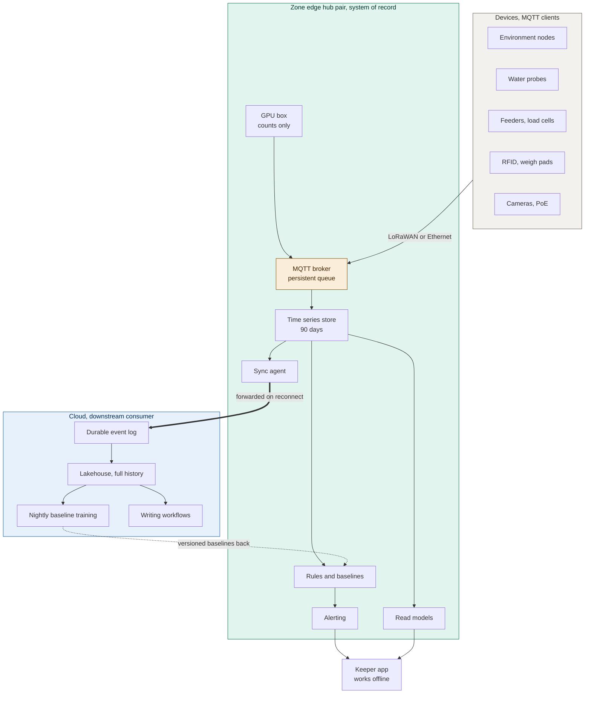

# ADR-001: Edge First, Event Driven Architecture with the Hub as System of Record

## Status
Proposed

## Context
- WiFi across the estate is patchy: parts of the grounds have no signal at all, and the link out can drop for days at a time.
- Animal care can't wait for a network. A tank with rising ammonia and falling filter flow needs a keeper right now, internet or not.
- The data volume is trivial, a couple of kilobytes a second in total. Dropouts are the real problem here, not throughput.
- The same events need to be read in different shapes: is this animal okay today, what's the monthly trend, and what goes into a training set.

## Decision

| Aspect | Decision | Rationale |
|---|---|---|
| **System of record** | The edge hub in each animal zone is the system of record: broker, a 90-day time-series store, rules, baselines, alerting, the keeper-app backend, the vision runtime, and a sync agent, all running on a UPS. | Keeps detection and alerting working entirely on the estate, with no dependency on the network. |
| **Shared event bus** | Every device publishes onto one MQTT bus. Feeding, health, and the piranha count share it instead of running three separate pipelines. | One pipeline is cheaper to build and run than three, and these events genuinely belong together. |
| **Append-only events** | Events are append-only, each carrying a device timestamp and a monotonic sequence number. Corrections are new events, never edits. | Preserves a full history for replay and backtesting, and lets us say exactly what we knew and when. |
| **Derived read models** | Read models are derived projections, and none of them is authoritative. The feed board, the dashboards, the training tables, and the vet case history are all rebuildable from the log. | If a read model gets it wrong, we rebuild it from source instead of patching a second source of truth. |
| **Cloud as downstream consumer** | The cloud is a downstream consumer, never a dependency. If it's gone for a month, the estate still detects sick animals and alerts keepers. | Welfare detection can never depend on a network we don't trust. |
| **Paired hubs** | Two hubs per zone, run as a pair, plus a GPU box for vision. The pair survives a single hub failure; it doesn't share load. | Gives each zone a working fallback without needing a full load-balanced cluster. |

## Diagram

| Symbol | Meaning |
|---|---|
| Green | Runs on the estate with no internet needed. |
| Blue | Cloud; may be absent for weeks at a time. |
| Amber | The system of record. |
| Bold arrow | Crosses the unreliable estate-to-cloud boundary. |
| Dashed arrow | Returns configuration (trained baselines) back to the estate. |

## Alternatives Considered

| Option | Verdict | Reason |
|---|---|---|
| Cloud-first with thin relay gateways | Rejected | Every welfare alert would depend on a link we already know drops. |
| REST between devices and a central service | Rejected | A dropped request is a lost reading unless we build our own retry and buffering, which is store-and-forward reinvented badly. |
| WebSockets as the device transport | Rejected | Long-lived sockets burn battery and thrash on reconnect, and still lose data without buffering underneath. |
| A proprietary cloud IoT SDK on every device | Rejected | Couples a decade-long hardware asset to one vendor, whose offline behaviour is theirs to change at will. |
| One central hub for the whole estate | Rejected | The link to a remote aquatic house is itself patchy, so a single hub just moves the dead zone rather than removing it. |
| CRUD state with no event log | Rejected | Loses replay, backtesting, and the ability to say what we knew and when. |

## Consequences and Tradeoffs

| Type | Point | Detail |
|---|---|---|
| ✅ Positive | Network-independent | Detection, alerting, and the keeper app all work without the network, and one pipeline now serves three problems instead of three separate verticals. |
| ✅ Positive | Easy backtesting | Checking results against recorded vet visits becomes a query, not a data-recovery project. |
| ⚠️ Trade-off | Real infrastructure | There's real hardware on the estate to patch, monitor, and physically visit. |
| ⚠️ Trade-off | Permanent eventual consistency | Every cloud-side report has to state how current its data actually is. |
| ⚠️ Trade-off | Multi-clock investigations | An investigation may span a device buffer, a gateway buffer, a hub queue, and a cloud log, each with its own clock. |
| ⚠️ Trade-off | Logic can drift | Rules can end up living in two places and drifting apart. We mitigate this by shipping baselines as versioned configuration, not as code in both places. |

## Conclusion
The zone edge hub is the system of record; the cloud is just a downstream consumer. We pay for on-site infrastructure and permanent eventual consistency, and in exchange we get welfare detection that never depends on a network we can't trust.
