# ADR-002: LoRaWAN and Power over Ethernet for Sensors, Never WiFi

## Status
Proposed

## Context
- WiFi coverage is patchy. The brief names this constraint twice, and every other decision here bends around it.
- Roughly 300 devices are spread across 55 enclosures, most in 18th-century buildings and outdoor pens. Some sit inside venomous enclosures, where a battery change is a two-person job with its own safety routine.
- Running cable through listed structures is expensive, and sometimes not even permitted.
- A camera running inference is a power problem, not a network problem. It can flatten a battery in hours.
- Data volume is trivial: a temperature reading is tens of bytes.

## Decision

| Aspect | Decision | Rationale |
|---|---|---|
| **No WiFi for sensors** | No animal-care sensor uses WiFi. WiFi is reserved for visitor devices and staff laptops. | Keeps the constrained, patchy WiFi network free for the things it's actually good at. |
| **LoRaWAN for battery devices** | Battery-powered, low-rate sensors use LoRaWAN: environment nodes, water probes, splash sensors, and feeders/RFID readers wherever a cable isn't practical. Environment nodes get three to five years of battery life. | Long range, low power, and no cabling, exactly what a battery sensor in a remote enclosure needs. |
| **Ethernet/PoE where power exists** | Anything that needs power anyway uses Ethernet or PoE: cameras, and mains-powered feeders and readers where a cable run already exists. | If it's already drawing power, wired connectivity is simpler and more reliable than adding radio. |
| **Cameras only where cabled** | Cameras go only where there's a cable, no exceptions. | This is the reason sensing is layered per species rather than applied uniformly everywhere. |
| **Wearables via short-range radio** | Wearable tags use short-range radio to a gateway inside the enclosure. The tag stays small; the gateway covers the range. | Keeps the tag itself light and cheap enough for an animal to wear. |
| **Two gateways per sensor** | Every sensor is heard by at least two LoRaWAN gateways. Five gateways cover the animal zones, on Ethernet with 4G fallback, buffering if the hub is unreachable. | One gateway going down shouldn't blind an enclosure. |
| **Local buffering on devices** | Devices hold their own ring buffer, 24 hours on the feeder controllers. | Turns a radio gap into a delay instead of a lost reading. |

## Diagram

| Symbol | Meaning |
|---|---|
| Green | Battery-powered, long-range radio. |
| Blue | Powered and cabled. |
| Purple | Short-range radio to a local gateway. |
| Red | The rejected transport, WiFi. |

## Alternatives Considered

| Option | Verdict | Reason |
|---|---|---|
| WiFi everywhere with mesh extenders | Rejected | Capital spend fighting the estate's own stated constraint, power-hungry radios that turn every battery sensor into a maintenance liability, and dead zones would remain anyway. |
| A cellular modem per device | Rejected | A recurring bill for 300 devices, worse penetration than LoRaWAN through thick stone, and higher power draw. 4G stays at the gateway instead, where one subscription serves many devices. |
| Zigbee or Bluetooth mesh as the primary transport | Rejected | Tens of metres of range means many hops across a sprawling estate, and mesh routing on battery nodes is painful to debug. Survives only for wearables. |
| Cable everything | Rejected | Running cable through listed buildings and enclosures we can't dig up is prohibitively expensive. |
| Cameras on battery with solar | Rejected | An inference-capable camera draws power continuously, and solar on a British estate in February isn't a real power supply. |

## Consequences and Tradeoffs

| Type | Point | Detail |
|---|---|---|
| ✅ Positive | Coverage where it matters | Including inside thick-walled animal houses, with battery life measured in years, so a device in a venomous enclosure gets visited on a planned cycle instead of in an emergency. |
| ✅ Positive | No recurring connectivity bill | And the WiFi constraint becomes an explicit design input instead of a surprise found during installation. |
| ⚠️ Trade-off | Tiny bandwidth | LoRaWAN bandwidth is small and duty-cycle limited: no imagery, no high-rate streams, and firmware updates become a physical or gateway-mediated job. |
| ⚠️ Trade-off | Radio latency | Latency is seconds to minutes, fine for welfare telemetry, which is exactly why door and gate state on dangerous enclosures is cabled instead. |
| ⚠️ Trade-off | Two transports to run | LoRaWAN and Ethernet each need their own build, test, and monitoring, with different failure modes and firmware paths. |
| ⚠️ Trade-off | Camera placement dictated by wiring | Cameras go where the cable is, not where we'd most like to look, and the two-gateway rule may need a sixth gateway once installation meets reality. |

## Conclusion
LoRaWAN when a device is battery-powered, Ethernet when it needs power anyway, and never WiFi. We accept tiny bandwidth and camera placement dictated by cabling, in exchange for telemetry that keeps working across a patchy estate for years.
