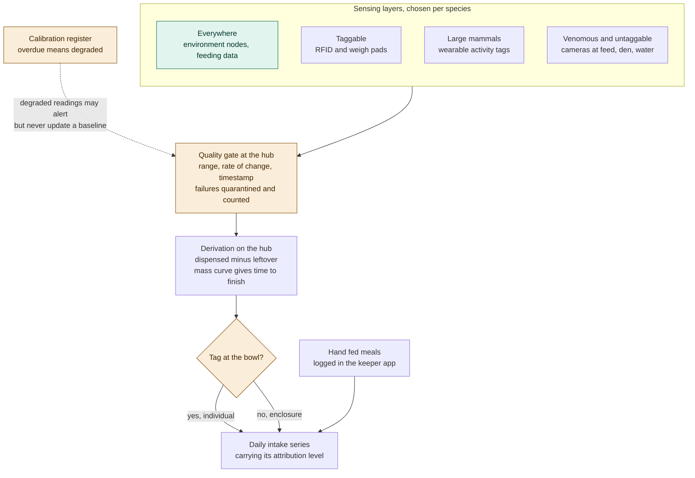

# ADR-003: Feeding and Health, Step 1. Measuring Intake and Condition

## Status
Proposed

## Context
- Feeding is currently recorded by hand, and how well an animal ate is just a keeper's impression. The brief wants what was offered and what was eaten at every feed across 55 enclosures, attributed to individuals wherever they can carry a tag.
- Appetite loss is the earliest common sign of illness across species, so the feed bowl is the cheapest health instrument on the estate.
- Two hundred animals, and they're not alike. Some can take a chip, some a collar, some are venomous and can't be handled at all. One recipe for everyone is either unaffordable or fails on exactly the species that most need watching.
- The hardware budget is fixed, so the order we instrument in matters as much as the list itself.
- A load cell drifts, and an RFID reader misses reads in a crowd. Once a bad reading reaches a baseline, it stops being a bad reading and becomes a bad definition of normal.

## Decision

| Aspect | Decision | Rationale |
|---|---|---|
| **Non-invasive first** | Anything that touches an animal needs veterinary sign-off per species, and is never the first option tried. | Protects animal welfare and avoids handling risk before it's proven necessary. |
| **Sensing layered by species** | Environment nodes and feeding data go everywhere. RFID and weigh pads go to taggable species. Wearables go to large mammals only. Cameras aimed at feed, den, and water points cover venomous and untaggable species. | One uniform sensing recipe is either unaffordable or fails on exactly the species that need it most. |
| **No whole-enclosure video** | Cameras point only at the places an animal must visit. | Keeps both cost and the privacy surface small. |
| **Load cell as primary instrument** | The load cell under the bowl is the primary feeding instrument, read every 15 seconds during a feed. The controller also publishes dispense events, jams, and hopper level. | Gives a continuous, fine-grained read on intake without touching the animal. |
| **Intake is derived, not measured** | Intake is dispensed minus what remains at the next feed. The shape of the mass curve also gives time-to-finish. | Time-to-finish catches an animal that still eats, but eats slowly, something a single before/after weight can't show. |
| **Attribution carries its confidence level** | Attribution is by RFID and carries its own level: a tag at the bowl gives an individual figure, no tag gives an enclosure figure, and that level is stored alongside the number, not hidden behind it. | So a keeper or a model always knows whether a number describes one animal or a shared bowl. |
| **Hand-fed meals are logged too** | Hand-fed meals are logged in the keeper app, so the series covers the whole diet, not just the part that crossed a load cell. | An intake series that skips hand-feeding would be silently incomplete. |
| **Quality gate before storage** | Every reading is validated at the hub before it reaches any store, rule, baseline, or model: is it physically possible, is it consistent with what came before, does it carry a device timestamp and sequence number. Failures are quarantined and counted. | Stops a bad reading before it can quietly become part of the definition of "normal." |
| **Calibration has an owner** | Calibration has an owner and a due date. An overdue instrument marks its readings as degraded, and a degraded reading may raise an alert but never updates a baseline. | Prevents an uncalibrated instrument from silently corrupting a baseline. |
| **Three funding waves** | Environment nodes, probes, and feeders first; then RFID and weigh pads; then cameras and wearables. Each wave has to earn its keep before the next is funded. | Matches the fixed hardware budget instead of assuming it all arrives at once. |

## Diagram

| Symbol | Meaning |
|---|---|
| Green | The universal, cheap layer every enclosure gets. |
| Amber | Runs before anything is stored. |
| Attribution branch | Drawn on purpose: it's where the system is routinely honest about what it doesn't know. |

## Alternatives Considered

| Option | Verdict | Reason |
|---|---|---|
| Cameras everywhere with whole-enclosure tracking | Rejected | An order of magnitude more expensive, defeated by large naturalistic enclosures, and it produces continuous video when we only want a few numbers. |
| Wearables on every animal | Rejected | Fitting one is a handling procedure, most species can't safely carry one, and habituation makes the first few days incomparable anyway. |
| Weight as the primary signal | Rejected | Confirms a problem days after appetite already showed it. Kept only as corroboration. |
| Treating intake as a measured reading | Rejected | Hides the fact that intake is arithmetic over two weighings, so a missing leftover weighing would produce a confident, wrong number. |
| Splitting shared-bowl intake evenly | Rejected | Invents per-animal precision the instrument can't actually support, and that invented number would go on to train a baseline. |
| Validating in the cloud | Rejected | Detection has to run on the estate with no internet, so a quality gate that only lives in the cloud doesn't protect the path that matters. |

## Consequences and Tradeoffs

| Type | Point | Detail |
|---|---|---|
| ✅ Positive | Every enclosure covered from day one | No animal is invisible while the expensive layers are still unfunded, and intake is comparable estate-wide because it's computed the same way everywhere. |
| ✅ Positive | Attribution travels with the number | A keeper and a model both always know whether they're looking at one animal or a shared bowl. |
| ✅ Positive | Silent failures get caught | The quality gate and calibration register stop the failure mode with no symptom: a drifting instrument quietly moving an animal's definition of normal. |
| ⚠️ Trade-off | Intake is only as good as the leftover weighing | A bowl knocked over leaves a gap, and that gap has to stay visible rather than get quietly filled in. |
| ⚠️ Trade-off | Shared enclosures get a weaker signal | We accept enclosure-level intake there rather than fabricate an individual number. |
| ⚠️ Trade-off | Calibration is recurring labour forever | It's the first thing to slip in a busy month, and phasing also means a wave-one enclosure and a wave-three enclosure aren't comparable for a year. |

## Conclusion
We measure without touching the animal, layer sensing by species, and put a quality gate and a calibration register between every reading and every baseline. A bad reading that reaches a baseline becomes a bad definition of normal, so we stop it before it gets there.
