# ADR-004: Feeding and Health, Step 2. Learning Normal and Spotting Drift

## Status
Proposed

## Context
- Illness is currently noticed once an animal visibly stops eating or moving, which is late and expensive. Success here means lead time: days between the first detectable change and the vet visit.
- A single population-wide threshold is useless. A healthy tortoise and a healthy otter share no numbers in common, and two otters in the same enclosure don't either.
- Appetite is noisy. An animal that eats less on one hot afternoon isn't ill, and a system that treats it as ill gets switched off within a fortnight.
- A slow decline is exactly what we most want to catch, and exactly what a rolling average most easily hides. If an animal has been getting worse for three weeks, those three weeks are the wrong thing to call normal.
- Much of what looks like drift already has a known explanation: a diet change, a move, a treatment course, a breeding season.
- Baselines need years of history, and years of history live in the cloud, while detection has to keep working with the link down for weeks.
- Nothing can be detected until a species rhythm exists, and institutional knowledge about most species is thin, lives in care sheets, and walks out the door when a keeper leaves.

## Decision

| Aspect | Decision | Rationale |
|---|---|---|
| **Two separate layers** | Rhythm is set per species as configuration, signed off by the vet: feed frequency, fasting tolerance, feed window. Normal is learned per individual: that animal's usual intake, weight, activity, and den time. Keeping these apart is the core decision. | A species-wide rhythm and an individual's normal answer different questions and shouldn't be conflated into one number. |
| **Retrieval proposes, never applies** | Retrieval-augmented generation over the curated husbandry corpus proposes the species rhythm; it never applies it. Candidate values come back with a citation to the source care sheet, the vet accepts, edits, or rejects each field, and only the signed-off version becomes configuration. | A care sheet can be wrong, stale, or about the wrong subspecies, and the rhythm is what every baseline gets built on. |
| **Retrieval also proposes expected seasonal patterns** | The same retrieval proposes what to watch for: seasonal patterns that are normal rather than drift, such as a species that fasts after a large meal or during shedding. Accepted items become known event types under the same vet sign-off. | Stops normal seasonal behaviour from being mistaken for a health problem. |
| **Normal is a rolling median and spread** | An animal's normal is a rolling 30-day median and spread per signal, adjusted for season. Median and spread rather than mean and standard deviation. | One unusual day can't drag a mean off course the way it can a median. |
| **Illness periods excluded from training** | Known abnormal periods are excluded from training. A confirmed illness or treatment course never becomes part of what "normal" looks like. | This is what stops a slow decline from quietly becoming the new baseline. |
| **Baselines trained nightly in the cloud** | Baselines train nightly in the cloud against years of history, back-tested against recorded vet visits, and ship to the hub as versioned configuration. If the cloud is unreachable for more than a week, the hub computes locally and says so. | Keeps long-history training in the cloud while detection keeps working entirely offline. |
| **Plain rules ship first, and stay** | Plain rules ship first and remain in production: feed not dispensed, dispensed and not eaten, finishing much slower than normal, intake below baseline on three of the last four days, leftovers rising, hopper low or jammed. | There's no labelled data on day one, and six plain rules already cover most real feeding faults, with an explanation a keeper can argue with. |
| **Deviation is a robust z-score** | Deviation is measured as a robust z-score in spreads from the animal's own median, not as a percentage of a global threshold. | Keeps the comparison anchored to what's actually normal for that individual animal. |
| **Persistence required before firing** | Nothing fires until it persists, as N of the last M readings. Two spreads below on three of four days is worth a look; three spreads below on two days is act; weight down 4% in a week is worth a look. | A system that fires on every blip gets ignored, and then it catches nothing at all. |
| **Corroboration escalates** | Two signals for the same animal within 48 hours escalate the alert one level. | Two independent signs of trouble are more convincing than one. |
| **Physical danger bypasses the baseline** | Readings that are dangerous in themselves bypass the baseline entirely. Enclosure temperature out of range or falling fast is "act," urgent after 20 minutes. | A failed heater is a fact, not a deviation, and shouldn't wait for a statistical model to notice. |
| **Known events have an open and a close** | Known events (diet change, move, treatment) are a detection input with an open and a close date, not an annotation added after the fact. Open-ended events carry an expected close date so suppression can't become permanent. | Stops a temporary explanation from silently suppressing alerts forever. |
| **We predict conditions, not illness** | We predict water chemistry and temperature, which are continuously measured physical quantities. We do not predict illness. A falling intake trend is a projection, never a forecast of disease. | Keeps the system honest about the limits of what it can actually know. |

## Diagram

| Symbol | Meaning |
|---|---|
| Green | Needs no training data and works from the first week. |
| Amber | What stops noise from reaching a keeper. The vet gate is here because retrieval proposes a rhythm and never sets one. |
| Red | Bypasses the baseline entirely, because a failed heater is a fact, not a deviation. |

## Alternatives Considered

| Option | Verdict | Reason |
|---|---|---|
| One threshold per species for every animal in it | Rejected | Individuals differ enough that a shared threshold is either too wide to catch anything or too tight to stay quiet. |
| Mean and standard deviation | Rejected | A single extreme day moves both, so "normal" is least stable exactly when the animal is most interesting. |
| A rolling window with no exclusions | Rejected | A three-week decline becomes the new normal, and the system loses the exact thing it was built to catch. |
| Firing on a single deviation | Rejected | Daily alerts across 55 enclosures, and the capability gets switched off by the very people it was built for. |
| Models instead of plain rules at the start | Rejected | There's no labelled data on day one, and six plain rules already cover most real feeding faults with an explanation a keeper can argue with. |
| Typing every species rhythm from keeper memory | Rejected | Slow across this many species, with no provenance, and nobody can later tell a reference from a guess. |
| Letting retrieval write the configuration directly | Rejected | A care sheet can be wrong, stale, or about a different subspecies, and the rhythm is what every baseline is built on. |
| Applying known events after an alert fires | Rejected | The alert has already interrupted somebody; a late explanation doesn't give back the trust it cost. |
| Predicting illness onset | Rejected | No dataset here supports it, and a confident wrong prediction is worse than an honest trend. |

## Consequences and Tradeoffs

| Type | Point | Detail |
|---|---|---|
| ✅ Positive | Lead time is the organizing metric | And it can be measured directly against recorded vet visits. |
| ✅ Positive | Something useful ships in week one | The plain rules need no history at all. |
| ✅ Positive | Slow declines stay visible | Excluding known illness periods is what makes a slow decline detectable instead of normalised, which is the hardest and most valuable case. |
| ✅ Positive | Every rhythm is traceable | It arrives with a citation, so a value can be traced, dated, and corrected when the reference is updated. |
| ⚠️ Trade-off | Deliberate delay | Persistence trades lead time for precision on purpose. A real problem is reported a day or two late, and that's a choice we're making. |
| ⚠️ Trade-off | New arrivals are a blind spot | A new arrival has no baseline for 30 days and is covered only by species rhythm and the plain rules, during the exact period it's most stressed. |
| ⚠️ Trade-off | Known events depend on people | An unrecorded diet change still produces a false alert. |
| ⚠️ Trade-off | Vet time on the critical path | Vet review of proposed rhythms is real veterinary time, and a plausible-but-wrong proposal is harder to catch than an obviously wrong one. |

## Conclusion
Rhythm is configured per species and proposed with citations. Normal is learned per individual and excludes the periods we already know were abnormal. Nothing fires until it persists, because a system that cries wolf gets switched off, and then it detects nothing at all.
