# ADR-005: Feeding and Health, Step 3. Alerting a Keeper and Closing the Loop

## Status
Proposed

## Context
- Detection alone is worth nothing. Lead time only actually shortens if a person acts on it.
- Alert fatigue kills systems like this quietly. Nothing breaks; keepers just stop opening the cards, and months of detection go to waste before anyone notices.
- A keeper on a round has both hands busy. Whatever arrives has to be readable in seconds and answerable in two taps.
- Three different audiences want different things from the same events: the keeper wants the next action, the vet wants history, the engineer wants to know a gateway is down.
- The system has no standing to name a condition, that's a vet's job.
- A keeper judging an alert often needs species knowledge, not more numbers. Whether this species normally fasts for a week after a large meal decides whether to escalate, and that knowledge isn't in the event store.
- Without a recorded outcome, there's no precision figure and no way to tune thresholds.

## Decision

| Aspect | Decision | Rationale |
|---|---|---|
| **Three alert levels** | Three levels decide who gets told. Review appears in the keeper app. Act adds an SMS. Urgent adds the vet and the operations board. | Matches the urgency of the notification to the urgency of the situation. |
| **Named owner on every alert** | Every alert names an owner when it fires, the section keeper on shift. Reassignment is explicit. | Prevents the case where three people each assume someone else is handling it. |
| **A simple, actionable card** | The card is one plain sentence, the chart that produced it, and three buttons: looks fine, concern, escalate to vet. The sentence cites the facts it rests on. | Has to be readable in seconds and answerable in two taps by someone with both hands full. |
| **Optional species context** | An optional species-context panel sits beside the card, retrieved from the curated husbandry corpus with its citation and review date. Husbandry only, never clinical, visibly separate from the animal's own data, served from the hub's own copy of the index so it still works offline. | Gives a keeper the species knowledge they need to judge an alert, right where they need it. |
| **No condition is ever named** | No condition, drug, or treatment is ever named. The only permitted recommendations are observe, check, weigh, and escalate to the vet. | The system has no standing to diagnose, and a named condition becomes a working diagnosis regardless of any caveat attached. |
| **Offline-first keeper app** | The keeper app is the keeper's only surface, and it's offline-first, because the detection that produced the alert was too. | An alert that only reaches a keeper when the network is up defeats the point of offline-first detection. |
| **Published precision target** | Seventy percent of act-level alerts must be confirmed by a verdict. This is a tracked headline number with a named owner. | Gives the team an honest, trackable measure of whether alerts are actually useful. |
| **A hard ceiling on alerts per shift** | A hard ceiling on alerts per keeper per shift carries equal standing to precision. Breaching it is a design failure that triggers a threshold review, not a busier shift. | Puts the burden of fixing alert fatigue on the design, not on the keepers. |
| **Thresholds tuned per enclosure** | Thresholds are tuned per enclosure, so one noisy enclosure doesn't raise the bar estate-wide and hide real signals in the quiet ones. | Keeps a single noisy enclosure from degrading detection everywhere else. |
| **A verdict is mandatory to close** | A verdict is required. An alert can't close any other way, and it's two taps. | An alert with no recorded outcome teaches the system nothing. |
| **Verdicts feed everything back** | Verdicts tune thresholds, correct baselines, measure precision, and grow the eval sets that gate any change to detection or generated text. | Turns routine keeper work into the labelled data the whole system runs on. |
| **Three separate surfaces** | Three surfaces, never merged: the keeper app for keepers, Grafana on the hub for operators (device health, gateway coverage, queue depth, calibration debt), and a reporting surface for managers (lead time, precision, care cost). Keepers are never sent to Grafana. | Each audience gets what it actually needs, in the format it needs it. |

## Diagram

| Symbol | Meaning |
|---|---|
| Red | The path that interrupts somebody away from their round. |
| Amber | The required step. The diagram exists partly to show there's no route from an alert to closed that skips it. |
| Green | Everything the verdict pays for. |

## Alternatives Considered

| Option | Verdict | Reason |
|---|---|---|
| One notification channel for everything | Rejected | Either everything sends an SMS, the fastest route to fatigue, or nothing does, and an urgent alert waits for somebody to open an app. |
| Alerts addressed to a team | Rejected | Shared ownership produces the exact case where three people each assume someone else is handling it. |
| Letting the system name a likely condition | Rejected | It becomes a working diagnosis regardless of any caveat attached to it. |
| Optional feedback, like a thumbs icon | Rejected | Comes from only the most engaged keepers on the most interesting alerts, a biased sample, and volume collapses within a month. |
| Measuring precision alone | Rejected | Precision looks great if you raise thresholds until nothing fires, so the ceiling and lead time have to carry equal standing. |
| Retrieving clinical guidance onto the card | Rejected | Husbandry context helps a keeper judge normal behaviour; treatment guidance would turn the card into a diagnostic tool. |
| Blending species context into the alert sentence | Rejected | The sentence cites facts measured about this specific animal, and mixing in a care sheet would make a citation mean two different things. |
| Grafana as the keeper interface | Rejected | It needs a network, and a time-series panel doesn't tell somebody holding a bucket what to do next. |

## Consequences and Tradeoffs

| Type | Point | Detail |
|---|---|---|
| ✅ Positive | Nothing is silently ignored | Every alert has a named owner and a required close, and verdicts make the whole system measurable from the same two taps. |
| ✅ Positive | Fatigue becomes an engineering number | The ceiling turns fatigue into something visible, with the burden of fixing it on the design rather than the keepers. |
| ✅ Positive | Institutional knowledge shows up when needed | Species context puts what a keeper needs beside the moment they need it, dated and cited, instead of in a reference book in an office. |
| ⚠️ Trade-off | Permanent friction | A required verdict is friction on every single alert, forever. If it's not genuinely two taps, it gets gamed by pressing "looks fine" on everything. |
| ⚠️ Trade-off | Uneven verdict quality | A rushed keeper at the end of a shift produces a label carrying the same weight as a careful one. |
| ⚠️ Trade-off | An early, unproven number | Seventy percent is a target we'll be held to before we have the data to know it was the right number, and per-enclosure thresholds are more to configure and review. |
| ⚠️ Trade-off | Context is only as good as the corpus | A stale care sheet reads exactly like a current one, which is why it always carries its review date. |

## Conclusion
Alerts are levelled, routed to a named person, delivered offline, and closed with a verdict that becomes the label everything else runs on. An alert nobody acts on has the same lead time as no alert at all.
