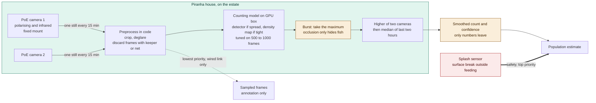

# ADR-006: Edge Vision for the Piranha Count, and What It Actually Costs

## Status
Proposed

## Related Documents
- [C4 Diagrams: Piranha Population Count](c4-diagrams-piranha-population-count.md), covering this and [007](007-adr-piranha-population-as-a-range.md).

## Context
- Piranhas can't be tagged or handled routinely, and fish are lost to aggression, illness, or escape. The brief wants a smoothed count several times a day, an alert on a meaningful drop, and a check against manual counts.
- This is a safety matter as well as a welfare one. A piranha that leaves the tank is a public safety incident.
- A camera can't reliably count a school of fish. They hide each other, look alike, and move fast, and occlusion is one-sided since it only ever hides fish, never invents extras.
- Two cost questions get conflated here: where inference runs, and how often we look. The second one drives cost by two orders of magnitude.

## Decision

| Aspect | Decision | Rationale |
|---|---|---|
| **Inference at the edge** | Inference runs at the edge on a small GPU box in the piranha house. Only derived numbers ever leave the box. | Keeps a safety-relevant signal working with no dependency on the network, and avoids uploading imagery at all. |
| **Two fixed overhead cameras** | Two overhead PoE cameras with polarising filters for glare and infrared for low light, on fixed mounts under fixed lighting. | A fixed setup keeps capture conditions stable, which matters more here than a better model. |
| **Stills, not video** | We sample stills, not video: one frame per camera every 15 minutes, avoiding feeding times. This sampling rate is the real cost decision, set by what the biology needs, since a population doesn't change between minutes. | Sampling frequency drives cost by orders of magnitude; the population itself doesn't move fast enough to need more. |
| **Take the maximum of a burst** | A short burst is taken per sample, and we use the highest count rather than the average, because occlusion can only push a count down, never up. | Any correction should work against occlusion's known one-sided bias, not average it away. |
| **Preprocessing in code** | Crop to the tank, remove glare, and discard any frame with a keeper or net in view. A frame with a keeper in it is worse than no frame at all. | Keeps obviously unusable frames from ever reaching the model. |
| **Model follows the shoal shape** | The model choice follows the shoal: an object detector when fish are spread out, a density map when they're packed tight. Both are small, tuned on 500 to 1,000 keeper-labelled frames, and return a count with a confidence. | A single model type doesn't handle both a spread-out shoal and a tightly packed one equally well. |
| **Explicit smoothing** | Smoothing is explicit: the higher of the two cameras, then the median of the last two hours. The output is always a smoothed count with a confidence, never a population estimate. | Keeps the count honest about what it is, a smoothed camera reading, not a population figure. |
| **Fixed mounts matter more than the model** | Fixed mounts and lighting matter more than a better model. Re-aiming a camera invalidates the model. | Capture consistency is the real lever on accuracy here, not model sophistication. |
| **Splash sensors handle escapes** | Splash and escape sensors live here too. A surface break outside feeding time is the escape signal, and it needs no vision at all. | A safety-critical signal shouldn't depend on a vision pipeline succeeding. |

## The Cost Question

At our sampling rate, two cameras at four frames an hour for about 20 usable hours works out to roughly 58,000 frames a year.

| Option | Capital | Recurring | Verdict |
|---|---|---|---|
| Edge, our own small model | GPU box, low four figures, once, plus keeper labelling | Electricity. No marginal cost per frame | Chosen |
| Cloud frontier model, same sampling rate | None | Low hundreds of pounds a year, affordable on its own | Rejected on accuracy and bandwidth, not price |
| Cloud, video or a frame per second | None | Three orders of magnitude more, plus an upload the backhaul can't carry | Rejected outright |

Three things worth saying plainly. Cloud inference at 15-minute sampling wouldn't actually be expensive, so we shouldn't lean on a cost argument we can't defend. The real reasons for choosing the edge are bandwidth over a patchy, sometimes metered link, and the fact that a general-purpose model is worse at counting an occluded shoal than a small one tuned specifically on this tank. And the largest real cost is keeper annotation time, the scarcest resource on the estate, and the line item that actually needs defending in the budget.

## Diagram

| Symbol | Meaning |
|---|---|
| Green | Happens entirely on the estate. |
| Amber | The two decisions carrying the accuracy: taking the maximum of a burst, and letting only numbers cross the boundary. |
| Red | The safety signal, which needs no vision at all. |

## Alternatives Considered

| Option | Verdict | Reason |
|---|---|---|
| Cloud inference on uploaded frames | Rejected | Rejected on bandwidth and accuracy, not price, and it would put a safety signal behind a link we already know drops. |
| Continuous video | Rejected | Three orders of magnitude more compute for no biological gain, on a backhaul that couldn't carry the upload anyway. |
| A general-purpose frontier model prompted to count fish | Rejected | No better at this task, and gives no calibrated confidence we can actually fuse with other signals. |
| Mean or median across the burst | Rejected | The mean is biased low by an amount that varies with how tightly the shoal is packed. |
| A single camera | Rejected | One occlusion geometry with no cross-check, so a dirty or moved camera becomes undetectable. |
| Imaging sonar as primary | Rejected | Retained as a fallback. Counts well in murky water, but it's river-scale technology and costly for a single tank. |
| Stereo vision | Deferred, not rejected | Would help with occlusion, but doubles calibration complexity. Revisit once we know how much error the current approach leaves. |

## Consequences and Tradeoffs

| Type | Point | Detail |
|---|---|---|
| ✅ Positive | No marginal cost per inference | Counting, smoothing, and the escape alert all keep working with the link down, which matters for a signal with a safety dimension. |
| ⚠️ Trade-off | Always biased low | Occlusion isn't fixable by a better model, which is why this output is never presented as a population figure on its own. |
| ⚠️ Trade-off | Needs labelled frames to start | It needs 500 to 1,000 keeper-labelled frames before it works at all. |
| ⚠️ Trade-off | Fragile capture discipline | A nudged camera or a change in water clarity degrades the model silently, so drift is watched per camera rather than in aggregate. |
| ⚠️ Trade-off | Turbidity defeats optics | And a cloudy tank is often caused by uneaten food, the very thing we care about measuring. |

## Conclusion
A small tuned model on a GPU box, one still per camera every fifteen minutes, taking the maximum of a burst. The sampling rate is the real cost driver, and keeper annotation is the real bill. What we accept in return is a permanently low count that must never be published on its own.
