# ADR-007: Population Reported as a Range, Fused From Three Signals

## Status
Proposed

## Context
- The camera count is biased low, and no better model fixes that, because occlusion only ever hides fish, never invents extras.
- The brief asks for population levels and change. The tempting shortcut is to just publish the camera number, but the first time a keeper counts 38 fish while the dashboard says 41, the capability loses credibility for good.
- Three signals exist and none is sufficient alone. The manual count at tank service is the truth, but infrequent. Food eaten per fish is always on and detects change without counting anything. The camera is frequent, noisy, and biased low, but gives a direction of travel.
- Fish are lost to aggression, illness, escape, or death, and gained by restocking or breeding, so a rising count matters too, otherwise every restock would trigger a false alarm.

## Decision

| Aspect | Decision | Rationale |
|---|---|---|
| **A slowly-changing hidden number** | The population is modelled as a hidden number that changes slowly, with each observation nudging it according to its own reliability, a Bayesian state-space model with birth, death, and predation terms. The manual count moves it a lot; the camera moves it a little. | Lets three signals of very different reliability all contribute without any one of them dominating unfairly. |
| **Camera bias is learned, not assumed** | The camera's habitual undercount is learned by comparing it against manual counts, so the correction is estimated from data and moves when capture conditions change. | A fixed correction factor would go stale the moment lighting or turbidity changes. |
| **Output is always a range** | The output is a posterior reported as a range with a direction: around 38 fish, most likely between 34 and 43, trending down. | Honest about the real uncertainty, and still enough information to act on. |
| **No interface ever shows a bare number** | No interface presents a bare population number, not the keeper app, not the manager dashboard, not the monthly report, not a generated briefing. | Protects the credibility the moment a keeper's manual count doesn't match a single published figure. |
| **Alert on confidence, not noise** | Alerts fire on confidence, not on noise. Underneath the model sit plain rules: a median down more than 10% in 24 hours, a splash paired with a drop, a week of decline. | Keeps routine noise from generating alerts that erode trust in the system. |
| **Splash/escape path bypasses the model** | The splash and escape path is separate and deterministic. A surface break outside feeding time is a top-priority safety alert and doesn't wait for the model to become confident. | A safety event needs an instant deterministic response, not a statistical judgment call. |
| **Known events are recorded, not inferred** | Restocks, found deaths, and transfers are recorded as known events, so the model treats them as observed changes rather than anomalies. | Stops a routine restock from looking like an unexplained population jump. |
| **Cross-signal disagreement is its own alert** | If the camera trend and the food-per-fish trend diverge beyond tolerance, that raises an investigation on its own. It costs nothing and needs no labels. | Free continuous validation that catches a failure the camera can't self-report. |
| **Density is watched too** | Density is watched alongside the raw count, because overcrowding drives aggression. | Population size alone doesn't capture a crowding problem in a smaller or larger tank. |

## Diagram

| Symbol | Meaning |
|---|---|
| Purple | Ground truth, infrequent but authoritative. |
| Green | Always-on signals that cost nothing extra. |
| Amber | The output, always a range. |
| Red | The deterministic safety path that bypasses the model. |

## Alternatives Considered

| Option | Verdict | Reason |
|---|---|---|
| Report the raw camera count | Rejected | Wrong in a known direction, and publishing it would destroy credibility the first time somebody counted by hand. |
| Manual census only | Rejected | A number once a month with no visibility in between, so an escape or a die-off is only found days later. |
| A fixed correction factor on the camera | Rejected | The undercount varies with density, turbidity, and lighting, and a fixed factor gives no uncertainty at all. |
| A Kalman filter on the camera alone | Rejected | Close to what we do, but the real observation model needs three sources with different noise, a one-sided bias, and discrete jumps for restocks. |
| Machine learning over the fused signals | Rejected | The manual counts are the only labels, and there are only a handful a year; we'd also lose interpretable uncertainty. |
| A point estimate with a separate confidence figure | Rejected | People read the number and ignore the caveat next to it. The range has to be the answer, not a footnote to it. |
| Waiting for model confidence before alerting on an escape | Rejected | Statistical confidence is the wrong instrument for a safety event. |

## Consequences and Tradeoffs

| Type | Point | Detail |
|---|---|---|
| ✅ Positive | Durable credibility | When a keeper counts 38 and the system said 34 to 43, the system was right. |
| ✅ Positive | Change detected without counting | Food per fish is always on, needs no vision and no labels, and is unaffected by turbidity. |
| ✅ Positive | Free continuous validation | Cross-signal disagreement catches the failure the camera can't self-report. |
| ⚠️ Trade-off | Harder to explain | A state-space model with a learned bias is harder to explain to a keeper or a sponsor than just saying "the camera counted 41." |
| ⚠️ Trade-off | Ranges are less satisfying | There will be recurring pressure to publish the midpoint instead. The interface rule exists precisely because that pressure is predictable. |
| ⚠️ Trade-off | Calibration takes time to trust | The interval is only as good as its calibration, which rests on a handful of manual counts a year, so it takes about a year to know whether our intervals are honest. |
| ⚠️ Trade-off | Food-per-fish is confounded | Fish also eat less when unwell, when water quality is poor, or when it's cold. That's why divergence triggers an investigation, not a conclusion. |

## Conclusion
The population is a slowly changing hidden quantity, fused from an authoritative manual count, an always-on food signal, and a low-biased camera trend, and it's always reported as a range. We accept real model complexity and the mild, permanent frustration of anyone who wanted a single number.
