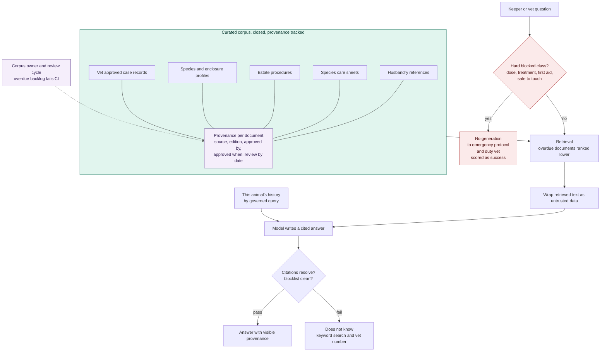

# ADR-008: Retrieval Over a Curated, Provenance Tracked Corpus

## Status
Proposed

## Context
- More than 200 animals across many species, including venomous ones. Institutional knowledge is thin, and the person who knew how this species behaves in this enclosure may already have left.
- Two knowledge needs get conflated here. General knowledge about a species, meaning references, care sheets, and known welfare risks, and the history of one animal, meaning past alerts, verdicts, diet changes, and what happened last time it stopped eating. The first is documents. The second is structured data and belongs in a query.
- This is a high-harm topic. A confidently wrong answer about a venomous species, or one that drifts into clinical advice, is a real harm, not a theoretical one.
- Open web retrieval is the tempting shortcut. On a subject where the difference between a reputable care sheet and a hobbyist forum post can be an animal's life, breadth without provenance is worse than nothing.

## Decision

| Aspect | Decision | Rationale |
|---|---|---|
| **Retrieval over a curated corpus** | Retrieval-augmented generation runs over a curated corpus, with mandatory citations and tracked provenance on every document. It answers husbandry and procedural questions, and refuses clinical ones. | Keeps every answer traceable to a specific, vetted source instead of the model's own unverifiable knowledge. |
| **The corpus is closed** | The corpus is closed: references the estate holds or licenses, species care sheets, estate procedures, species and enclosure profiles, and vet-approved case records. Nothing else. | A closed, known corpus is the only way to guarantee provenance on every answer. |
| **Provenance is first-class metadata** | Every document carries provenance as first-class metadata: source, publisher, edition, who approved it, when, and a review-by date. | A peer-reviewed reference, a manufacturer care sheet, and an estate procedure deserve different levels of confidence. |
| **Provenance is shown, not just stored** | Provenance is shown to the reader, not just stored in the system. A keeper should be able to see which kind of source they're looking at. | Lets the reader judge the source's authority themselves, rather than trusting a single blended answer. |
| **Citations are mandatory** | Citations are mandatory. An answer with no resolvable citation is not delivered. The system says it doesn't know, and offers keyword search and the on-call vet's number instead. | An unsupported answer is worse than an honest "I don't know" on a subject this high-stakes. |
| **Hard boundaries before generation** | Hard boundaries sit before generation: no dosages, no treatment plans, no first aid or envenomation advice. Those route to the emergency protocol and a named human instead, and whether an animal is safe to touch gets a hard-coded answer. A refusal that escalates counts as a success. | Some questions are too risky to let a model answer at all, no matter how the prompt is worded. |
| **The corpus has an owner and a review cycle** | The corpus has an owner and a review cycle. A document past its review date ranks lower, and a growing backlog of overdue documents fails a data-quality check. | A stale corpus degrades silently otherwise, and nothing would ever flag it. |
| **Animal history is a query, not retrieval** | Animal history is answered by a governed query, not retrieval. An answer may combine both, with each part cited to its own source type, so a keeper can see which claim came from where. | Structured time-series data belongs in a query; semantic search over it would be unreliable and unnecessary. |
| **No fine-tuning on husbandry text** | No fine-tuning happens on husbandry text. Knowledge stays in the corpus, where it can be cited, corrected, dated, and removed. | Knowledge baked into model weights can't be corrected or dated the way a document can. |

## Diagram

| Symbol | Meaning |
|---|---|
| Red | Question classes that never reach a model. |
| Purple | Provenance and its ownership, what makes a citation worth anything. |
| Two separate paths | Documents answer species knowledge; a query answers this animal's history. Kept apart on purpose. |

## Alternatives Considered

| Option | Verdict | Reason |
|---|---|---|
| Open web retrieval | Rejected | No provenance, no review, no way to tell a reference from a forum post, and an injection surface we don't control. |
| Fine-tuning on husbandry literature | Rejected | Knowledge baked into weights can't be cited, corrected, dated, or removed, and a changed care standard would mean retraining instead of just replacing a document. |
| Pretrained knowledge with no retrieval | Rejected | Unverifiable, and confidently wrong in exactly the long-tail species where training data is thinnest. |
| Putting animal history into the retrieval index | Rejected | It's structured time-series data. Embedding a daily intake figure and hoping semantic search finds the right rows is worse than a query, and makes aggregation impossible. |
| Answering clinical questions with a disclaimer | Rejected | A dose in front of a keeper is a dose, whatever caveat is written underneath it. |
| An agent that searches and follows up autonomously | Rejected | An unbounded input set makes the citation check meaningless and the cost unpredictable. |

## Consequences and Tradeoffs

| Type | Point | Detail |
|---|---|---|
| ✅ Positive | Thin institutional knowledge becomes accessible | A new keeper can ask what an experienced one would have known, with a source to go read. |
| ✅ Positive | Every answer is traceable and correctable | A wrong care sheet gets replaced, and the next answer changes with no retraining needed. |
| ✅ Positive | Refusal is designed as a success | So the incentives never push the system toward answering a clinical question it shouldn't. |
| ⚠️ Trade-off | Curation is permanent expert work | Someone with veterinary judgement has to approve every document, set review dates, and work the overdue queue. This is the main cost, and the thing most likely to lapse. |
| ⚠️ Trade-off | Weakest exactly where help is most wanted | Coverage is thinnest in the long tail, where knowledge is scarcest, so the system will most often say it doesn't know exactly where it's needed most. |
| ⚠️ Trade-off | Licensing obligations | References are copyrighted, so the estate has to hold or license whatever it indexes. |
| ⚠️ Trade-off | Stale content fails silently | An out-of-date care standard reads exactly like a current one. The clinical boundary will also frustrate a vet asking a legitimate question in their own domain, a deliberate coarseness we accept. |

## Conclusion
Retrieval serves animal health at three points: it proposes the species rhythm a vet signs off, it offers species context beside an alert card, and it answers a keeper's husbandry question. Always from a closed corpus, always cited, never clinical.
