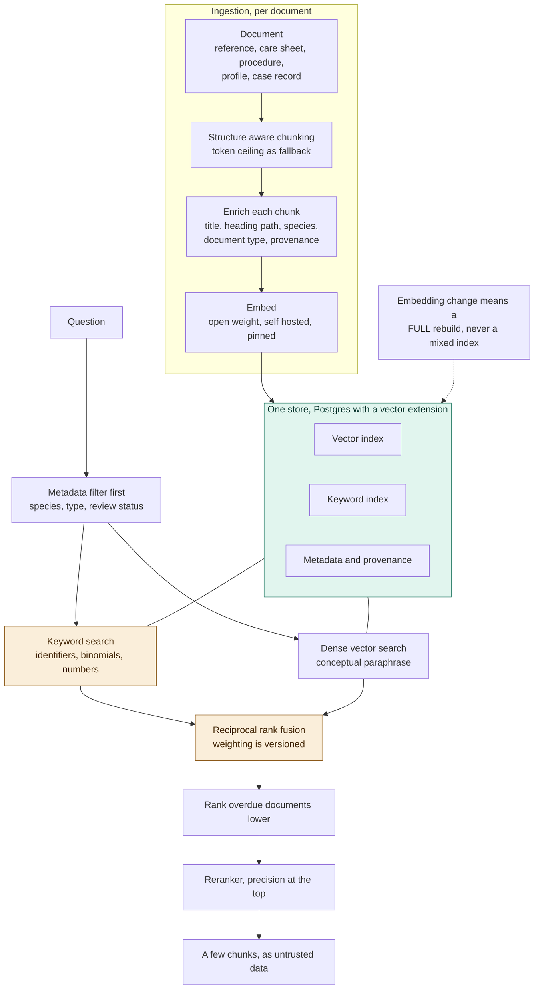

# ADR-009: Retrieval Index Design, Chunking, Embeddings and Hybrid Search

## Status
Proposed

## Context
- The previous record settles what the corpus is. This one covers how documents actually become retrievable, because these are the choices most likely to be changed casually, and the ones that decide whether retrieval works at all.
- A retrieval failure is indistinguishable from a knowledge failure. If a care sheet is chunked badly, the relevant paragraph never surfaces, the keeper is told "we don't know," and nobody investigates, because not knowing is meant to be a normal, designed behaviour.
- The corpus is mixed: long reference works, two-page care sheets, procedures written as numbered steps, short profiles, and case records. A chunking strategy tuned for one of these is wrong for the others.
- The queries are the crux. Keepers use exact identifiers and precise vocabulary, enclosure 22, animal A118, a species binomial, a procedure number. Pure semantic search is weak at exactly these, because an embedding of one Latin name sits close to every other Latin name. They also ask conceptual questions in their own words, where keyword search fails on vocabulary mismatch.
- Volume is small. A curated corpus for one estate is thousands of chunks, not millions, and that changes what the right infrastructure answer is.

## Decision

| Aspect | Decision | Rationale |
|---|---|---|
| **Chunk on document structure** | Chunking follows document structure rather than a fixed token count: a care-sheet section, a group of procedure steps, a reference subsection. A token ceiling is only the fallback for unstructured text. | A fixed-size chunk cuts a procedure mid-step or a reference mid-argument; structure-aware chunking doesn't. |
| **Every chunk carries its context** | Every chunk carries document title, heading path, species, and the full provenance block. A retrieved chunk is exactly what the model sees, and it has to be citable on its own. | Without this context, a chunk shown to the model or the reader loses the information needed to cite or trust it. |
| **Metadata filtering happens first** | Metadata filtering, species, document type, review status, happens before semantic ranking, as structured filters rather than something we hope the embedding captures. | Structured filters are exact; hoping an embedding captures them isn't. |
| **Hybrid search, keyword and dense** | Hybrid search fuses keyword and dense vector search rather than relying on either alone. This is the central decision. Keyword handles identifiers, binomials, and procedure numbers; vectors handle paraphrase; results fuse by reciprocal rank with a versioned weighting. | Keepers' actual queries need both exact-match and conceptual search, and neither alone covers both. |
| **Overdue documents rank lower, not excluded** | Overdue documents rank lower rather than being excluded outright, and the keeper can see the document's review date. | A stale care sheet still beats no answer at all, as long as its age is visible. |
| **A small reranker over fused candidates** | A small reranker runs over the fused candidates. The model only ever sees a handful of chunks, so which handful it sees is the whole game. | Top-of-list precision matters more than raw recall when only a few chunks are actually shown. |
| **One store, not two** | Postgres with a vector extension holds the keyword index, the vector index, and the relational metadata together, so hybrid search stays a single query instead of a cross-system join. | Keeps hybrid search simple and consistent without a second system to keep in sync. |
| **Self-hosted, pinned embedding model** | An open-weight embedding model, self-hosted and pinned by version. Embeddings are commodity, the corpus is small enough to re-embed cheaply, and self-hosting avoids both a per-embedding bill and the risk of a provider silently changing the model out from under us. | A silently changed embedding model would invalidate the whole index with no error raised anywhere. |
| **The index is a versioned artefact** | Chunking strategy, embedding version, fusion weights, and reranker version are all recorded, and changing any of them triggers the eval gate. | Retrieval quality depends on all of these together; changing one without evaluation risks silently breaking retrieval. |
| **Reembedding is always a full rebuild** | Reembedding is a full rebuild, never done in place, because an index holding mixed embedding versions is silently broken. | A partially reembedded index would return inconsistent, hard-to-diagnose results. |
| **Retrieval quality is measured separately** | Retrieval quality is measured with its own question-to-expected-chunk pairs, separate from answer quality, so we can tell a retrieval failure from a generation failure. | Without this split, a bad answer can't be traced back to whether retrieval or generation was at fault. |

## Diagram

| Symbol | Meaning |
|---|---|
| Amber | The hybrid fusion and the keyword leg, what makes identifiers and binomials findable at all. |
| Green | A single store holding vectors, the keyword index, and metadata together, which keeps hybrid search cheap. |

## Alternatives Considered

| Option | Verdict | Reason |
|---|---|---|
| Fixed-size token chunking as the default | Rejected | Cuts procedures mid-step and reference works mid-argument. Retained only as the fallback for unstructured text. |
| Whole documents as chunks | Rejected | Precision collapses, since every query ends up matching every large document weakly. |
| Dense vector search only | Rejected | The most important rejection here. It fails on exactly the queries keepers type, since embeddings place all binomials near each other. |
| Keyword search only | Rejected | Fails on vocabulary mismatch, but retained as a fallback for when the index is unavailable. |
| A managed vector database | Rejected | Expensive infrastructure for a library-sized problem, a second store to keep consistent, and hybrid search becomes a cross-system join. Revisitable only if the corpus grows by orders of magnitude, which we don't expect. |
| A hosted embedding API | Rejected | A per-embedding bill for a core capability, a provider dependency, and the specific risk of a silently changed model invalidating the whole index. |
| Skipping the reranker | Rejected | Top-of-list precision dominates answer quality, and a small reranker is cheap relative to what it buys. |
| Incremental reembedding in place | Rejected | A mixed index is silently broken, and "silently" is the operative word. |

## Consequences and Tradeoffs

| Type | Point | Detail |
|---|---|---|
| ✅ Positive | Keepers' actual queries work | Identifiers and binomials included, thanks to the keyword leg. |
| ✅ Positive | Hybrid search stays a query, not an integration | One store means metadata updates are transactional with the index. |
| ✅ Positive | No external dependency for a core capability | No per-embedding or per-query bill, and retrieval and generation are measured separately, so we can tell which one failed. |
| ⚠️ Trade-off | Chunking is work per format | A reference PDF, a procedure document, and a markdown profile each need their own extraction logic. PDFs will be genuinely painful, and this is the largest hidden cost. |
| ⚠️ Trade-off | Fusion weight is another parameter to get wrong | Its right value differs by query type, so tuning it globally is a compromise on every query. |
| ⚠️ Trade-off | Self-hosting means models to maintain | Running and updating our own embedding model and reranker means quality will lag the best hosted options. |
| ⚠️ Trade-off | A rebuild must be atomic | A partially rebuilt index serving live queries is worse than a stale one. Postgres with a vector extension also won't scale indefinitely, so we're betting the corpus stays small. |

## Conclusion
Chunk on structure, filter on metadata, then fuse keyword and dense search with a small reranker, all from one Postgres store and a pinned, self-hosted embedding model. Keepers search by enclosure number and species name, and a dense-only index would fail them at exactly that point.
