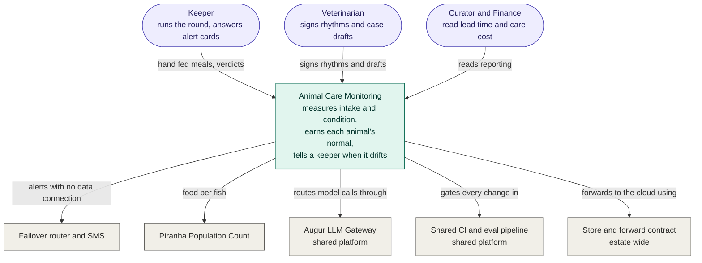
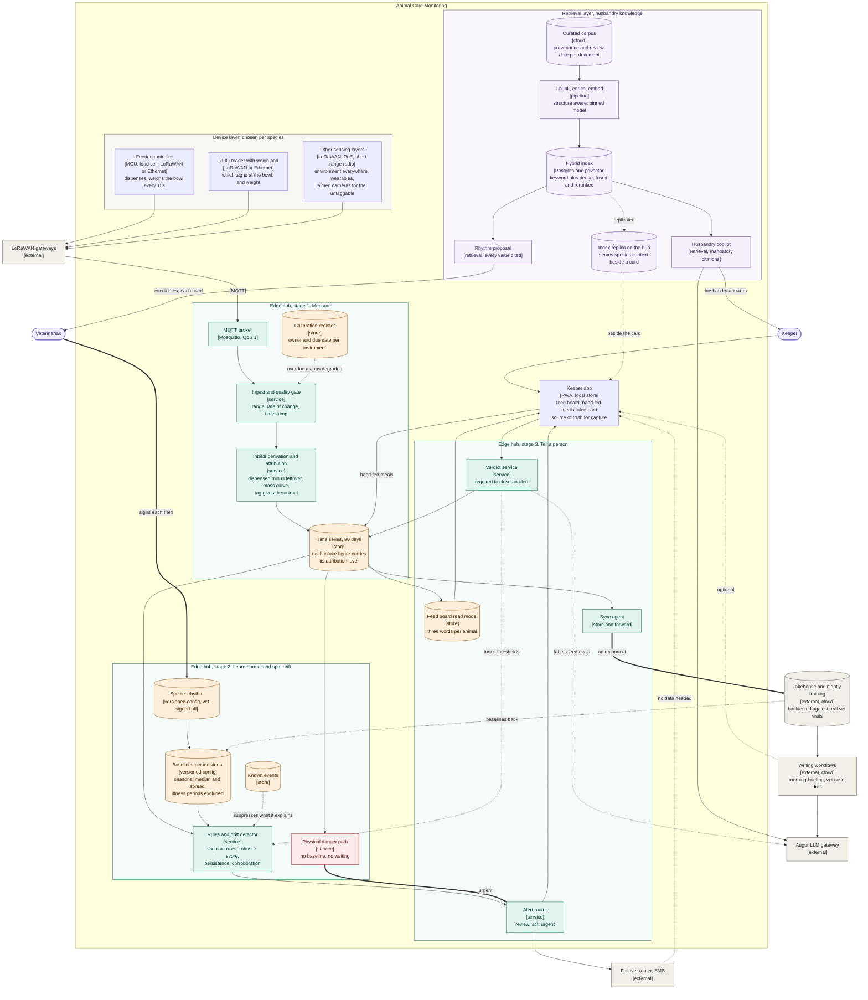
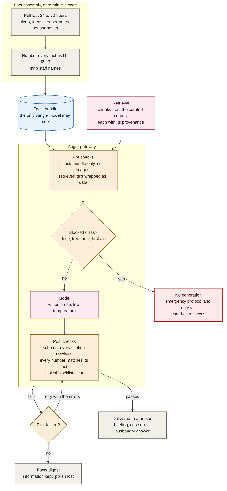
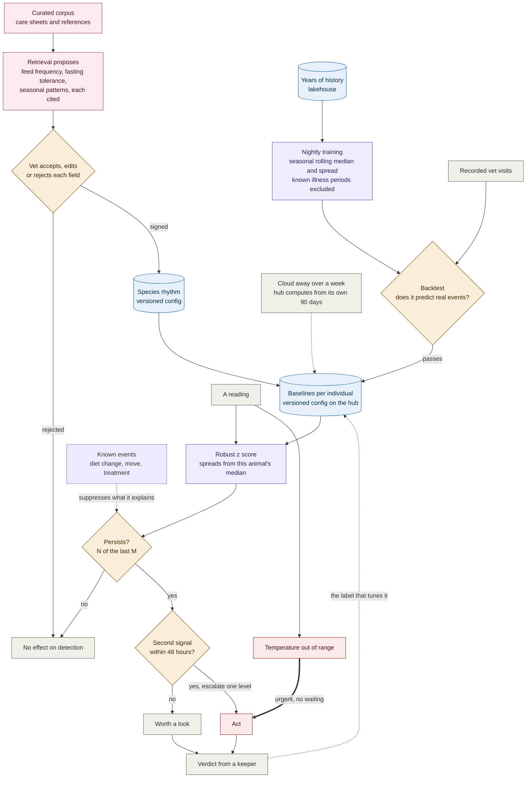

# C4 Diagrams: Animal Care Monitoring

*Supports [001](001-adr-edge-first-event-driven-architecture.md), [002](002-adr-sensor-connectivity-lorawan-not-wifi.md), [003](003-adr-animal-feeding-and-health-measuring.md), [004](004-adr-animal-feeding-and-health-learning-normal.md), [005](005-adr-animal-feeding-and-health-alerting.md), [008](008-adr-rag-over-a-curated-corpus.md), and [009](009-adr-retrieval-index-design.md). Diagram detail, not itself an architectural decision.*

How much and how well the animals eat, and how we track their health, are one pipeline running on one set of containers, so they share these diagrams.

---

## Level 1. System Context

**Key.** Stadium shapes are people. Teal is the system these diagrams describe. Grey is a system it depends on or serves, owned elsewhere.

**Why this diagram matters.** Three people need three different things from this system: the keeper wants the next action, the vet wants a signed record, and the curator wants a number. The only thing flowing to the piranha count is food eaten per fish, which is the cheapest population signal on the estate and costs nothing extra to produce.

---

## Level 2. Container

**Key.** Green runs on the estate with no internet. Amber cylinders are stores. Purple is the retrieval layer. Red bypasses the baseline. Bold arrows mark the three paths that must never be blocked: the physical danger path, the vet's sign-off, and the one crossing of the unreliable link.

**Why this diagram matters.** The three green stages (Measure, Learn Normal, Tell a Person) are the same three records as the ADR set, so the diagram and the ADRs describe the same shape. Feeding and health aren't two separate systems, because the feed bowl is the earliest health instrument on the estate and its output is the same series in the same store. Everything in the detection path runs entirely on the estate with no internet, so a whole keeper round can complete with the link down; the cloud only ever suggests a better baseline, and the hub decides whether to use it.

Two arrows are worth following closely. The calibration register feeds into the quality gate, because an instrument past its due date marks its readings degraded, and a degraded reading may still raise an alert but can never update a baseline. And the species-context arrow reaches the card from the hub's own index replica, never mixed in with the animal's own data, so a general care sheet is never mistaken for a measurement.

---

## Level 3a. Component, where the model is called

The AI subsystem deep dive. Where exactly a model runs, on what input, and what it is not allowed to do.

**Key.** Grey is deterministic code. Pink is the only place a model runs. Blue is the facts bundle, the only input a model ever sees. Amber are the checks on both sides of it. Red never reaches a model at all.

**Why this diagram matters.** Non-determinism enters at exactly one pink box, and it's fenced on both sides. Code assembles the facts and numbers them first, so the model can't introduce a fact of its own. Every claim coming back has to cite a fact ID that actually exists, and every number has to match the fact it cites, so faithfulness becomes something we can test, not just judge by reading. Two whole classes of question never reach a model at all, and a refusal that escalates counts as a success, not a failure. If the checks fail twice, the keeper still gets the facts digest, so the underlying content is never withheld, only the polished wording is.

---

## Level 3b. Component, how normal is learned and drift becomes an alert

The second deep dive. How a reading becomes a baseline, and what has to be true before anybody is interrupted.

**Key.** Pink is retrieval, which proposes and never applies. Purple is the statistical work. Amber diamonds are the four gates a signal has to pass before a person is interrupted. Blue cylinders are versioned configuration. Red is the path that skips all of it.

**Why this diagram matters.** Three separate things decide what normal means, and none of them is a model. A vet signs the species rhythm, a nightly job learns the individual baseline and has to beat a backtest against real vet visits before it ships, and known illness periods are excluded so a slow decline never becomes the new normal. A deviation then passes two more gates, persistence and corroboration, before anybody is interrupted, which is the trade of lead time for precision that keeps keepers reading the cards. The red path exists because a failed heater is a fact rather than a deviation, and waiting for three of four days would be absurd. The verdict loop at the bottom is what makes the whole thing measurable.
