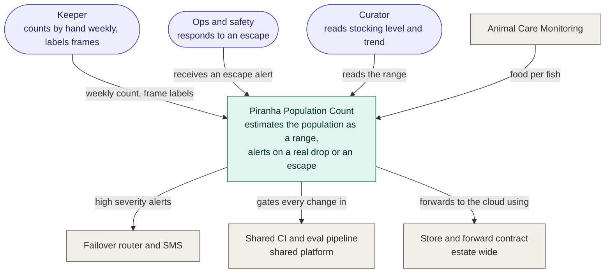
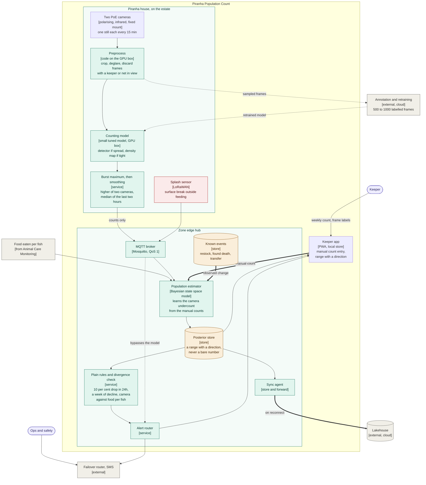
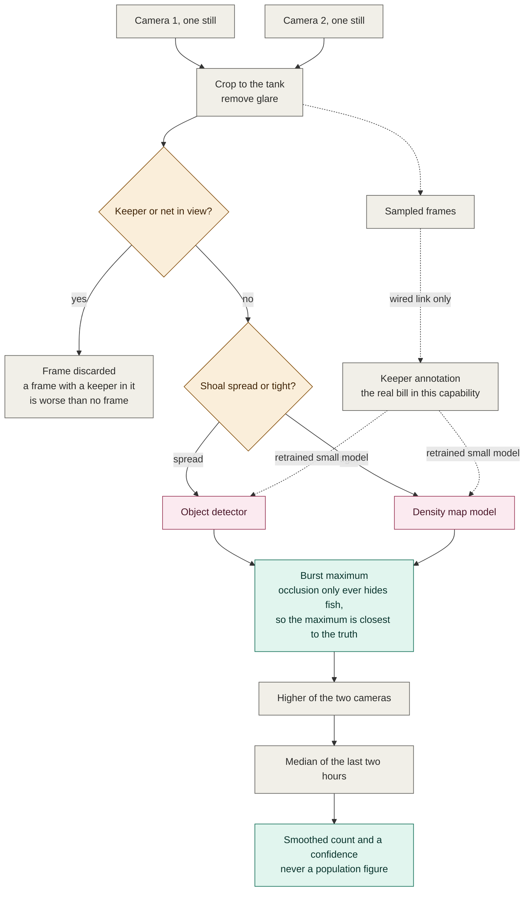
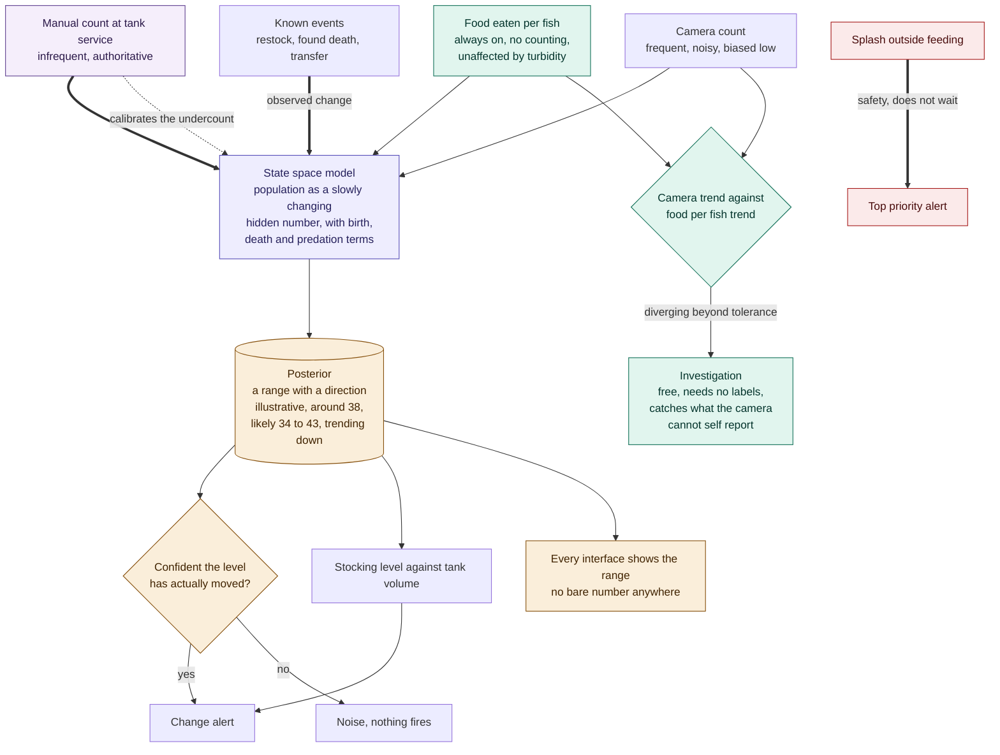

# C4 Diagrams: Piranha Population Count

*Supports [001](001-adr-edge-first-event-driven-architecture.md), [005](005-adr-animal-feeding-and-health-alerting.md), [006](006-adr-edge-vision-for-piranha-counting.md), and [007](007-adr-piranha-population-as-a-range.md). Diagram detail, not itself an architectural decision.*

A smoothed headcount several times a day, an alert on a meaningful drop or an escape, and a verification loop against periodic manual counts. The fish can't be tagged or handled routinely.

This is a separate pipeline from animal care monitoring, with different devices, different mathematics, and a different output shape. It shares only the message bus, the hub, and the keeper app.

---

## Level 1. System Context

**Key.** Stadium shapes are people. Teal is the system these diagrams describe. Grey is owned elsewhere.

**Why this diagram matters.** There's no Augur gateway here on purpose: nothing in this pipeline calls a language model. The only intelligence is a small vision model we tune ourselves and a state-space model, and both produce numbers, not prose. The keeper is the single most important input, because the manual count is the only ground truth on the estate.

---

## Level 2. Container

**Key.** Green runs on the estate with no internet. Amber cylinders are stores. Red is the deterministic safety signal. Bold arrows are the two inputs that move the estimate most. Dashed arrows are feedback, calibration or paths that may be absent.

**Why this diagram matters.** Three signals reach the estimator, not one, and the keeper's manual count is drawn bold because it's the only ground truth on the estate. Only counts and confidence cross the boundary out of the GPU box, and frames travel to annotation on the lowest-priority lane over a wired link and nowhere else, the bandwidth argument from [006](006-adr-edge-vision-for-piranha-counting.md) made visible. The splash arrow runs straight to the router and bypasses the estimator entirely, because statistical confidence is the wrong instrument for a fish on the floor.

---

## Level 3a. Component, the counting pipeline on the GPU box

Where the vision model runs, what is done to a frame before it gets there, and why the maximum rather than the average.

**Key.** Grey is deterministic code. Pink is the only place a model runs. Amber diamonds are the two routing decisions. Green marks the two choices that carry the accuracy.

**Why this diagram matters.** Most of this pipeline is not a model. Cropping, deglaring and discarding a spoiled frame are ordinary code, and capture discipline buys more accuracy than a better model would. The burst maximum is the one line worth defending, because occlusion is one sided and can only ever hide fish, so the average is biased low by an amount that changes with how tightly the shoal packs. The output is deliberately a smoothed count with a confidence rather than a population, because the count is known to be low and publishing it alone would destroy credibility the first time a keeper counted by hand. The dashed loop on the right is the real cost in this capability, which is keeper annotation time rather than compute.

---

## Level 3b. Component, fusing three signals into a range

How a biased camera, a weekly hand count and a food signal become one honest number, and when that number is allowed to raise an alert.

**Key.** Purple is ground truth, infrequent but authoritative. Green costs nothing extra and needs no labels. Lavender is the statistical fusion. Amber is the posterior and the confidence gate. Red bypasses all of it. Bold arrows are the observations that move the estimate most.

**Why this diagram matters.** The manual count has two arrows for a reason. It is an observation that moves the estimate a great deal, and it is also what teaches the model how far the camera undercounts, so the correction is estimated from data rather than assumed and it moves when capture conditions change. Restocks and found deaths enter as known events, so the model treats them as observed changes rather than anomalies and nobody gets a false alarm every time stock arrives. The divergence check on the left is free continuous validation, catching the failure a camera cannot report about itself, such as a lens going cloudy. And the splash path is red because statistical confidence is the wrong instrument for a fish on the floor.
