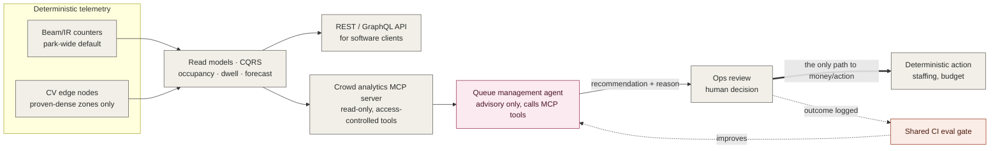
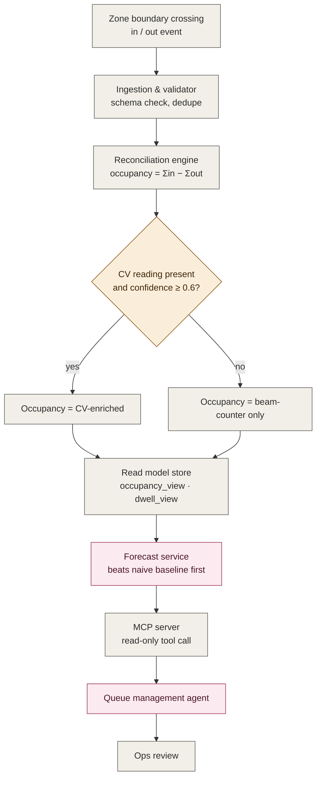

# ADR-001: Hybrid Deterministic-First Sensing with Layered AI Enrichment for Crowd & Popularity Analytics

## Status
**Accepted** (Step 1, described below, now including the MCP tool-calling surface). Step 2 (digital twin) is **Proposed**, gated on the readiness criteria in [002](002-adr-phased-rollout-crowd-and-popularity-analytics.md). This is one architecture built in sequence, not a separate optional phase.

## Related Documents
- [002: Phased Rollout](002-adr-phased-rollout-crowd-and-popularity-analytics.md)
- [C4 Diagrams: Crowd & Popularity Analytics](c4-diagrams.md)
- [Confidence Calibration Design Note](confidence-calibration-design-note.md)

## Context

| Factor | Why it matters |
|---|---|
| No visibility into which zones are actually popular | No basis for staffing or capex decisions, and guests have no wait-time visibility, so crowds concentrate instead of spreading out on their own. |
| Stripped of AI framing, this is a counting problem | Occupancy, dwell time, and throughput are arithmetic on one signal: people crossing a boundary (Little's Law, `W = L / λ`). |
| WiFi is patchy park-wide | Any device here needs to survive dropouts, the same constraint the edge-to-cloud MQTT contract already solves once, park-wide. |
| MQTT/edge hardware budget is finite, shared with Animal Care and Ticketing | Instrumenting every zone with camera-grade hardware from day one isn't affordable. |
| Beam/IR counters lose accuracy above roughly 4 to 5 people per square metre | Full computer vision everywhere is neither affordable nor necessary, since most zones never reach that density. |
| More than one consumer needs this data (the Queue agent today, Guest Concierge and a future Pricing agent tomorrow) | A bespoke API integration per consuming agent doesn't scale as the estate's agent ecosystem grows. |

**Driving question:** how do we count people accurately enough to run the business, without overspending on hardware or exposing visitor privacy, and where does AI actually earn its place on top of that count, rather than replacing it?

## Diagram: System View

| Symbol | Meaning |
|---|---|
| Gray | Deterministic component, including the REST API and the MCP tool-calling surface. |
| Pink | AI/LLM component. |
| Coral | Verification/eval loop. |
| Bold arrow | The only path that can touch money or action. |
| Dashed arrow | Feedback/logging, not a live decision path. |

## Decision

| Aspect | Decision |
|---|---|
| **Sensing** | Beam/IR counters park-wide as the default. CV is added only in zones proven dense by counting data, and it never streams raw frames, only a count, a density, and a confidence score. |
| **Confidence handling** | Below the threshold (illustrative 0.6), the system automatically falls back to beam-counter-only. A low-confidence reading is never silently trusted. |
| **Forecasting** | A lightweight classical time-series model, benchmarked against a naive baseline before it ships, not deep learning, not an LLM. |
| **Agent** | One narrow, read-only Queue Management Agent, with no persistent memory and no write access to actuation or scheduling. |
| **Data access** | Two facades: a REST/GraphQL API for software clients, and a new Crowd Analytics MCP Server (read-only tools) for AI agents. Every tool is access-controlled per calling agent. |
| **Financial control** | **Financial Isolation Principle**: no AI component ever computes, approves, or touches a monetary figure. Only a human, via Ops Review, does. |

## Diagram: Decision Flow

| Symbol | Meaning |
|---|---|
| Gray | Deterministic step. |
| Amber diamond | The confidence gate enforcing "no false precision." |
| Pink | Learned/AI component. |
| Path | Shows one event's actual journey from sensor to human review. |

## AI Resilience

| AI Risk | Mitigation |
|---|---|
| Provider lock-in | All model calls route through the Common LLM Gateway (a shared Open Host Service), so swapping providers is a gateway-level change, not a per-context rewrite. |
| Price/availability flux | Agent call volume scales with zone-clusters × check frequency (roughly 580/day), not visitor count, so cost is decoupled from the 3x growth target. The gateway owns fallback-model routing. |
| Non-determinism | Every recommendation is schema-validated at runtime (a guardrail) and checked in CI against a golden set of ops-labelled historical snapshots before any change ships (an eval). |
| Drift | Confidence calibration is fit per zone against two independent ground-truth sources, not the beam counter alone, on a governed recalibration cadence. See the [Confidence Calibration Design Note](confidence-calibration-design-note.md). |
| Contract stability | MCP tool contracts (`get_zone_occupancy`, `get_zone_forecast`, `get_popularity_ranking`, and Step 2's `simulate_scenario`) are versioned, so a schema change is never silent. |
| Access scope | Each consuming agent is granted only the specific tools it needs. No agent gets blanket access just for being "an agent." |

## Risks & Trade-offs

| Type | Point | Detail |
|---|---|---|
| ✅ Positive | No new privacy exposure | Counting stays aggregate and anonymous. |
| ✅ Positive | Cost scales with proof, not hope | CV is added only where the data justifies it. |
| ✅ Positive | Nothing here can block a guest at a gate | The system degrades gracefully if the LLM gateway is down. |
| ✅ Positive | Cheap at scale | AI cost per 1,000 visitors rounds to zero. |
| ✅ Positive | One interface, not N bespoke integrations | Every future agent reuses the same MCP tools. |
| ⚠️ Trade-off | Beam counters stay weak in dense crowds | Until CV is justified there by the data. |
| ⚠️ Trade-off | A few minutes of staleness is baked in | Fine for staffing decisions, not for anything transactional. |
| ⚠️ Trade-off | The chokepoint assumption may not hold everywhere | Open plazas and festival grounds are the likely exception. |
| ⚠️ Trade-off | The 0.6 confidence threshold is illustrative | See the [Confidence Calibration Design Note](confidence-calibration-design-note.md) for the real tuning procedure. |
| ⚠️ Trade-off | FinOps assumptions need rework as usage grows | The roughly 580 calls/day estimate assumes today's consumers only; it changes once the MCP server opens to more of them. |
| ⚠️ Trade-off | The tool schema is now a contract | Other teams will depend on it, so changing it later is a breaking-change conversation. |

## Alternatives Considered

| Alternative | Why Rejected |
|---|---|
| WiFi/BLE MAC-address probing | Violates the aggregate/anonymous requirement outright. |
| Streaming raw camera frames to the cloud | The single biggest unnecessary attack surface available, and it violates the edge-anonymisation mandate. |
| Computer vision park-wide from day one | Cost and power availability don't support it, and most zones never reach the densities where beam counters actually fail. |
| Deep-learning or LLM-based forecasting | A classical time-series model already beats the naive baseline at a fraction of the compute and explainability cost. |
| Persistent agent memory or write access | No proven payoff yet, and it would break the safety-critical separation between AI and actuation. |
| Bespoke point-to-point integration per consuming agent | Doesn't scale as more agents need this data, and duplicates the same read/access logic per integration. |

## Requirements Traceability

| Addresses | Requirement | Status |
|---|---|---|
| Crowd density estimation | Estimate crowd density via edge CV in proven-dense zones | Covered, see Decision |
| Occupancy & queue forecasting | Forecast per-zone occupancy/queue time vs. a naive baseline | Covered, see Decision |
| Agent advisory output | Queue Management Agent gives an advisory recommendation with a stated reason | Covered, see Decision |
| Read-only agent access | Agent has read-only tool access only | Covered, see Decision, extended by the MCP access-control requirement below |
| Financial isolation | Financial Isolation Principle | Covered, see Decision |
| Eval logging | Every ops review outcome is logged and feeds the eval dataset | Covered, see AI Resilience |
| **MCP access control** *(new)* | MCP tools are read-only and access-controlled per calling agent | Covered, see Decision and AI Resilience |
| **Digital twin tool** *(draft)* | Digital twin `simulate_scenario` tool, Step 2 | Covered in [002](002-adr-phased-rollout-crowd-and-popularity-analytics.md), not yet built |

## Conclusion
A deterministic, beam-counter-first architecture, with computer vision and AI layered on only where the data proves it's needed, gives the estate an honest, cheap, privacy-safe count today, a forecast and an advisory agent on top of it, and a single MCP tool-calling surface any future agent can reuse instead of a bespoke integration. The same read models, the same agent, and the same CI gate carry the estate through the phases in [002](002-adr-phased-rollout-crowd-and-popularity-analytics.md), each one pulled into existence by the estate's own growth curve rather than a calendar guess.

Every open item flagged in this document and its supporting notes, the chokepoint assumption, the calibration threshold, the twin's backtest, final FinOps pricing, is a pilot-phase validation step, not a missing decision. Each one already has a specified, reviewable procedure for how it gets resolved once the system is running.
