# ADR-002: Phased Rollout, Gated on Visitor Volume Not a Calendar Date

## Status
Step 1 is **Accepted** (see [001](001-adr-crowd-and-popularity-analytics.md)). Step 2 is **Proposed**. Step 3 is **Roadmap**, named to show a plan exists, not committed to.

## Context
- The full crowd and popularity analytics capability can't be built all at once: the digital twin in Step 2 needs training data that Step 1 hasn't produced yet, and the pricing reuse in Step 3 only makes sense once Step 2's own predictions have earned trust.
- Committing to a calendar date for each step would either ship something half-validated or delay something the estate has already outgrown.
- One architecture is being built in sequence here, not three separate optional projects that happen to share a name.

## Decision

| Step | Volume gate | Builds | Answers |
|---|---|---|---|
| **1: Ground truth & platform interface** *(Accepted)* | ~5,000/day and up | Beam+CV counters, per-zone forecast, one advisory Queue Management Agent, REST API + Crowd Analytics MCP Server | "How busy is this zone, and what's it about to look like?" |
| **2: Cross-zone prediction** *(Proposed)* | ~8,000 to 10,000/day | A learned transition graph plus a deterministic queueing calculation, exposed as one new `simulate_scenario` tool on the same MCP server and agent | "If X happens here, where does the crowd go, and when?" |
| **3: Platform reuse** *(Roadmap)* | ~12,000 to 15,000/day | The same `simulate_scenario` tool reused by Ticketing/Pricing, plus a stereo-vision upgrade where crush density is proven | Demand-shaping via pricing, once staffing and hardware alone can't absorb further growth |

Each step's gate is the estate's own visitor-volume curve, not a calendar date.

## Diagram

| Symbol | Meaning |
|---|---|
| Green | Shipped today. |
| Purple | Required next step, gated on real evidence, not optional, just not built yet. |
| Gray | Roadmap reuse, genuinely not committed. |

## Alternatives Considered

| Alternative | Why Rejected |
|---|---|
| Build all three steps up front | Step 2's model has nothing to train on until Step 1's ticket-scan history exists, so building it early just means building it twice. |
| Gate steps on a calendar date instead of volume | A date can arrive before the data needed to validate the next step exists, or long after the estate has already outgrown the current step. |
| Commit fully to Step 3 now | Reusing a simulation for a pricing decision only makes sense once Step 2's backtest has already earned trust internally; committing earlier would be a promise made ahead of the evidence. |

## Consequences and Tradeoffs

| Type | Point | Detail |
|---|---|---|
| ✅ Positive | Each step is justified by real evidence | Not by a plan drawn up in advance of the data. |
| ✅ Positive | Nothing is oversold | Step 3 is named to show a roadmap exists, and no more than that. |
| ⚠️ Trade-off | Step 2 ships only once its backtest passes at a defensible horizon | The prediction range is capped wherever confidence decays too far to be useful. |
| ⚠️ Trade-off | The order is fixed | A team eager to start Step 3 early has to wait for Step 2's trust to be earned first. |

## Conclusion
The build order is fixed by dependency, not preference: Step 2 needs Step 1's history to train on, and Step 3 needs Step 2's trust to reuse. Each step is pulled into existence by the estate's own growth curve, and Step 3 stays a named intention on a roadmap until the evidence says otherwise.
