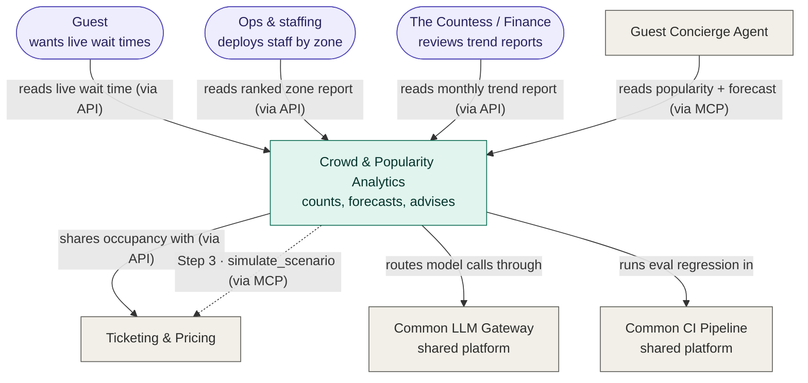
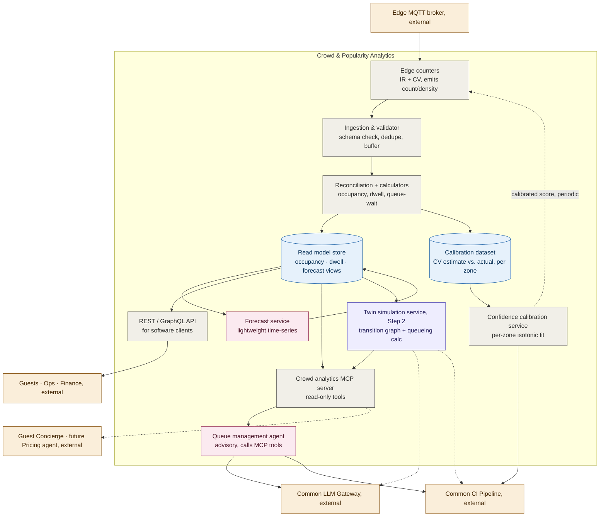
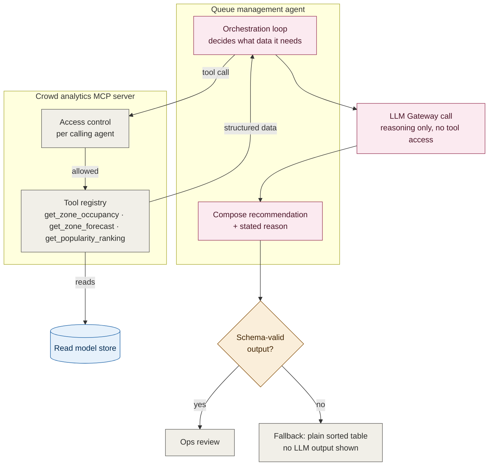
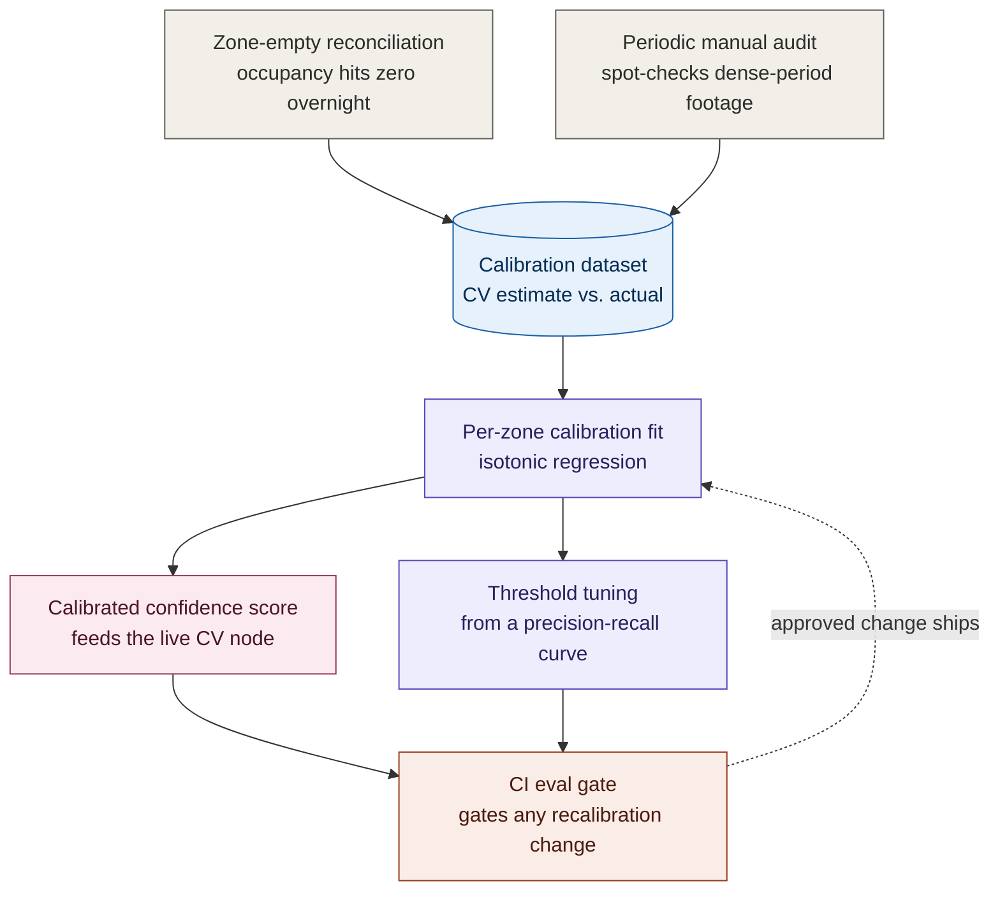

# C4 Diagrams: Crowd & Popularity Analytics

*Supports [001](001-adr-crowd-and-popularity-analytics.md). Diagram detail, not itself an architectural decision.*

## Level 1: System Context

| Symbol | Meaning |
|---|---|
| Stadium shapes | People (actors). |
| Rectangles | Software systems. |
| Purple | Actors. |
| Teal | The system this document describes. |
| Gray | Other systems it depends on or serves, owned elsewhere. |
| Dashed | Step 3 reuse, not yet built. |
| "(via API)" / "(via MCP)" labels | Which facade each relationship uses. |

---

## Level 2: Container

| Symbol | Meaning |
|---|---|
| Gray | Deterministic container, including the REST API, the MCP tool surface, and the confidence calibration service. |
| Blue cylinder | Data stores: the CQRS read models and the calibration dataset. |
| Pink | AI/learned container (calls an LLM or produces a forecast). |
| Purple | Step 2 container, required next but not yet built. |
| Amber | External system or consumer outside this bounded context. |
| Dashed arrow | A relationship that starts at Step 2/3, or a periodic/batch update rather than a live call. |

The Twin container is drawn solid, matching every other Step 1 container, because it's a required next step, not an optional maybe. Only its outward arrows to the LLM Gateway and CI Pipeline stay dashed, since those calls don't happen until Step 2 ships. The same dashing marks the Step 3 relationship where other agents could call the twin's `simulate_scenario` tool directly through MCP, once it's proven. The confidence calibration service is new this round; its full mechanism is in the [Confidence Calibration Design Note](confidence-calibration-design-note.md).

---

## Level 3a: Component, Queue Management Agent and MCP Server

The targeted AI-subsystem deep-dive: where exactly the LLM is called, and what it is, and isn't, allowed to do on its own.

| Symbol | Meaning |
|---|---|
| Pink | Components that reason or call an LLM. |
| Gray | Deterministic components, including the entire MCP server. |
| Blue cylinder | The CQRS read-model store. |
| Amber diamond | The guardrail deciding whether the LLM's output is trusted or discarded. |

**Why this diagram matters:** the LLM itself never calls a tool with open-ended autonomy. The orchestration loop, plain deterministic code, decides what data is needed and fetches it through MCP's access-controlled tool registry before the LLM is invoked. The LLM's only job is composing a recommendation and a stated reason from data it's handed, and that output still has to clear a schema guardrail before a human ever sees it. This is the concrete answer to "where does non-determinism enter the pipeline": it enters in exactly one place, and it's fenced on both sides.

---

## Level 3b: Component, Confidence Calibration Mechanism

The second targeted AI-subsystem deep-dive: how a raw CV model score becomes a trustworthy, per-zone confidence number, and what breaks the circularity of validating CV against the exact sensor (beam counters) it's meant to outperform.

| Symbol | Meaning |
|---|---|
| Gray | Ground-truth sourcing, deterministic/procedural. |
| Blue cylinder | The labelled calibration dataset. |
| Purple | The statistical fitting/tuning process. |
| Pink | The calibrated artefact that actually ships to production. |
| Coral | The governance gate any change must clear. |
| Dashed | An approved change flowing back into the live calibration. |

**Why this diagram matters:** the beam counter can't be the calibration reference, because it's specifically unreliable in the exact dense conditions CV's confidence score most needs validating against. Calibrating against a broken reference would just teach CV to agree with a wrong answer. Two independent sources break that circularity: zone-empty reconciliation (free, continuous, but blind mid-day) and periodic manual audits (sparse, but the only real ground truth in dense conditions). The full mechanism, including cold-start behaviour for a brand-new CV zone with no calibration history yet, is in the [Confidence Calibration Design Note](confidence-calibration-design-note.md).
