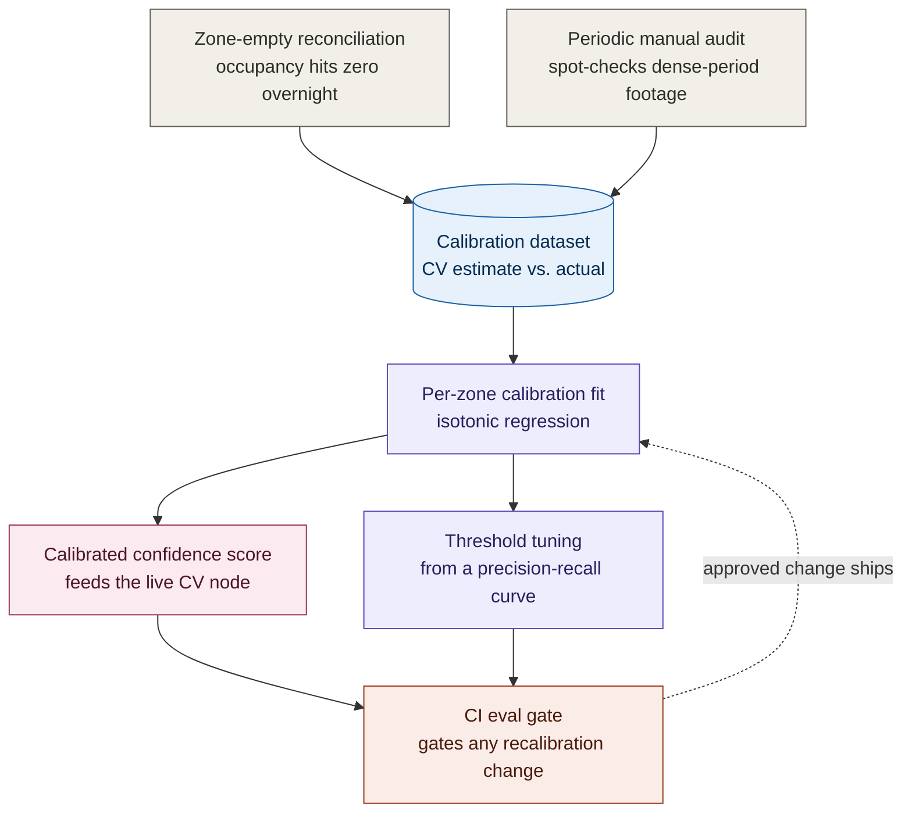

# Confidence Calibration Design Note: Crowd & Popularity Analytics

*Supports [001](001-adr-crowd-and-popularity-analytics.md)'s AI Resilience section. This is implementation-level design detail, not an architectural decision, it can change without reopening the ADR.*

## 1. The Problem

CV edge nodes are only deployed in zones already proven dense by beam-counter data. That means the beam counter, the obvious calibration reference, is specifically unreliable above roughly 4 to 5 people per square metre, exactly the density band CV's confidence score most needs validating. Calibrating against a broken reference would just teach CV to agree with a wrong answer, so two independent, beam-counter-free ground-truth sources are used instead.

## 2. Ground-Truth Sources

| Source | Frequency | Cost | Valid density range | What it catches |
|---|---|---|---|---|
| **Zone-empty reconciliation** | Continuous, every close/reset | Free (existing data) | Any density, but only end-of-period | Cumulative drift between CV's running total and the known-zero reset point. |
| **Periodic manual audit** | Sampled, e.g. weekly per zone | Staff time | Valid at any density, including crush | Real ground truth in the moment, including dense conditions reconciliation can't see. |

Neither source alone is enough: reconciliation is free but blind mid-day, and the audit is valid mid-day but too sparse to run continuously.

## 3. Calibration Dataset

Recorded per observation: `zone_id`, `timestamp`, raw model confidence score, CV occupancy estimate, ground-truth value (when available, tagged by source), and density band. This is kept as its own store, separate from the operational read models (`occupancy_view`, `dwell_view`), since it's a training/monitoring artefact, not a live query surface.

## 4. Fitting Method

| Method | Data needed | Assumes | Verdict |
|---|---|---|---|
| Platt scaling | Low | A sigmoid-shaped relationship between raw score and true probability | Fine for a brand-new zone with little data. |
| **Isotonic regression** *(default)* | Medium to high | Only that the relationship is monotonic, no shape assumption | Preferred once a zone has enough samples, and more honest about the actual error curve. |

The fit is done per zone, not park-wide, because lighting, camera angle, and crowd behaviour differ enough per zone that a single global calibration would average away real, zone-specific bias.

## 5. Evaluating Calibration Quality

| Concept | What it means here |
|---|---|
| Reliability diagram | Bucket predictions by stated confidence, then compare each bucket's actual accuracy against the diagonal (perfectly calibrated) line. |
| Expected Calibration Error (ECE) | The average gap between stated confidence and actual accuracy, weighted by bucket size. |
| **CI gate rule** | Reject a recalibration if it produces a worse ECE than the currently deployed table on the same held-out set, the same "beat the incumbent" discipline as the forecast model's naive baseline. |

## 6. Threshold Tuning (Replacing the Illustrative 0.6)

| Term | Definition |
|---|---|
| Precision | Of readings above the threshold, what fraction were actually accurate. |
| Recall | Of the genuinely dense periods, what fraction did the system correctly trust CV for. |
| **Selection rule** | Pick the threshold that minimises the false-trust rate, while keeping recall high enough that CV isn't sitting unused in the zones it was purchased to cover. |

This replaces "0.6" with a number derived from a documented procedure, once real data exists to run it on.

## 7. Recalibration Cadence & Governance

- Recompute weekly per zone, or immediately after a defined number of new manual-audit samples land, whichever comes first.
- Every recalibration runs the CI eval gate (Section 5). A failed gate keeps the currently deployed calibration live rather than auto-promoting a worse one.

## 8. Cold Start: New CV Zones

- A newly instrumented zone starts with zero calibration history.
- Until a defined minimum accumulates (for example, one full week of reconciliation data plus at least one manual audit), that zone's CV confidence is never trusted above a conservative park-wide default.
- Occupancy falls back to beam-counter-only in the meantime, the same fallback behaviour as any low-confidence reading, just triggered by "insufficient history" rather than "low score." This is also the direct answer to a brand-new zone having no track record yet.

## 9. Mechanism Diagram

| Symbol | Meaning |
|---|---|
| Gray | Ground-truth sourcing, deterministic/procedural. |
| Blue cylinder | The labelled calibration dataset. |
| Purple | The statistical fitting/tuning process. |
| Pink | The calibrated artefact that actually ships to production. |
| Coral | The governance gate any change must clear. |
| Dashed | An approved change flowing back into the live calibration. |

This diagram also appears as Level 3b in [c4-diagrams.md](c4-diagrams.md), the container-level view's targeted AI-subsystem deep-dive; it's repeated here so this note is readable standalone.

## 10. What This Resolves, and What It Doesn't

This document turns "0.6 is illustrative" into a fully specified procedure for producing a real number: ground-truth sourcing, fitting method, evaluation metric, and threshold-selection process are all now explicit. It does **not** produce the number itself, since that requires real operating data, which doesn't exist yet. That remains an open item, now with a documented path to closing it rather than an unexplained placeholder.
