# ADR-001: Store-and-Forward MQTT as the Edge-to-Cloud Contract

## Status
Accepted

## Date
16 September 2026

## Context
- Gates and edge devices constantly produce events: ticket scans, occupancy counts, fraud signals, and animal-welfare telemetry.
- WiFi across the estate is patchy, so the link between edge and cloud will drop regularly.
- We cannot lose a single scan during an outage. A dropped scan means a paying visitor is turned away, a fraudulent one slips through, or the reconciliation numbers stop adding up.
- The hardware budget assumes MQTT-capable devices, and MQTT is already our event backbone (CQRS/EDA).
- So the real question is *how does an event survive a network outage and still arrive, exactly once, at the cloud?*

## Decision

| Aspect | Decision | Rationale |
|---|---|---|
| **Buffering** | Use MQTT with store-and-forward buffering at the edge: every device writes events to a local, persistent (on-disk) queue and forwards them to the cloud broker when the link returns. | Guarantees no event is lost while the link is down. |
| **Delivery guarantee** | Use QoS 1 (at-least-once) delivery with persistent sessions, not QoS 2. | Cheaper and faster over a flaky link than QoS 2's four-step handshake. |
| **Consumer design** | Make the cloud consumers idempotent: every event carries a unique event ID, and reconciliation de-duplicates on that ID. | At-least-once plus idempotent consumers is the standard robust pattern for unreliable links. |
| **Ordering** | Do not rely on MQTT for ordering. Events carry an edge timestamp + sequence number, and the cloud applies deterministic conflict-resolution rules (e.g. "first valid scan wins"). | Buffered events from different gates can sync out of order; ordering must be reconstructed explicitly. |

## Diagram

| Symbol | Meaning |
|---|---|
| Rounded box | Service / component |
| Amber box | Store-and-forward buffer (holds data during outage) |
| Bold arrow | Flush across the on-prem/cloud boundary on reconnect |

## Alternatives Considered

| Option | Verdict | Reason |
|---|---|---|
| Sync REST / HTTP to the cloud | Rejected | A dropped request loses the event unless we build our own retry-and-buffer layer, store-and-forward reinvented, badly. |
| MQTT QoS 2 (exactly-once) | Rejected | Handshake is slow and brittle over an unreliable link; buys little that QoS 1 + idempotent consumers don't buy more cheaply. |
| QoS 0 (fire-and-forget) | Rejected | No delivery guarantee. |

## Consequences and Tradeoffs

| Type | Point | Detail |
|---|---|---|
| ✅ Positive | Zero data loss during outages | That's the whole point: entry and revenue data survive hours-long WiFi drops. |
| ✅ Positive | Offline-first by design | The gate never waits on the network. |
| ✅ Positive | Loose coupling | Edge and cloud fail independently; neither blocks the other. |
| ✅ Positive | Cheap and lightweight | Fits the constrained hardware and finite budget. |
| ⚠️ Trade-off | Eventual consistency, not real-time | Acceptable, since entry decisions are made locally at the gate, not in the cloud. |
| ⚠️ Trade-off | Duplicates are expected | At-least-once means the cloud *will* see repeats; complexity is pushed into idempotent consumers rather than a fragile exactly-once transport. |
| ⚠️ Trade-off | Ordering must be reconstructed | Depends on timestamps, sequence numbers, and explicit reconciliation rules, not the broker. |
| ⚠️ Trade-off | Operational surface | A durable local queue and a broker bridge to run and monitor per zone. |
| 📈 Monitoring | How we'll know it's working | Track per-gate buffer depth (backlog during outages), reconnect-to-flush latency, and duplicate rate at the reconciliation layer; alert if buffer depth or duplicate rate trends abnormally, which signals a device or link fault. |

## Conclusion
QoS 1 store-and-forward guarantees no scan is ever lost over patchy WiFi. The only trade-off is duplicates, which is resolved cheaply and deterministically by de-duplicating on event ID in the cloud, giving us an offline-first, loss-free edge-to-cloud backbone.
