# ADR-002: Asymmetric Cryptography for Offline-Verifiable Ticketing

## Status
Accepted

## Context
- The estate has 40+ turnstiles and gates serving up to 15,000 visitors a day at target growth, and WiFi coverage across the grounds is patchy.
- A network call per scan is a single point of failure. The turnstile has to decide "let this person in" in under a second, with or without a link.
- Most tickets are bought in advance through the app, but some are bought at the gate, and a gate sale can happen exactly when the link is down, since patchy WiFi doesn't wait for a convenient moment.
- Family passes need to admit up to N people, possibly through different gates, without becoming N separate full-price tickets or opening a duplicate-admit loophole.
- Whatever signs a ticket has to be trusted by every turnstile on the estate, and that trust can't depend on the network being up at the moment of the scan.

## Decision

| Aspect | Decision | Rationale |
|---|---|---|
| **Asymmetric signing** | The central Ticketing service signs every ticket with the estate's Ed25519 private key. Turnstiles and kiosks carry only the matching public key and verify signatures locally, with no round trip. | Verification never needs a network call, which is exactly what a patchy-WiFi estate needs. |
| **Private key stays in the cloud KMS** | The private key never leaves cloud KMS. Turnstiles and kiosks hold only the public key, distributed and rotated during normal connectivity. | A compromised turnstile can verify tickets, but it can never forge one. |
| **Self-contained ticket payload** | Ticket ID, pass type, valid date, family/sub-ID where relevant, and expiry all live inside the signed payload. | A turnstile can verify authenticity and validity with no external lookup at all. |
| **Family passes as one N-admit token** | A family pass is one signed token carrying a distributed admits-remaining counter, not N separate child tickets. | Any family member can enter through any gate without a duplicate-admit race, and there's only one counter to reconcile, not N identities. |
| **Offline gate sales from a pre-signed voucher pool** | Each kiosk and turnstile is pre-loaded, while online, with a small batch of pre-signed, single-use admission vouchers. A gate sale during an outage issues one from local stock against a locally recorded payment, and it reconciles like any other local ledger entry on reconnect. | Solves the offline gate-sale case without ever putting signing authority or a private key on-site. |
| **Local redemption ledger** | Every turnstile marks a ticket ID redeemed locally the instant it's used, and syncs that redemption via MQTT QoS 1 store-and-forward on reconnect. | Catches a screenshotted or duplicated QR against the local ledger even offline, and estate-wide the moment the sync lands. |
| **Scheduled key rotation** | The signing key rotates on a routine cadence during connectivity. Turnstiles accept both the current and the immediately-previous public key. | Stops a rotation that happens mid-outage from stranding a device that hasn't synced yet. |

## Diagram

| Symbol | Meaning |
|---|---|
| Red | Where the private key lives. It never appears anywhere else on this diagram. |
| Green | On-estate edge devices; they hold only the public key. |
| Gray | Deterministic services and infrastructure. |
| Dashed arrow | Provisioning or replenishment that only happens while online. |
| Solid arrow | The path that still works with the link down. |

## Alternatives Considered

| Alternative | Why Rejected |
|---|---|
| Delegated edge private keys on HSM/TPM hardware per gateway | Puts signing authority and secret material on-site at 40+ locations, a far bigger attack surface than a single cloud KMS, and needs HSM/TPM hardware the funded budget doesn't call out. |
| Physical smart cards or NFC wearables | Issuing, recovering, and sanitising thousands of physical tokens a day is a logistics and cost burden a signed QR code avoids entirely. |
| A shared symmetric secret (HMAC) at every gate | One shared secret compromised at any single gate lets someone forge tickets estate-wide. Asymmetric keeps every verification-only device unable to forge, no matter how many are compromised. |
| Synchronous central verification, a network call per scan | This is the exact single point of failure and network dependency the estate's patchy WiFi rules out. |
| No offline gate-sale capability, app/web purchase only | A real minority of visitors will want to buy at the gate, and turning them all away during an outage is worse than serving them from a small pre-signed voucher pool. |

## Consequences and Tradeoffs

| Type | Point | Detail |
|---|---|---|
| ✅ Positive | Verification never depends on the network | It's local and near-instant at every turnstile. |
| ✅ Positive | A compromised edge device can't forge tickets | It never holds the private key, only the public one. |
| ✅ Positive | Family passes are simpler to issue and revoke | One N-admit token instead of managing N separate child tickets. |
| ⚠️ Trade-off | The voucher pool is finite | A long outage combined with unexpectedly high gate-sale demand could exhaust it. This is a sizing and monitoring problem to plan for, not a hidden one. |
| ⚠️ Trade-off | Key rotation has to be planned around connectivity | A device that misses several rotations in a row during an extended outage needs a defined recovery path. |
| ⚠️ Trade-off | Reconciliation can surface conflicts | For example the same voucher redeemed at two gates due to a sync race. This needs a deterministic tie-break rule, not a human reviewing every case. |

## Conclusion
Asymmetric signing with Ed25519 keeps ticket verification fully offline and keeps forging power out of reach of any single compromised edge device, since only the cloud KMS ever holds the private key. Family passes are one signed N-admit token, not N tickets, and the rare offline gate sale is served from a pre-signed voucher pool rather than by pushing signing authority out to the edge.
