# ADR-003: The Two-Plane Safety Model, Deterministic Transactional vs Non-Deterministic Advisory

## Status
Accepted

## Date
16 September 2026

## Context
- The estate wants AI woven into nearly every sub-problem: pricing, animal welfare, footfall, visitor concierge. At the same time, nothing about money, access, or animal safety can be allowed to depend on a model's judgement.
- A model's mistake and a code bug fail differently. A bug is at least reproducible. A model can be confidently wrong in a way that looks exactly like being confidently right, and that difference has to be designed for, not discovered in production.
- Different sub-problems keep arriving at the same shape of answer independently: ticketing keeps AI out of the money path entirely, animal welfare requires a human before any action, pricing requires a human for anything but routine changes. That repetition is a sign this deserves one shared rule instead of four separate ones.
- Judges are explicitly asked to check whether the architectural characteristics of AI additions match the rest of the system. Without one stated rule, every sub-problem would have to justify its own safety boundary from scratch.

## Decision

| Element | Nature | What it covers |
|---|---|---|
| **Transactional plane** | Deterministic | Ticketing, payments, family-pass entitlement, access control, and the audit log. Governed, testable, and repeatable, the same code run against the same input always gives the same output. |
| **Advisory plane** | Non-deterministic | Every AI component in the platform: Augur, Guide, Ark, footfall analytics, the profitability advisor. It can observe and propose, but it can never move money or open a gate by itself. |
| **Deterministic Decision Gate** | Deterministic | The only bridge between the two planes. A proposal from the Advisory plane enters as data; the gate applies fixed rules and policy; only an approved, audited action is ever emitted into the Transactional plane. |

## Diagram

| Symbol | Meaning |
|---|---|
| Blue | The Transactional plane; deterministic, governed, and testable. |
| Pink | The Advisory plane; every AI component in the platform lives here. |
| Amber | The Deterministic Decision Gate, the only crossing point between the two. |
| Dashed arrow | A proposal, data only, never a live action. |
| Bold arrow | An approved, audited action, the only thing that ever reaches the Transactional plane. |

## Alternatives Considered

| Alternative | Why Rejected |
|---|---|
| Let each sub-problem define its own AI safety boundary | Ticketing, animal welfare, and pricing all independently arrived at the same shape of rule. Four separately-justified boundaries are four chances to get the boundary slightly wrong, where one shared rule is one chance to get it right. |
| Allow AI to act directly within a pre-approved range (e.g. small price changes) | Even a bounded range is still an AI component touching money or access on its own, which reopens exactly the failure mode this ADR exists to close. |
| Human-in-the-loop for every AI output, with no gate | Doesn't scale. A human reviewing every footfall forecast or every welfare data point isn't a safety mechanism, it's a bottleneck that gets rubber-stamped once the volume gets high enough. |
| No structural separation, rely on testing and code review alone | Non-determinism isn't caught by the same review process that catches a logic bug. A model can pass every test on Tuesday and be subtly wrong by Thursday, structural separation is what contains that regardless of when it happens. |

## Consequences and Tradeoffs

| Type | Point | Detail |
|---|---|---|
| ✅ Positive | Every sub-problem gets AI everywhere it adds value | Without individually re-litigating what's safe, because the boundary is already decided once, here. |
| ✅ Positive | A bad AI proposal has a bounded blast radius | The worst a wrong or stale proposal can do is get rejected or delayed at the gate, never a wrong transaction. |
| ✅ Positive | Judges (and engineers) only have to check one rule | Not one custom safety argument per sub-problem. |
| ⚠️ Trade-off | The gate is a mandatory extra step on every AI-influenced action | Even an obviously-correct proposal still has to clear it, which is deliberate friction, not an oversight. |
| ⚠️ Trade-off | The rule constrains what "AI-driven" can mean on this platform | Some genuinely useful automation (e.g. a fully autonomous pricing bot) is ruled out by design, not because it wouldn't work, but because it would break this boundary. |
| ⚠️ Trade-off | Every new sub-problem has to be placed correctly on the spine | Getting a component's plane wrong (treating an advisory signal as transactional, or vice versa) is the one mistake this model doesn't protect against by itself. |

## Conclusion
Money, access, and audit stay deterministic. Every AI component lives in the Advisory plane and can only ever propose. The Deterministic Decision Gate is the one place a proposal can become an action, and it's the same gate for every sub-problem on the estate, not a different safety argument for each one.
