# ADR-005: Edge-vs-Cloud Computer-Vision Inference Placement

## Status
Accepted

## Date
16 September 2026

*This is a platform-wide placement rule. `animal_monitoring/006` and `footfall_and_popularity/001` each apply it to their own domain; this record is where the rule itself is decided so both don't have to justify it separately.*

## Context
- Computer vision shows up in at least two places on the estate: counting the piranha population, and estimating footfall/occupancy. Both need a placement decision: does inference run on-estate or in the cloud?
- The estate's WiFi is patchy, and neither piranha counting nor occupancy counting can afford to depend on a link that regularly drops.
- Uploading raw camera frames to the cloud is both a bandwidth problem (the backhaul can't carry continuous or even frequent frame uploads) and a privacy problem (raw frames may contain visitor faces).
- Small, tuned, single-purpose models (a piranha counter, an occupancy counter) consistently outperform general-purpose cloud models on these specific counting tasks, since a general model has never seen this specific tank or this specific zone's camera angle and lighting.
- Not every vision workload is like this. Heavier, non-time-sensitive analysis (retraining a model on months of footage, generating a batch report) doesn't have the same latency or bandwidth constraint.

## Decision

| Aspect | Decision | Rationale |
|---|---|---|
| **Latency/privacy/cost-sensitive CV runs at the edge** | Counting and safety-relevant inference (piranha counting, occupancy/footfall counting) runs on-estate, on Lookout's edge GPU boxes. Only derived numbers (a count, a density, a confidence score) ever leave the device. | Removes the network dependency for anything time-sensitive or safety-relevant, and keeps raw imagery off the wire entirely. |
| **Heavier, batch analysis runs in the cloud** | Model retraining, longer-horizon trend analysis, and anything that isn't needed in near-real-time runs in the cloud against anonymised, already-processed data. | These workloads can tolerate cloud latency and benefit from more compute than an edge box can offer. |
| **Only anonymised data crosses the boundary** | Whatever does leave the estate (for training or batch analysis) has already had identity stripped at the edge, per the Edge Anonymiser (`ADR-006`). | The edge/cloud placement decision and the anonymisation decision work together: nothing that could identify a visitor is ever a candidate for cloud placement in the first place. |
| **Model tuning happens per-deployment, not generically** | Each edge vision model (piranha counter, a given zone's occupancy counter) is tuned on footage from its own camera and conditions, not treated as a generic, swappable component. | A general-purpose model consistently underperforms a small model tuned on the specific tank or zone it's watching. |

## Diagram

| Symbol | Meaning |
|---|---|
| Green | On-estate edge inference; raw imagery never leaves this box. |
| Amber | The only thing that crosses the boundary: a derived number, never a frame. |
| Blue | Cloud-side batch work, which can tolerate latency and needs more compute. |

## Alternatives Considered

| Alternative | Why Rejected |
|---|---|
| Stream raw camera frames to a cloud vision API | Fails on bandwidth (the backhaul can't carry it), fails on privacy (raw frames may contain visitor faces), and a general-purpose cloud model underperforms a small model tuned on the specific tank or zone. |
| Run every vision workload on the edge, including retraining | Edge GPU boxes don't have the compute budget for retraining against months of footage; this work genuinely benefits from cloud-scale compute and doesn't have a latency constraint. |
| Run every vision workload in the cloud, including counting | Reintroduces the exact network dependency and bandwidth problem this decision exists to avoid, for the workloads that are the most latency- and safety-sensitive on the estate. |
| One generic, shared vision model across all cameras | A single generic model has never seen this specific camera's angle, lighting, or subject, and consistently loses to a small model tuned on its own deployment's footage. |

## Consequences and Tradeoffs

| Type | Point | Detail |
|---|---|---|
| ✅ Positive | Counting and safety signals work with no network dependency | The piranha escape alert and occupancy counts keep working through a WiFi outage. |
| ✅ Positive | No raw imagery ever needs to cross the estate boundary | Bandwidth stays low, and privacy exposure is minimised at the source rather than filtered afterward. |
| ✅ Positive | Each deployment gets a model tuned to its own conditions | Rather than a generic model that's mediocre everywhere. |
| ⚠️ Trade-off | Edge hardware is a real, per-deployment cost | Every new counting use case needs its own GPU box and tuning effort, not just a cloud API call. |
| ⚠️ Trade-off | Edge models need their own retraining and drift-monitoring cadence | Since each one is tuned to specific conditions, a physical change (camera moved, lighting changed) can silently degrade a model tuned to the old conditions. |
| ⚠️ Trade-off | This rule doesn't optimise for the workloads it excludes | A genuinely latency-tolerant batch job placed on the edge anyway would be wasting edge compute that a counting task needs. |

## Conclusion
Latency-, privacy-, and cost-sensitive computer vision runs on the edge, tuned to its own deployment, and only ever sends derived numbers off the estate. Heavier, non-time-sensitive analysis runs in the cloud against already-anonymised data. The same rule backs both the piranha count and footfall/occupancy counting, so neither domain has to justify the placement choice on its own.
