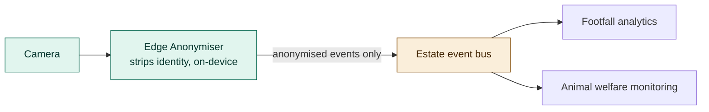

# ADR-006: Edge Anonymiser, No Faces Leave the Estate

## Status
Accepted

## Date
16 September 2026

## Context
- Cameras on the estate serve two purposes that both touch visitor privacy: footfall/occupancy counting, and animal-enclosure monitoring where visitors are incidentally in frame.
- The estate's exotic-animal collection was previously private and is only now opening to the public, so there's no existing visitor expectation of being filmed here, unlike, say, a ride queue with a visible camera.
- The EU AI Act and Digital Fairness Act both treat identifiable imagery, and any inference drawn from it, as carrying real regulatory weight, not a hypothetical one.
- Every consumer of this camera data (footfall analytics, welfare monitoring) needs a count or a behavioural signal, not an identity. Nothing downstream actually requires knowing who was in frame.

## Decision

| Aspect | Decision | Rationale |
|---|---|---|
| **Identity is stripped at the edge** | Faces and other identifying detail are removed from camera frames before any event derived from them is published to the estate's event bus. This happens on the same edge device as the camera, not downstream. | If identity is stripped before the data leaves the device, there's no point downstream where a raw, identifiable frame could leak or be misused. |
| **No raw frames leave the device** | Only anonymised, derived data (a count, a density, a behavioural flag) is ever published. The raw frame itself never crosses the device boundary. | Matches the placement rule in `ADR-005`: only derived numbers are candidates for leaving the edge at all. |
| **This is privacy-by-design, not a policy** | The anonymisation happens in code, on every frame, unconditionally. There's no configuration flag or code path that publishes a raw, identifiable frame. | Consistent with this platform's general principle that controls are enforced, not requested; see `ADR-003`. |
| **Applies uniformly to footfall and welfare CV** | The same Edge Anonymiser is used wherever a camera feeds either footfall analytics or animal-welfare monitoring. | One anonymisation mechanism to build, test, and trust, rather than a separate one per consumer. |

## Diagram

| Symbol | Meaning |
|---|---|
| Green | On-device processing; the raw frame never leaves this box. |
| Amber | The event bus, which only ever carries already-anonymised data. |

## Alternatives Considered

| Alternative | Why Rejected |
|---|---|
| Anonymise in the cloud, after upload | Requires uploading raw, identifiable frames first, which is the exact exposure this decision exists to avoid; a breach or misconfiguration anywhere between the camera and the cloud anonymisation step would leak identifiable footage. |
| Blur or redact only in the UI layer | The raw, identifiable frame still exists in storage and in transit; a UI-level redaction is cosmetic, not a real privacy control. |
| Retain identity but restrict access via permissions | Access controls can be misconfigured or bypassed; removing the identifying data at the source means there's nothing to leak even if a downstream permission fails. |
| Anonymise only for footfall, not welfare monitoring | Welfare cameras incidentally capture visitors too, and there's no principled reason those frames deserve less protection than footfall cameras. |

## Consequences and Tradeoffs

| Type | Point | Detail |
|---|---|---|
| ✅ Positive | No faces or identifiable frames ever leave the estate | Removes an entire class of privacy and regulatory risk at the source, rather than managing it downstream. |
| ✅ Positive | One mechanism serves every camera-based use case | Consistent behaviour and a single thing to test and audit, instead of a bespoke anonymisation step per consumer. |
| ✅ Positive | Aligns with the EU AI Act and Digital Fairness Act | By design, not as an afterthought applied once regulators asked. |
| ⚠️ Trade-off | Anonymisation runs on every edge device with a camera | Adds compute cost and complexity to every camera deployment, not just a subset. |
| ⚠️ Trade-off | Some downstream analysis that would benefit from raw imagery is foreclosed | For example, a future capability that wanted to distinguish individual visitors for a legitimate reason would need a separate, explicitly-justified decision, not a bypass of this one. |
| ⚠️ Trade-off | The anonymiser itself becomes a component that must never regress | A bug that lets a raw frame through undermines the entire privacy guarantee, so this component carries a higher correctness bar than most. |

## Conclusion
Identity is stripped at the edge, on the same device as the camera, before anything is published. No raw or identifiable frame ever leaves the estate, for footfall counting or for animal welfare monitoring alike, by construction, not by policy.
