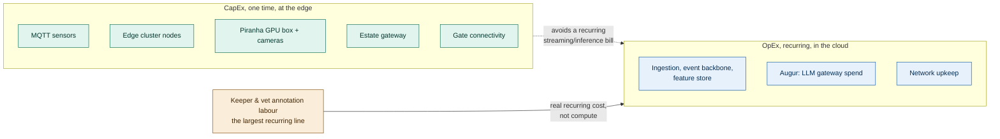

# ADR-007: Cost Model and Investment Strategy, Edge CapEx to Hold Down Cloud OpEx

## Status
Proposed

## Related Documents
- [ADR-001: MQTT Store-and-Forward](ADR-001-store-and-forward-mqtt%20.md)
- [ADR-005: Edge vs Cloud CV Placement](ADR-005-edge-vs-cloud-cv-placement.md)
- [ADR-006: Edge Anonymiser](ADR-006-edge-anonymiser.md)
- [ADR-AI-001: Provider and Model Portability](ADR-AI-001-provider-and-model-portability.md)
- [Animal Monitoring ADR-006: Edge Vision for Piranha Counting](../animal_monitoring/006-adr-edge-vision-for-piranha-counting.md)

## Context

| Factor | Why it matters |
|---|---|
| Every prior platform ADR made an edge-vs-cloud or provider call partly on cost grounds | The actual numbers were never gathered in one place, so a Finance sign-off or a judge has nowhere to look. |
| The brief funds MQTT edge hardware, not a blank cheque for compute | Every CV or AI placement decision is also a spending decision, not just a technical one. |
| The estate's growth target is 5,000 to 15,000 daily visitors within three years | The investment has to survive that curve, not get re-costed every time it moves. |
| Streaming raw video or running every model in the cloud looks free until the bill arrives at scale | [ADR-005](ADR-005-edge-vs-cloud-cv-placement.md), [ADR-006](ADR-006-edge-anonymiser.md), and [animal_monitoring/006](../animal_monitoring/006-adr-edge-vision-for-piranha-counting.md) already rejected that path on cost grounds without showing the arithmetic. |
| Reactive care and reactive staffing are the estate's status quo today | They carry a real cost, in emergency vet visits, overstaffed or understaffed zones, and lost repeat visits, even though none of it shows up on a hardware invoice. |

## Decision

| Aspect | Decision |
|---|---|
| **Investment shape** | Push spend into one-time CapEx at the edge (sensors, edge clusters, the piranha GPU box) wherever it removes a recurring cloud bill; keep OpEx to what the cloud is actually good at, aggregation, storage, and the LLM gateway. |
| **Gates get their own budget line** | Turnstile connectivity ([ticketing_and_access_control/003](../ticketing_and_access_control/003-adr-reentry-and-gate-connectivity.md)) is funded outside the general MQTT hardware budget, since it's the single highest-value place to invest in reliable connectivity. |
| **AI OpEx stays capped and visible** | Every model call routes through Augur ([ADR-AI-001](ADR-AI-001-provider-and-model-portability.md)), so LLM spend sits on one line and degrades by tier at the spend ceiling, instead of surprising Finance mid-month. |
| **The real recurring cost is labour, not compute** | Keeper and vet annotation time, calibration ground truth, piranha frame labelling, is the largest OpEx line here, and it's budgeted as its own line rather than hidden inside "AI cost." |
| **Illustrative figures, durable structure** | Every unit cost below is a placeholder for shape, not a vendor quote. What survives a real quote is the structure: what's CapEx, what's OpEx, and what recurs as coverage grows. |

### Infrastructure CapEx, one-time

| Component | Quantity | Unit cost (illustrative) | Total | Rationale |
|---|---|---|---|---|
| MQTT sensor nodes, feed-weight, water, environment | ~300 | $20 | $6,000 | The MQTT hardware budget the brief funds; feeds the deterministic backbone every sub-problem shares ([ADR-001](ADR-001-store-and-forward-mqtt%20.md)). |
| Edge cluster nodes, Jetson-class GPU/NPU | 12 | $250 | $3,000 | Runs Lookout CV and the Anonymiser per zone cluster, not per enclosure ([ADR-005](ADR-005-edge-vs-cloud-cv-placement.md), [ADR-006](ADR-006-edge-anonymiser.md)). |
| Piranha house GPU box + two PoE cameras | 1 | $4,500 | $4,500 | No marginal cost per frame once installed ([animal_monitoring/006](../animal_monitoring/006-adr-edge-vision-for-piranha-counting.md)). |
| Estate Gateway, ruggedised aggregation server | 1 | $3,000 | $3,000 | Single on-site uplink, aggregates every zone broker. |
| Gate/turnstile connectivity, funded separately | 40+ | $150 | $6,000 | A deliberate investment outside the general hardware budget ([ticketing_and_access_control/003](../ticketing_and_access_control/003-adr-reentry-and-gate-connectivity.md)). |
| Installation and commissioning labour | 1 | $6,000 | $6,000 | Physical deployment across a sprawling estate. |
| **Total CapEx** | | | **~$28,500** | |

### Cloud & AI OpEx, annual

| Service | Annual cost (illustrative) | Rationale |
|---|---|---|
| Cloud ingestion, event backbone, feature store | $3,000 | Telemetry and CQRS events every advisory service reads from. |
| Augur: LLM gateway spend, two providers plus a shadowed self-host | $400 to $2,200 | At $1 to $6/day depending on load; tracked centrally, not per capability ([ADR-AI-001](ADR-AI-001-provider-and-model-portability.md)). |
| Keeper and vet annotation, calibration labour | $4,800 | The real bill behind every learned model here, not the compute ([animal_monitoring/006](../animal_monitoring/006-adr-edge-vision-for-piranha-counting.md), [ADR-AI-003](ADR-AI-003-production-monitoring.md)). |
| Network and connectivity upkeep | $1,800 | Patchy WiFi zones, plus upkeep of the funded gate wiring. |
| **Total OpEx** | **~$10,000 to $11,800/year** | |

## Diagram

| Symbol | Meaning |
|---|---|
| Green | One-time capital spend, at the edge. |
| Blue | Recurring cloud spend. |
| Amber | Labour, the largest recurring line, and the one most often left off an "AI cost" estimate. |
| Dashed arrow | Cost avoided, not cost incurred: what the CapEx spend prevents from becoming a cloud bill. |

## What This Investment Is Actually Buying

| Status quo, reactive | With this architecture, proactive | Where it's decided |
|---|---|---|
| A welfare issue surfaces only when a keeper happens to notice, or the vet gets an emergency call | Feed/water sensors and CV give a leading indicator before the animal is visibly sick | [animal_monitoring](../animal_monitoring/README.md), [ADR-003](ADR-003-two-plane-safety-model.md) |
| A piranha escape is discovered after the fact, a public-safety incident | The splash sensor and edge inference flag it the moment it happens, with no dependency on the network | [animal_monitoring/006](../animal_monitoring/006-adr-edge-vision-for-piranha-counting.md) |
| Staffing is a guess; popular zones queue, quiet zones sit overstaffed | Occupancy and forecast give ops a number to staff against | [footfall_and_popularity/001](../footfall_and_popularity/001-adr-crowd-and-popularity-analytics.md) |
| One flat price, no read on what's actually driving repeat visits | A Pricing Advisor proposes, a human approves, and the effect gets measured, not assumed | [visitor_growth_profitability/001](../visitor_growth_profitability/001-adr-pricing-and-investment-advisor.md) |

None of these have a brief-stated dollar figure attached, see [README §15 Assumptions](../../../README.md#15-assumptions). This ADR doesn't invent one. The case for the investment is the failure modes it closes, not a projected saving nobody could audit.

## Alternatives Considered

| Option | Why Rejected |
|---|---|
| Cloud-only, no edge hardware | Reads as zero CapEx until the video-streaming and inference bill arrives at 15,000 visitors/day; already rejected on cost grounds in [ADR-005](ADR-005-edge-vs-cloud-cv-placement.md) and [ADR-006](ADR-006-edge-anonymiser.md). |
| One shared GPU box for both general CV and the piranha count | Couples an animal-safety signal's uptime to a cluster used for unrelated park CV; a hardware fault takes out two capabilities at once. |
| Funding gates from the general MQTT hardware budget | Underfunds the one connectivity investment [ticketing_and_access_control/003](../ticketing_and_access_control/003-adr-reentry-and-gate-connectivity.md) argues is worth paying for properly. |
| A single combined "AI budget" line, labour folded into compute | Hides the actual biggest recurring cost, keeper and vet time, inside a line that reads as a cloud bill. |
| Publishing a projected annual saving figure | No brief-stated baseline exists to subtract from; a specific number here would be exactly the false precision this repo avoids elsewhere. |

## Consequences and Tradeoffs

| Tradeoff | Mitigation |
|---|---|
| CapEx is paid before any revenue from the 3x growth target shows up | Sized to today's 55 enclosures + 40 rides, not the 15,000/day target, so it doesn't front-load spend the estate doesn't need yet. |
| Illustrative unit costs will be wrong once real quotes come in | The structure, what's CapEx vs OpEx, what recurs with volume, is the durable decision; [README §15](../../../README.md#15-assumptions) already flags these as estimates. |
| Labour cost, annotation and calibration, has no natural ceiling as coverage grows | Tracked as its own line so it can't hide inside a shrinking compute bill and get missed. |
| A cost ADR this explicit invites scrutiny down to the line item | That's the point; it's easier to defend one line item than an unexamined total. |

## Conclusion
Push spend into one-time CapEx wherever it removes a recurring cloud bill, keep the LLM gateway's OpEx on one visible line, and stop letting keeper and vet labour hide inside a number that looks like a compute cost. The figures here are placeholders for shape, not a quote, and the case for the investment is the specific failure modes it closes, not an invented saving nobody could check.
