# ADR-008: The Decision and Audit Log, One Immutable Record of Every Gate Decision

## Status
Proposed

## Date
16 September 2026

## Related Documents
- [ADR-003: The Two-Plane Safety Model](ADR-003-two-plane-safety-model.md), which creates the gate this log records.
- [ADR-AI-003: Production Monitoring of AI Behaviour](ADR-AI-003-production-monitoring.md), which sets the retention tiers this log honours.
- [animal_monitoring/001](../animal_monitoring/001-adr-edge-first-event-driven-architecture.md), whose append-only event rule this follows.

## Context
- [ADR-003](ADR-003-two-plane-safety-model.md) turns on a single claim: AI can propose, but only the Deterministic Decision Gate can act. That claim is only worth anything if the proposal, the inputs, the policy applied, and the verdict are all kept. Nothing currently says what the gate writes when it decides.
- Three answers in the README already rest on this log: how we would know if the AI misbehaved in production, why non-deterministic output is safe, and how a regulator gets accountability. It is also the named architectural response for Observability, an H-priority characteristic.
- The advisory traces in [ADR-AI-003](ADR-AI-003-production-monitoring.md) answer "was the model behaving." They do not answer "why was this visitor refused entry" or "who approved this price change." Different question, different audience, different retention.
- [ADR-AI-003](ADR-AI-003-production-monitoring.md) already commits to keeping any AI-influenced financial or safety decision for seven years, but no record says which store honours that tier, or how a seven-year immutable record survives an erasure request.
- Gate decisions happen at turnstiles with no network. A log that requires connectivity would quietly break the offline-first guarantee that [ADR-002](ADR-002-offline-ticket-signing.md) exists to provide.
- A record that can be edited is not evidence. A regulator asking about a decision eighteen months later needs the inputs as they were, not as they are now.

## Decision

| Aspect | Decision | Rationale |
|---|---|---|
| **The gate writes the record, not the proposer** | Every decision crossing from advisory to transactional produces exactly one record, written by the gate itself. No service writes its own audit entry. | A service that writes its own entry can omit one, and nothing would show the omission. |
| **What a record contains** | The proposal and its source capability, the model and prompt version behind it, the facts it cited, the policy version applied, the verdict, the actor (a named human or "automatic"), a timestamp, and a correlation ID. | Enough to replay the decision without needing the original system state, which is what "replayable" has to mean. |
| **Deterministic decisions are logged too** | Not only AI-influenced ones. Admissions, refunds, revocations, manual overrides and price changes all write a record. | "Who let this person in" is asked far more often than "which model suggested it," and a log covering only AI would answer the rarer question. |
| **Append-only, corrections are new records** | No update, no delete. A correction is a new record referencing the one it corrects, following the event rule in [animal_monitoring/001](../animal_monitoring/001-adr-edge-first-event-driven-architecture.md). | Preserves what was known and when, which is the whole point of keeping it. |
| **Written with the action, not after it** | The record commits in the same transaction as the action it describes. | Makes both failure modes detectable: an action with no record, and a record with no action. |
| **Edge decisions are logged locally, then reconciled** | A turnstile deciding offline writes locally and forwards over MQTT QoS 1 ([ADR-001](ADR-001-store-and-forward-mqtt%20.md)). Duplicates are expected and deduplicated on correlation ID. | The log inherits the estate's offline-first assumption rather than fighting it. |
| **Retention by decision class** | Any AI-influenced financial or safety decision is kept seven years; every other gate decision thirteen months. This log is the store that honours the seven-year tier in [ADR-AI-003](ADR-AI-003-production-monitoring.md). | Matches retention to how long each kind of record is actually needed, and names the store responsible. |
| **Pseudonyms, never identities** | Visitor IDs are pseudonymised before they reach the log, and an erasure request resolves the pseudonym rather than deleting the record. | Reconciles the right to erasure with a seven-year immutable record: the decision survives, the person becomes unidentifiable. |
| **Reads are audited** | Who read the log, when, and which records. Access is granted by role and reviewed. | It contains pseudonymised visitor data and named staff actions, so unrestricted reading is its own exposure. |

## Diagram

| Symbol | Meaning |
|---|---|
| Pink | The advisory plane, which can only ever hand the gate a proposal. |
| Amber | The gate, and the single write it makes for every decision. |
| Blue | The transactional plane, where the action and its record commit together. |
| Green | The offline path: a decision made at the edge with no network, reconciled later. |
| Red | The two questions the log exists to answer. |

## Alternatives Considered

| Alternative | Why Rejected |
|---|---|
| Log only AI-influenced decisions | Splits the record of a single admission across two systems, and leaves the most frequently asked question, about access and money, unanswered. |
| Reuse the advisory trace store from [ADR-AI-003](ADR-AI-003-production-monitoring.md) | Traces are kept ninety days and carry prompts and retrieved context, which is exactly the material that should not sit around for seven years. Different retention, different audience, different risk. |
| Let each service write its own audit entry | No single ordering, no guarantee of completeness, and the service with the most reason to omit a record is the one holding the pen. |
| A mutable record with a change history | A record that can be edited is not evidence, and a change history is just a slower edit with better manners. |
| A cloud-only audit log | Gate decisions happen at turnstiles with the network down. A log that needs connectivity would make the offline path unauditable, which is the path most likely to be questioned. |
| Delete records on an erasure request | Destroys the seven-year financial and safety record the estate is obliged to keep. Pseudonym resolution achieves erasure without destroying the decision. |
| Sample the log at high volume | The volumes here are small, and the one record anybody ever asks for is the one that would have been sampled out. |

## Consequences and Tradeoffs

| Type | Point | Detail |
|---|---|---|
| ✅ Positive | One place answers "what happened and who decided" | Regulators, Finance, ops and incident review all read the same record rather than reconciling three systems. |
| ✅ Positive | The two-plane claim becomes provable | [ADR-003](ADR-003-two-plane-safety-model.md) stops being an assertion about the design and becomes something demonstrable from data. |
| ✅ Positive | Erasure and immutability coexist | Pseudonym resolution satisfies both obligations without either being quietly dropped. |
| ✅ Positive | The offline path is auditable | A turnstile admission made with no network is as well recorded as one made online, just later. |
| ⚠️ Trade-off | The gate gains a write-path dependency | If the log is unavailable the gate must buffer or fail closed. At the edge it buffers; in the core, failing closed is the safer default and will occasionally cost an admission. |
| ⚠️ Trade-off | Storage grows and is never pruned below thirteen months | Small in absolute terms at this estate's volumes, but it is a commitment that only ever accumulates. |
| ⚠️ Trade-off | Seven-year retention outlives the current stack | Whatever store is chosen has to be readable by a team that has not been hired yet, which argues for a boring, open format over a convenient one. |
| ⚠️ Trade-off | Auditing reads adds friction to legitimate investigation | Someone debugging an incident is also generating audit entries, and that is the intended cost. |

## Conclusion
Every gate decision, AI-influenced or not, writes one immutable record containing the proposal, its inputs, the policy applied and the verdict, committed with the action it describes. It works offline and reconciles later, keeps pseudonyms rather than identities so erasure and a seven-year record can coexist, and it is the single place the estate can prove what happened and who decided.
