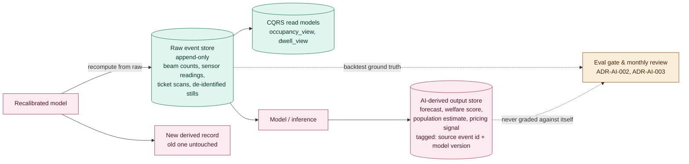

# ADR-009: Raw Telemetry and AI-Derived Outputs Live in Separate, Pointer-Linked Stores

## Status
Proposed

## Related Documents
- [ADR-004: Architecture Style](ADR-004-architecture-style.md)
- [ADR-006: Edge Anonymiser](ADR-006-edge-anonymiser.md)
- [ADR-AI-002: Validation and Verification](ADR-AI-002-validation-and-verification.md)
- [ADR-AI-003: Production Monitoring](ADR-AI-003-production-monitoring.md)

## Context

| Factor | Why it matters |
|---|---|
| Several sub-problems compute an AI output from a raw signal | Footfall's forecast from beam/CV counts, Ark's welfare score from feed/health sensor readings, the piranha count from vision inference, the Profitability Advisor's pricing signal from aggregate occupancy and revenue. |
| [ADR-004](ADR-004-architecture-style.md) separates writes from reads, not raw from derived | CQRS read models exist for query performance; nothing in that decision says whether a model's output and the sensor fact it came from are allowed to live in the same table. |
| Evals need real ground truth to backtest against | [ADR-AI-002](ADR-AI-002-validation-and-verification.md)'s eval sets and [ADR-AI-003](ADR-AI-003-production-monitoring.md)'s monthly review ("model getting worse" vs "the world changing") both require the raw signal to still exist, untouched, after a model has run against it, possibly more than once. |
| A recalibration or a rollback shouldn't erase history | If a new calibration table or model version overwrites the old derived value in place, there's no way to prove what a downgraded model actually said last month, or to recompute it once a mistake is found. |

**Driving question:** when a model produces a number from a sensor reading, where does that number go, and can a bad model output ever end up mistaken for, or overwriting, the fact it was computed from?

## Decision

| Aspect | Decision | Rationale |
|---|---|---|
| **Two data paths, two stores** | Raw telemetry (beam/IR counts, feed-weight readings, ticket-scan events, de-identified stills before inference) writes to an append-only raw/event store. Every AI-derived output (a forecast, a welfare score, a population estimate, a pricing recommendation) writes to a separate derived-output store, never back into the raw store. | Keeps the raw record immutable and independently trustworthy, so a bad model output can never overwrite the ground truth it was computed from. |
| **Every derived value points back to its source** | A derived record carries a reference to the raw event(s) it was computed from and the model/version that produced it. Reprocessing with a new model version writes a new derived record; it never mutates the old one in place. | Turns a model rollback or recalibration into "recompute from raw data," not "restore from a backup," and keeps a full history of what a given version once said. |
| **Evals and the monthly review read from the raw store, not the derived one** | The eval gate's golden sets and [ADR-AI-003](ADR-AI-003-production-monitoring.md)'s monthly review backtest a candidate model against raw ground truth, never against another model's derived output. | Grading a model against another model's opinion just compounds whichever one is wrong. The raw store is the one place that can't already be contaminated by a prior bad inference. |
| **Anonymisation happens once, at the edge, before either path** | [ADR-006](ADR-006-edge-anonymiser.md)'s edge anonymiser runs before a frame is written anywhere, raw or derived. Neither store ever receives an identifiable frame. | This decision is about where a number goes after it's computed, not about identity, which is already fully solved upstream. |
| **CQRS read models stay a third, distinct thing** | The query-optimised read models from [ADR-004](ADR-004-architecture-style.md) (`occupancy_view`, `dwell_view`) are built from the raw event store for read performance; they are not the same store as the AI-derived output store, even when a UI displays both together. | Keeps "fast to query" and "produced by a model" as two independent properties, so it's always clear which figure is a fact and which is an inference. |

## Diagram

| Symbol | Meaning |
|---|---|
| Green | The raw/fact side: append-only, never written to by a model. |
| Pink | The derived side: anything a model produced, always tagged with its source and version. |
| Amber | The eval and monitoring path, deliberately wired to the raw side only. |
| Dashed arrow | A read used for grading, not for serving a live feature. |

## Alternatives Considered

| Alternative | Why Rejected |
|---|---|
| Write AI-derived outputs back into the same event stream as raw telemetry | Makes it impossible to tell later which entry is a sensor fact and which is a model's opinion without inspecting every record's metadata. |
| Overwrite the previous derived value in place on recalibration | Destroys the audit trail [ADR-AI-003](ADR-AI-003-production-monitoring.md)'s monthly review and quarterly drills depend on; there's no way to prove what a downgraded model actually said. |
| One combined store with a "source" column instead of two physical stores | Logically similar, but makes it easy to accidentally backtest against derived data by omitting a filter; two stores make that mistake structurally harder to make. |
| Treat this as already covered by [ADR-004](ADR-004-architecture-style.md) | [ADR-004](ADR-004-architecture-style.md) decided read-vs-write separation for scaling; it never states the raw-vs-derived separation this decision states, and that property is what every eval and audit actually depends on. |

## Consequences and Tradeoffs

| Tradeoff | Mitigation |
|---|---|
| Every AI-derived output needs a pointer back to its raw source | Schema work paid once per capability, not per request. |
| Storage grows with both raw history and every derived version | Retention windows in [ADR-AI-003](ADR-AI-003-production-monitoring.md) already bound this: 90 days hot for traces, 13 months for verdicts and versions, 7 years for AI-influenced financial or safety decisions. |
| A future change could still accidentally read from the wrong store | Tracked as its own fitness function, see [docs/fitness-functions.md](../../fitness-functions.md). |

## Conclusion
Raw telemetry and every AI-derived output live in two separate stores, joined by a pointer, not a shared table. Evals and audits always look at the raw store to grade a model, never at another model's own opinion, so a bad calibration or a rolled-back version can never quietly become the new ground truth.
