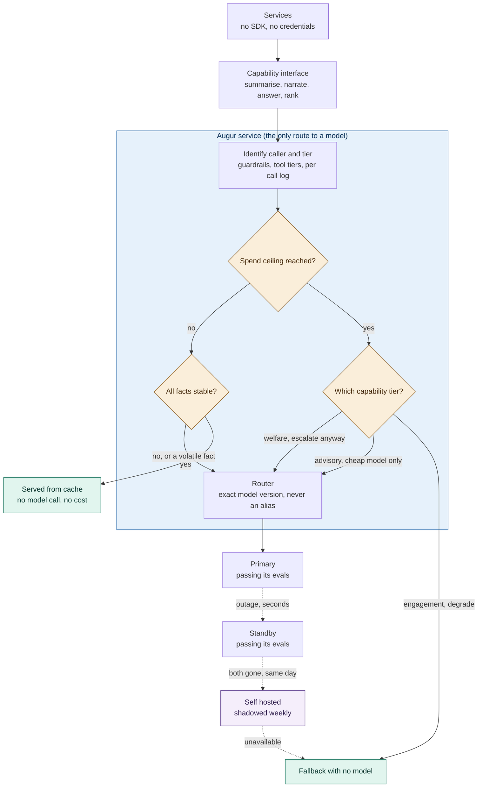

# ADR AI 01. Provider and Model Portability Through a Single Gateway

## Status
Proposed

## Date
16 September 2026

## Context

Seven capabilities need a language model: briefing, vet case draft, husbandry copilot, queue agent, concierge FAQ, concierge narration, and plain-English reporting. Ticketing needs none.

Wiring a provider SDK directly into each service is the fastest way to build the first capability, and the reason nobody can answer basic questions, like total spend or which model served a given request, by the fourth. Three things drove this decision:

- The brief names three provider-risk scenarios that each need a different response: outage, deprecation, and a provider closing or repricing.
- Prompts are tuned to a specific model family, and swapping even the embedding model can silently invalidate a search index with no error raised anywhere. Standardising the API shape is the easy part; the tuning underneath it is not.
- A prompt can be ignored by a model. A gateway policy is enforced in code, not just requested.

## Decision

| Aspect | Decision | Rationale |
|---|---|---|
| **No direct SDK access** | No service imports a provider SDK or holds a credential. Services declare a capability, a caller, and a tier; unidentified calls are refused. | Keeps Augur as the single, auditable route to any model, so nothing can bypass routing, cost tracking, or guardrails. |
| **No deterministic dependency on Augur** | Augur may be unavailable at any time. No deterministic critical path runs through it. | Money and access decisions must never depend on an LLM gateway being up. |
| **Multi-provider + self-hosted fallback** | Two providers stay live, both already passing their evals, plus a self-hosted model shadowed on sampled live traffic. | Covers both outage (failover to a standby) and shutdown/repricing (the self-hosted option is already validated, not scrambled together after the fact). |
| **Pinned model versions** | Routes name an exact model version; aliases fail registry validation. | Stops a silent upstream model swap from changing behaviour without a re-evaluation. |
| **Spend-ceiling behaviour by tier** | At the spend ceiling, the tier decides: welfare keeps escalating and raises an alert, advisory stops escalating, engagement degrades. | Not all AI use is equally important; welfare-critical calls must never silently stop just because a budget cap was hit. |
| **Escalation trigger** | Escalation fires on a guardrail failure, a low retrieval score, or a schema failure, never on the model's own confidence. | Model confidence scores are uncalibrated and unreliable as a trigger. |
| **Caching policy** | Volatile facts (ride status, price, today's hours) make a request uncacheable. Everything else is cached on prompt, assembler, model, and freshness class. | Cuts cost and latency without ever serving a stale operational fact. |
| **No-model fallback** | Every capability has a fallback that uses no model and is a shippable product on its own. | Guarantees the estate keeps functioning even if every model route is down. |
| **Cost model** | Cost is a formula of volume, cache-miss rate, tokens, and unit price. On placeholder rates the estate runs at $1–6/day in LLM spend. The larger cost is elsewhere: vision hardware, the itinerary solver, and eval labelling, each tracked on its own line. | Keeps the LLM gateway's own cost honest and comparable against the rest of the AI budget. |

| Scenario | Response | Target |
|---|---|---|
| Outage | Automatic failover through standby, self hosted, fallback | Seconds |
| Deprecation | Planned migration, prompts retuned, evals rerun | Inside the notice period |
| Provider closes or reprices | Cutover to the standby already passing its evals | Same day |

## Diagram

| Symbol | Meaning |
|---|---|
| Amber diamond | A control that's enforced in code, not just requested (spend ceiling, tier, cache checks). |
| Purple node | The self-hosted model we run ourselves, kept honest by shadowing live traffic. |
| Dashed arrow | A failure path; the last one always exists. |

## Alternatives Considered

| Option | Verdict | Reason |
|---|---|---|
| SDK per service | Rejected | No single enforcement point, no cost visibility, and portability gets solved seven separate times. |
| A shared library, opt-in per caller | Rejected | We need bypass to be impossible, not just discouraged. |
| Buying a gateway | Rejected (closest call) | Puts a vendor dependency inside the component meant to remove one; cheap to revisit later if needed. |
| A standby that's configured but untested | Rejected | Qualifying it under pressure takes longer than the outage it's meant to cover. |
| Dropping the self-hosted model | Rejected | A fallback covers an outage, not a shutdown; running on static pages indefinitely is a worse business, not a contingency. |
| Routing on model confidence | Rejected | Confidence scores are uncalibrated, so it would escalate either constantly or never. |

## Consequences and Tradeoffs

| Tradeoff | Mitigation |
|---|---|
| One component whose failure removes every generative feature | Every capability has a fallback, drilled quarterly |
| Two providers and a shadow means every eval run is three runs | The price of the shutdown case having a real answer |
| The adapter leaks, since tool calling and structured output differ per provider | Adapter contract tests are a blocking CI layer |
| Pinned versions forgo free provider improvements | A quarterly bake off evaluates current candidates |

The obvious cost is an extra network hop through Augur on every call. We're not worried about it, because nothing latency-sensitive is routed through Augur.

## Conclusion

Every LLM call goes through one gateway, backed by two qualified providers and a self-hosted model that's shadowed on live traffic before it's ever needed, with every route pinned to an exact model version. The standby only counts as a standby because it's already passing evals today, not because it could in an emergency.
