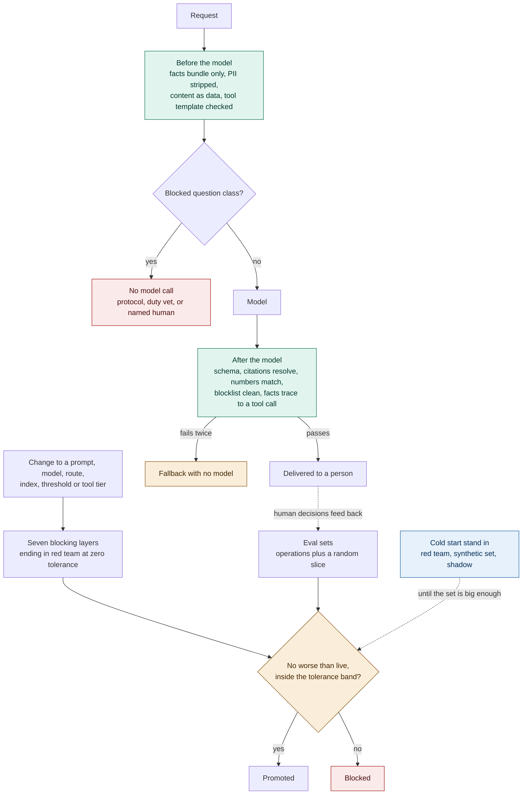

# ADR-AI-002: Validation and Verification of AI Outputs Through Guardrails and Evals

## Status
Proposed

**MLOps framing:** this is the estate's model/prompt promotion gate, deciding what's safe to ship before it reaches a keeper or a guest. What happens once an artefact is live is [ADR-AI-003](ADR-AI-003-production-monitoring.md)'s job.

## Date
16 September 2026

## Context

There's no single correct string for a welfare briefing, so a test that checks for an exact match is useless here. What actually works is measuring a distribution against a threshold, and checking it again against ground truth the system already produces day to day.

- Blocking a bad answer in the moment and deciding whether a change is safe to ship are two different jobs, on two different time budgets. If we combine them into one check, we end up with a runtime check that's too slow to sit inline, and a release gate that's too coarse to catch a real regression.
- Telling the model not to do something in the prompt helps, but it's not enough on its own. It gets followed most of the time, and "most of the time" is exactly the problem.
- Most of the checks we actually need are deterministic: schema shape, citations, number matching, blocklists. That's structure and string matching, not model reasoning, so it's cheap to run on every request.
- Every capability starts with an empty eval set. A gate that only trusts a large eval set protects nothing at the exact moment we understand the system least, right after launch.

## Decision

### Guardrails run in code, on every request

| Aspect | Rule | Why |
|---|---|---|
| **Input** | Only a code-assembled facts bundle goes into the model: staff names stripped, visitor IDs pseudonymised, images excluded by type, and retrieved content kept in a lane separate from instructions. | Stops untrusted retrieved content from being mistaken for an instruction. |
| **High-risk questions** | Bite/sting first aid, handling questions, and dosing queries never reach a model at all. They go to the fixed protocol, a hard-coded answer, or the duty vet. | Some questions are too risky to let a model answer, no matter how good it is. |
| **Output** | The response must match its schema, every number must match the fact it cites, the blocklist must be clean, and any action must stay inside the allowed set of verbs. | Catches a malformed or unsupported answer before a person ever sees it. |
| **Citations** | Every citation must resolve to something we actually supplied: a fact ID in the bundle, or a chunk ID in the retrieved set with its review date. | Stops the model from citing a source that doesn't exist. |
| **Failure handling** | One retry with the errors attached, then the no-model fallback. A refusal that escalates counts as a success. A request with no recorded verdict raises an incident. | Every request has to end in a known, auditable outcome, never silence. |

### Evals gate every versioned artefact

This covers prompts, models, routes, indexes, thresholds, calibration tables, schemas, and tool tiers, anything that changes model behaviour.

| Aspect | Rule | Why |
|---|---|---|
| **Blocking layers** | Seven blocking layers, ending in a red-team suite at zero tolerance. Cost and latency budgets gate alongside accuracy. | A release has to clear safety and cost together, not one after the other. |
| **Comparison method** | A candidate must be no worse than the live version, inside a tolerance band derived from the eval set's own variance. | Comparing two plain scores on a small set mostly measures noise, not a real difference. |
| **Set size** | The minimum eval-set size is computed per capability, from the power needed to detect a difference we'd actually act on. | A fixed round number has no statistical meaning; it just feels safe. |
| **Set composition** | Eval sets carry a random slice of ordinary traffic alongside the known corrections. | Corrections alone skew toward whatever defect someone happened to notice. |
| **Judge model** | The judge is a different model family than the one being graded, calibrated against human labels, and never the only gate on a high-risk capability. | A model shouldn't be the sole grader of its own output. |
| **Accuracy ceiling** | Human annotator agreement is published as the ceiling on accuracy. If two keepers only agree seven times in ten, seven in ten is the best any model can score. | Sets a realistic bar instead of chasing a perfect score nobody could hit. |

### Cold start

Only the comparative eval gate waits for volume. Guardrails work from the very first request. The red-team suite is hand-written and blocking from day one. A synthetic set, reviewed by a domain expert, stands in until real labels exist. Every new capability then runs in shadow, then to a limited audience, then in a controlled comparison against no AI at all.

## Diagram

| Symbol | Meaning |
|---|---|
| Top row | Runtime guardrails. Needs no labelled data, so it works from the very first request. |
| Bottom row | The eval gate that runs at release time. |
| Red | A question class that never reaches a model, so its failure rate is zero, not just low. |
| Blue | What protects the very first release, before there's anything to compare against. |

## Alternatives Considered

| Option | Verdict | Reason |
|---|---|---|
| One testing concern covering both jobs | Rejected | Too slow to run inline, and too coarse to catch a real regression at release. |
| A model as the guardrail | Rejected | It's vulnerable to the same content that could fool the generator it's checking. Kept inside the evals instead, where a wrong call delays a release rather than reaching a keeper. |
| Human review of every output | Rejected | Doesn't scale to 55 briefings before shift start, let alone a public chat surface. |
| Blocking the response outright on failure | Rejected | A keeper gets nothing at seven in the morning. A facts digest beats silence. |
| One fixed minimum set size, shadow as the only cold-start control | Rejected | A round number isn't a statistical property, and shadow testing alone leaves version one unqualified. |
| Comparing plain scores with no tolerance band | Rejected | Blocks real improvements and passes real regressions, both because of noise. |
| Exempting thresholds and calibration tables as "just configuration" | Rejected | They're the highest-leverage, least-visible changes in the whole system. |

## Consequences and Tradeoffs

| Tradeoff | Mitigation |
|---|---|
| Deterministic checks are literal and reject defensible output | False positive rate is sampled and reviewed, and the fallback is usable |
| A blocklist cannot catch a paraphrased diagnosis | A monthly expert audit looks for what code cannot |
| Every prompt change runs a full suite | The report publishes on the pull request, so the cost buys evidence at review |
| Keeping eval sets labelled is permanent work | Sets grow from decisions the workflow already produces |

The published accuracy ceiling might be an uncomfortable number to look at. But knowing it is better than blaming the model every time two keepers disagree with each other.

## Conclusion

We kept two mechanisms separate on purpose. Code blocks a bad answer right now, at request time. Evals decide what's safe to ship, at release time. And the questions that could actually get someone hurt never reach a model in the first place.
