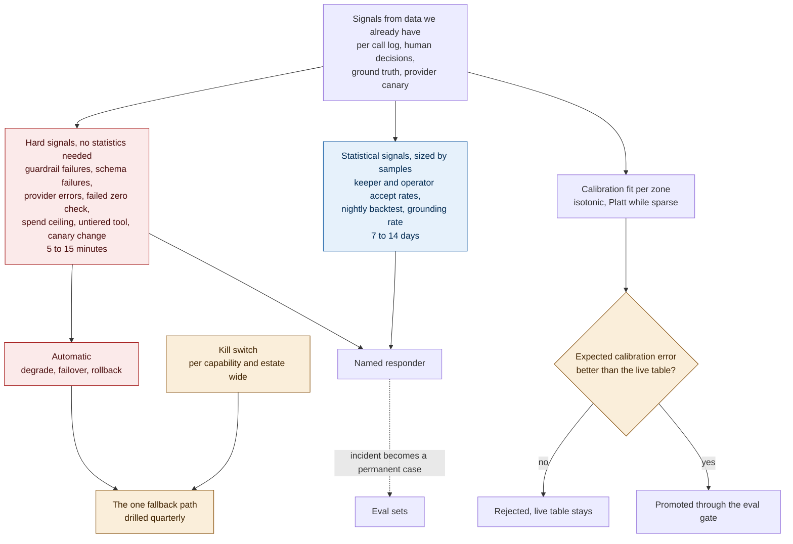

# ADR-AI-003: Production Monitoring of AI Behaviour

## Status
Proposed

## Date
16 September 2026

## Context
Passing an eval tells you how the system behaved on that day. Six weeks later the input mix has shifted, a provider has swapped the model behind a name that looks unchanged, and a calibration table has gone stale. A degraded model doesn't crash. It just recommends slightly worse things until someone eventually asks why bookings fell.

- Volumes are low: about 55 briefings, 3 case drafts, and roughly 580 agent calls a day. A monitoring window measured in hours only works for signals that need no real statistics behind them.
- Beam counters can't separate individual bodies above roughly 4 to 5 people per square metre, which is exactly the density band where vision confidence most needs checking. Calibrating against them would just teach the model to agree with a number we already know is wrong.
- One fallback path is meant to cover outages, budget ceilings, and a deliberate shutdown all at once. A path nobody has actually tested is carrying the whole resilience story on paper alone.

## Decision

| Aspect | Decision | Rationale |
|---|---|---|
| **What counts as a signal** | A signal needs a threshold, a window, a named responder, and a defined response. Anything missing one of these four isn't a signal yet. Every capability ships with at least one hard signal and one statistical signal. | Prevents "we're monitoring it" from meaning nothing more than a dashboard nobody's assigned to watch. |
| **Hard signals** | Hard signals need no statistics and run on fast windows of 5 to 15 minutes: guardrail failures, schema failures, provider errors, a failed overnight zero-occupancy check, spend against the budget ceiling, an untiered tool call, or a changed canary fingerprint. | These are wrong on a single occurrence, so they don't need to wait for a sample size. |
| **Statistical signals** | Statistical signals get 7 to 14 day windows, sized by the samples that actually exist. | Splitting hard and statistical signals is the core of this decision: a fast promise only where the data can actually support one. |
| **Canary prompts** | The same canary prompts run daily against every provider, and the answers are fingerprinted. A changed fingerprint freezes promotion and triggers a full eval rerun. | Catches a provider silently swapping the model behind a stable name. |
| **Calibration ground truth** | Calibration is fit against ground truth that doesn't depend on the instrument being calibrated: overnight zero checks and sampled manual counts for crowd density, recorded vet visits for health baselines. Fit per zone, since lighting and camera angle create local bias. A new calibration table that scores worse than the live one is rejected. | Calibrating against a source that shares the same blind spot would just teach the model to agree with a wrong answer. |
| **Rollout size** | Rollout size depends on whether the signal can actually be read at that volume. Low-volume capabilities are qualified by replaying against recorded inputs instead of a live percentage rollout; percentage rollout is used only for the concierge, which has the traffic to support it. Rollback on a band breach is automatic. | At 55 calls a day, a 5 to 10 percent rollout is five samples, not enough evidence either way. |
| **Quarterly drills** | Four drills every quarter: provider failover, the kill switch, a fallback usability review with a keeper, and shadow-job liveness. A drill that doesn't run counts as a failed drill, not a skipped one. | A fallback nobody has tested is a documented idea, not a working one. |
| **Kill switch** | The kill switch is a config flag that forces the existing fallback, not a separate code path. Two named roles can flip a single capability; one role can flip the whole estate. Every flip writes an audit record. | A separate code path for emergencies is a code path nobody exercises until the day it's needed. |
| **Monthly review** | A monthly review separates the model actually getting worse from the world changing around it. A new species or a ride under maintenance means resetting the baseline, not retraining the model. | Avoids chasing a "regression" that's really just a legitimate change in context. |
| **Retention** | Traces with prompts and retrieved context are kept 90 days hot; verdicts and versions for 13 months; any AI-influenced financial or safety decision for 7 years as a decision record. Visitor IDs are pseudonymised before reaching a prompt, and deletion resolves the pseudonym. | Matches retention to how long each kind of record is actually needed, without keeping sensitive context indefinitely. |

| Tier | Signal | Window |
|---|---|---|
| Welfare and safety | Keeper accept rate, nightly backtest against vet visits | Rolling 14 days |
| Advisory | Operator accept rate, forecast skill against naive baseline | Rolling 7 days |
| Engagement | Grounding rate, solver refusal rate | Same-day hard signal, 7-day trend |

## Diagram

| Symbol | Meaning |
|---|---|
| Red | Signals that are wrong on a single occurrence, which is what lets us promise a response within minutes. |
| Blue | Signals read over a window the sample volume can actually support. |
| Amber | The one degraded product every failure mode ends in, and the gate that stops a worse calibration table from replacing a better one. |

## Alternatives Considered

| Alternative | Why Rejected |
|---|---|
| Periodic manual audit as the main mechanism | This is the pattern where an expert eventually notices something's wrong. Kept only as a monthly sampled audit for paraphrase quality, not as the primary signal. |
| Waiting for complaints | Slow degradation generates none, and a keeper quietly learning to ignore a bad alert is the worse outcome. |
| One window for every signal class | Promises a response in hours for signals that actually need weeks of samples, which turns the strongest part of the monitoring story into its weakest. |
| A flat 5 to 10 percent rollout everywhere | At 55 calls a day that's five samples. Replaying against recorded inputs gives more evidence for less exposure. |
| Calibrating vision confidence against the beam counter | Unreliable in exactly the density band where the calibration is most needed. |
| A kill switch as separate infrastructure | A separate code path is one nobody exercises until the day it's actually needed. |
| Keeping full prompt logs indefinitely | A store holding visitor and veterinary context is a liability that only grows over time. |

## Consequences and Tradeoffs

| Tradeoff | Mitigation |
|---|---|
| The split promise looks less impressive than a single flat four-hour claim | Time-to-detect is proved against injected faults, rather than just asserted. |
| Manual counts cost staff time forever, and are the first thing to slip when the estate is busy | Audit completion is itself a tracked signal, and a zone without current ground truth drops to a conservative default. |
| Automatic degradation can drop a capability on a brief spike | Degrading wrongly still beats serving a bad welfare alert. |
| A drill that doesn't run blocks a release | It's the only thing separating a documented fallback from a fictional one. |

This decision also creates a dashboard and alerting build that doesn't exist yet. That's its cost, and its deliverable.

## Conclusion
Every signal has a threshold, a window, a named responder, and a defined response, and fast windows are promised only where the data can actually support them. A model that's quietly gotten worse doesn't crash anything, and without this, nobody would ever file a ticket for it.
