# ADR-001: Admissions as a Modular Monolith, Not Microservices

## Status
Accepted

## Context
- A family-pass purchase touches several concerns at once: the order, the payment, the entitlement issued, and (later) any refund or upgrade. All of these have to agree with each other, or a family ends up over-charged, under-admitted, or holding a ticket that doesn't match what they paid for.
- At the estate's actual scale, tens of admissions a second at the 15,000/day target, this isn't a high-throughput distributed-systems problem. It's a correctness problem on a modest volume of transactions.
- The estate runs a small ops and engineering team. Every extra deployable is something that team has to build, monitor, and keep online, on top of everything else this platform already asks of them.
- `platform/ADR-002-offline-ticket-signing.md` already decided how a ticket is signed and verified offline. This decision is about a different question: how the service that issues, amends, and refunds tickets in the first place is actually built.

## Decision

| Aspect | Decision | Rationale |
|---|---|---|
| **One deployable, one database** | Admissions is a modular monolith: a single service over a single relational database, not a set of independently deployed microservices. | Matches the actual throughput and team size. A distributed system here would add coordination cost with no corresponding benefit. |
| **Enforced internal module boundaries** | Catalogue, orders, passes, entitlements, and refunds are separate modules inside the one service, with boundaries enforced in code, not by network calls between them. | Gets the organisational clarity of separate concerns without paying for a distributed transaction to keep them consistent. |
| **Family-pass invariants live in one transaction** | Issuing a family pass, its entitlement, and its N-admit counter (from `platform/ADR-002`) all commit in a single database transaction. | A purchase and its entitlement can never disagree with each other, since there's no window where one exists without the other. |
| **Refunds and amendments are also single-transaction** | A refund or amendment updates the order, the entitlement, and (see [002](002-adr-revocation-deny-list.md)) the deny list state in the same transaction. | Removes an entire class of bugs where a refund succeeds but the entitlement doesn't get revoked, or vice versa. |
| **External payment stays external** | Card handling is delegated to an external payment provider; Admissions only ever holds a payment reference, never card data. | Keeps PCI-scope out of the monolith entirely, without needing a separate internal service to achieve that. |

## Diagram

| Symbol | Meaning |
|---|---|
| Gray | A module inside the single Admissions deployable. |
| Blue cylinder | The one shared relational database. |
| Amber | Something outside this ADR's boundary: payment, signing, or the gate itself. |

## Alternatives Considered

| Alternative | Why Rejected |
|---|---|
| Microservices per concern (orders, passes, entitlements, refunds as separate services) | Turns every family-pass invariant into a distributed transaction, real complexity the estate's throughput doesn't justify, and more services for a small team to run. |
| Third-party ticketing software | Commercial platforms generally assume connectivity at the point of scan, which contradicts the offline-first turnstile decision in `platform/ADR-002`. The estate would still have to build the offline layer on top of an unfamiliar data model. |
| Online-only validation (gate calls a central service per scan) | Simple and always consistent, but this is exactly the network dependency the estate's patchy WiFi rules out at the gate. |

## Consequences and Tradeoffs

| Type | Point | Detail |
|---|---|---|
| ✅ Positive | Family-pass correctness is enforced by the database, not by application-level compensating logic | A partially-applied purchase or refund isn't a state the system can end up in. |
| ✅ Positive | One deployable and one database to operate | Matches the size of the team that has to run it. |
| ✅ Positive | Admission events are a trustworthy source for analytics | Since they come from a single consistent system of record, not reconciled after the fact across services. |
| ⚠️ Trade-off | A single database is a single scaling axis | If Admissions ever needs to scale far beyond the 15,000/day target, this decision would need revisiting. |
| ⚠️ Trade-off | Online ticket sales depend on the monolith being up | Gates keep working offline for already-issued passes regardless (per `platform/ADR-002`), but a new sale during a monolith outage has to fall back to the pre-signed voucher pool, not a live purchase. |
| ⚠️ Trade-off | Module boundaries need discipline | Nothing stops a future change from reaching across modules directly inside the same codebase the way a network boundary would. |

## Conclusion
Admissions is one deployable over one database, with enforced internal module boundaries, not a set of microservices. At the estate's actual scale this keeps family-pass purchases, entitlements, and refunds correct by construction, without asking a small team to run more services than the problem actually needs.
