# ADR-002: Revocation as a Small, Time-Scoped Deny List

## Status
Accepted

## Context
- `platform/ADR-002-offline-ticket-signing.md` lets a turnstile verify a ticket is authentic and unexpired with no network call. It doesn't yet say what happens when a valid-looking ticket needs to stop working: a refund, a lost or stolen pass, or a confirmed fraud case.
- A ticket's signature proves it was genuinely issued. It says nothing about whether the person who bought it later got their money back.
- Most passes never get revoked. A deny list only needs to hold the small minority that have been refunded, lost, or flagged, not a record of every ticket ever issued.
- Some changes aren't really revocations at all: a family that pays to upgrade a day pass to a season pass shouldn't be turned away at the gate on their old QR code while the upgrade is still reconciling.
- Gates need this list to make a same-second decision, so it has to be small enough to hold entirely on-device and cheap enough to refresh constantly.

## Decision

| Aspect | Decision | Rationale |
|---|---|---|
| **Deny list scoped to today only** | The deny list holds only passes that would otherwise be valid today. A ticket whose validity window has already passed doesn't need an entry, it's already rejected on expiry alone. | Keeps the list small regardless of how many tickets the estate has ever sold, self-pruning at the end of each day. |
| **Two classes of entry** | A `revoked` entry (refund, loss, theft, fraud) is a hard denial, always rejected. A `superseded` entry (an upgrade or amendment) still admits at the original entitlement while the change reconciles in the background. | A refunded ticket and an upgraded ticket need different gate behaviour, and conflating them would either deny people who paid to upgrade, or admit people who got their money back. |
| **Revocation and the list update in one transaction** | Issuing a `revoked` or `superseded` entry happens in the same database transaction as the refund or amendment in Admissions (`platform/ADR-002` and [001](001-adr-admissions-as-a-modular-monolith.md)). | A refund can never succeed without the corresponding entry existing, and vice versa. |
| **Frequent refresh when connected** | Gates and kiosks pull the current deny list on a short, regular interval while online. | Keeps the list close to real-time under normal operating conditions. |
| **A bounded staleness tolerance, not a hard stop** | If a gate hasn't refreshed the list within a defined window, it keeps admitting on its last known list rather than stopping the queue, and every admission during that window is tagged `unverified-revocation` and logged for review. | A queue stopping entirely because a deny list is a few hours stale is a worse outcome than admitting a small number of already-rare revoked tickets, and the tag means nothing is silently lost. |

## Diagram

| Symbol | Meaning |
|---|---|
| Blue cylinder | The deny list itself, small and scoped to today. |
| Amber | A decision point at the gate. |
| Red | The hard-denial path. |
| Gray | Deterministic services and infrastructure. |

## Alternatives Considered

| Alternative | Why Rejected |
|---|---|
| Push the full list of all valid passes to every gate | The list churns constantly with same-day sales, and a legitimate walk-up buyer could be denied simply because their new pass hasn't propagated yet. |
| Short-lived tokens the visitor's phone must refresh | Assumes the visitor has connectivity, exactly the assumption the estate's patchy WiFi rules out, and it excludes printed passes that families with young children still rely on. |
| One deny-list class for every kind of change | Would either deny a family that paid to upgrade, or admit someone who's already been refunded, since a single hard-deny class can't tell the two cases apart. |
| Stop the gate entirely once the deny list goes stale | Turns a rare, small-value fraud risk into a certain, large-value queue outage. The bounded staleness tolerance accepts the smaller risk explicitly instead. |

## Consequences and Tradeoffs

| Type | Point | Detail |
|---|---|---|
| ✅ Positive | The deny list stays small by design | Not by hoping refunds stay rare, its scope to "today only" is what keeps it small even as the estate grows toward 15,000 visitors a day. |
| ✅ Positive | Upgrades never get denied at the gate | The `superseded` class exists specifically so a family who paid more doesn't get turned away on their old QR code. |
| ✅ Positive | A stale list degrades gracefully, not catastrophically | The estate accepts a small, bounded, logged fraud exposure rather than stopping the queue outright. |
| ⚠️ Trade-off | A bounded re-use window exists | Between a revocation happening and every gate refreshing, a revoked pass could in theory be presented at a different gate. This is a commercial cost to accept, not an architectural flaw to fully eliminate. |
| ⚠️ Trade-off | Two deny-list classes add gate logic | The scanner has to handle `revoked` and `superseded` differently, more complexity than a single flat list. |
| ⚠️ Trade-off | `superseded` entries need reconciliation | An upgrade admitted at the old entitlement still needs a manual or automated reconciliation step to settle the difference. |

## Conclusion
A deny list scoped to only today's passes stays small no matter how much the estate grows, and its two classes mean a refund is denied while an upgrade isn't. When a gate can't refresh the list in time, it keeps the queue moving and logs the exposure instead of stopping the estate at the door.
