# ADR-003: Re-Entry Model and Gate Connectivity as Deliberate Investment

## Status
Accepted

## Context
- `platform/ADR-002-offline-ticket-signing.md` describes a turnstile that redeems a ticket "once" via the local redemption ledger. That's the right model for a single-use voucher, but it leaves an everyday question unanswered: can a family leave the park for lunch outside and come back the same afternoon on the same day ticket?
- If a day ticket is consumed on first scan, the turnstile needs to track that consumption state, which means the offline verification path is no longer purely stateless, it now depends on the redemption ledger for every single scan, not just the offline-voucher edge case.
- The estate's gates are a small, fixed, known set of physical locations, not thousands of scattered sensors. That's a very different profile from the animal enclosures or footfall counters, which genuinely can't all be wired.
- The brief's constraint is "patchy WiFi across the estate," not "no connectivity is possible anywhere." A gate is exactly the kind of high-value, low-count location worth treating differently from the rest of the estate.

## Decision

| Aspect | Decision | Rationale |
|---|---|---|
| **Day tickets allow unlimited same-day re-entry** | A day ticket has no "consumed" state. Every scan checks the same three things: signature valid, validity window covers today, not on the deny list ([002](002-adr-revocation-deny-list.md)). | Keeps ordinary day-ticket verification fully stateless, no redemption ledger lookup needed for the common case, and matches how families actually use the park. |
| **The redemption ledger is reserved for genuinely single-use products** | The local redemption ledger from `platform/ADR-002` still tracks one-time use, but only for the products that need it: the pre-signed offline voucher pool, and any future single-admission-only ticket type. | A mechanism built for a narrow purpose (preventing an offline voucher from being spent twice) shouldn't be bolted onto every ticket type by default. |
| **Physical supervision covers concurrent-use risk** | Because a day ticket can be scanned more than once, gate staff (not the software) are the control against the same QR code being used by two people at once at different gates. | An unlimited re-entry model trades a software guarantee for a much simpler stateless verification path; the estate accepts that the remaining risk is small and cheap to manage physically. |
| **Gates are wired properly, as a deliberate investment** | Unlike the animal enclosures and footfall sensors, the turnstiles are a small, fixed set of locations. They get real, reliable connectivity as a funded line item, not best-effort WiFi. | Gates are the single highest-value place on the estate to invest in connectivity: it directly improves the freshness of the deny list every visitor's admission depends on. |
| **Offline is the fallback, not the everyday assumption** | Normal operation keeps the deny list seconds old, per [002](002-adr-revocation-deny-list.md)'s frequent refresh. Full offline verification (`platform/ADR-002`) is what a gate falls back to during an actual outage, not the default mode it runs in. | Matches the effort spent on offline-hardening to how often it's actually needed, while still guaranteeing the gate never stops working if the link does drop. |

## Diagram

| Symbol | Meaning |
|---|---|
| Green | The normal, everyday operating mode: gates are well-connected. |
| Gray | The fallback mode, used only during an actual outage. |
| Amber | The gate's decision check for a re-entry-capable day ticket. |
| Blue cylinder | The redemption ledger, used only for genuinely single-use products. |

## Alternatives Considered

| Alternative | Why Rejected |
|---|---|
| Consume every ticket type on first scan | Forces the redemption ledger into the critical path of every single admission, not just the offline-voucher edge case, adding state and complexity to the common case for no real benefit to a day-visit product. |
| Treat every gate the same as the rest of the estate's patchy WiFi | Ignores that gates are a small, fixed, known set of locations, exactly the kind of place where a real connectivity investment pays off, unlike a footfall sensor scattered across 55 enclosures. |
| Software-enforced single concurrent use per ticket (e.g. lock a ticket to one active session) | Adds real complexity (tracking active sessions, handling clock skew across gates) to prevent a low-frequency, low-value problem that physical gate supervision already covers well enough. |
| No staleness fallback, always require a fresh deny-list check | Already rejected in [002](002-adr-revocation-deny-list.md) for the same reason: stopping the queue over a stale list is a worse outcome than the small residual risk of admitting on a slightly stale one. |

## Consequences and Tradeoffs

| Type | Point | Detail |
|---|---|---|
| ✅ Positive | Day-ticket verification stays simple and stateless | No redemption-ledger dependency for the common case, only signature, validity window, and deny-list check. |
| ✅ Positive | Matches how visitors actually use the park | Leaving and returning the same day is normal behaviour for a family, and the architecture doesn't fight it. |
| ✅ Positive | Connectivity investment is targeted where it pays off most | A small number of gates get real wiring instead of spreading the same budget thinly across the whole estate. |
| ⚠️ Trade-off | Concurrent use of one QR code isn't software-prevented | The estate accepts this as a physical-supervision problem, not an architectural one, because the volume and value at risk are both small. |
| ⚠️ Trade-off | Gate wiring is capital spend outside the general hardware budget | This is an explicit investment decision, not something already funded by the estate-wide MQTT/edge budget mentioned in the brief. |
| ⚠️ Trade-off | Locks in the re-entry assumption | If the estate ever needed single-entry-only day tickets, this decision would need revisiting, since it's what makes the stateless verification path possible. |

## Conclusion
Day tickets allow unlimited same-day re-entry with no consumed state, keeping ordinary gate verification stateless; the redemption ledger stays reserved for products that genuinely need single-use tracking. Gates are treated as a small, high-value set of locations worth wiring properly, so full offline operation is the fallback for a real outage, not the everyday assumption.
