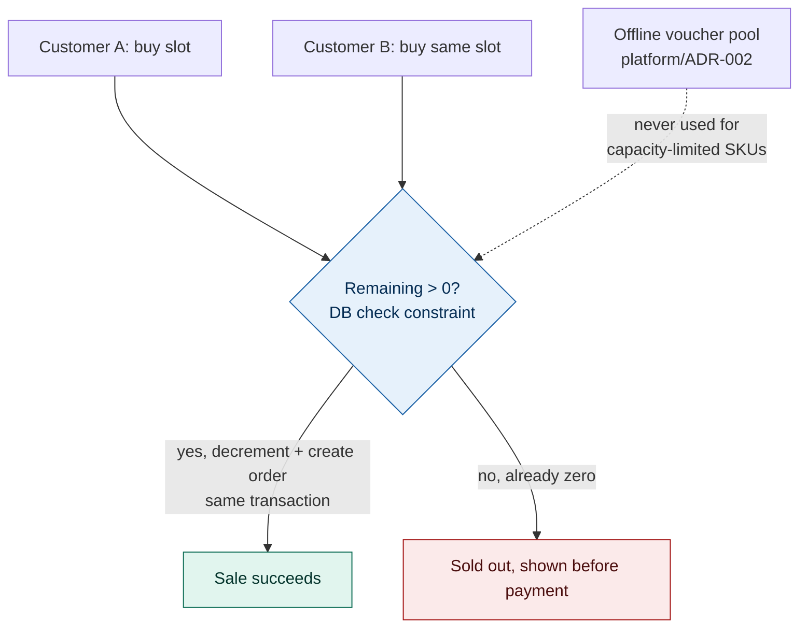

# ADR-004: Capacity-Limited Tickets Are Sold Online-Only, Enforced by One Database Constraint

## Status
Proposed

## Related Documents
- [001: Admissions as a Modular Monolith](001-adr-admissions-as-a-modular-monolith.md)
- [003: Re-entry and Gate Connectivity](003-adr-reentry-and-gate-connectivity.md)
- [platform/ADR-002: Offline Ticket Signing](../platform/ADR-002-offline-ticket-signing.md)

## Context

| Factor | Why it matters |
|---|---|
| Not every ticket is uncapped like the standard day ticket | Some products have a hard physical ceiling: a timed ride slot, a feeding-demonstration seat, a limited-capacity experience. A day ticket's unlimited re-entry model in [003](003-adr-reentry-and-gate-connectivity.md) doesn't apply here. |
| The pre-signed voucher pool has no live capacity awareness | [platform/ADR-002](../platform/ADR-002-offline-ticket-signing.md)'s offline gate-sale vouchers are generated ahead of time specifically to work with no network connection, which means nothing checks remaining capacity at the moment one is signed. |
| Two customers racing for the last seat is a concurrency problem | It's the kind of problem a single database is well-placed to solve outright, if the write path actually uses it that way rather than a read-then-write check. |
| Growth makes this worse, not better | More demand chasing the same fixed number of physical seats as the estate scales toward 15,000 visitors/day. |

**Driving question:** how do we sell a ticket type with a real, physical capacity limit without ever selling more of it than exists, while keeping the rest of ticketing exactly as offline-tolerant as it already is?

## Decision

| Aspect | Decision | Rationale |
|---|---|---|
| **Capacity-limited SKUs are online-only** | Any ticket type with a hard capacity ceiling is sold only through the online path, never through the offline pre-signed voucher pool. | The voucher pool has no way to check remaining capacity at signing time; selling a capacity-limited slot offline oversells it by construction, not by bad luck. |
| **One counter, one transaction** | Each capacity-limited slot has a remaining-count column inside Admissions' single database. A sale decrements it and creates the order in the same database transaction ([001](001-adr-admissions-as-a-modular-monolith.md)'s single-transaction pattern), guarded by a database check constraint, not an application-level read-then-write. | Two customers racing for the last seat can't both win. The constraint is the source of truth; a race-prone read-check-write in application code is exactly what this decision avoids. |
| **Standard day tickets stay uncapped** | [003](003-adr-reentry-and-gate-connectivity.md)'s unlimited-reentry day-ticket model is unchanged. This decision scopes only to the specific SKUs that carry a real capacity limit. | Most of the estate's ticket volume never needs this machinery; keep it scoped to where the constraint actually exists. |
| **Availability is reserved before payment, not after** | A slot is checked and briefly held before payment is attempted, and released automatically if payment doesn't complete inside a short window. | A customer shouldn't complete a card payment for a slot that's already gone. |
| **No AI in the allocation path** | Whether a slot is available is a database fact, not a prediction. Nothing about footfall forecasting or Ark's welfare signals touches this decision. | Availability is a correctness problem, not a demand-estimation problem; keeping them separate means a bad forecast can never oversell a real seat. |

## Diagram

| Symbol | Meaning |
|---|---|
| Blue diamond | The single database constraint deciding availability; not application code. |
| Green | The one sale that wins the race for the last seat. |
| Red | The other customer, shown sold-out before any payment is attempted. |
| Dashed arrow | The path this decision deliberately closes: the offline voucher pool never issues a capacity-limited SKU. |

## Alternatives Considered

| Alternative | Why Rejected |
|---|---|
| Sell capacity-limited slots through the pre-signed voucher pool too | The pool is generated with no live capacity check, which defeats the point of having a hard limit at all. |
| Optimistic locking at the application layer, read the count, check it, then write | Exactly the read-check-write race this decision exists to close; a database constraint doesn't have that window. |
| Overbook slightly and handle rare conflicts with a refund or apology | Tolerable for an airline seat, not for a family standing at a ride they were told they had a place on; the brief's trust concerns rule this out. |
| A separate booking microservice just for capacity-limited SKUs | Reintroduces the distributed-transaction problem [001](001-adr-admissions-as-a-modular-monolith.md) specifically avoided, for a small subset of the catalogue that doesn't need it. |

## Consequences and Tradeoffs

| Type | Point | Detail |
|---|---|---|
| ✅ Positive | Overselling a hard-capacity slot becomes structurally impossible | The database constraint enforces it, not a policy or a monitoring alert after the fact. |
| ✅ Positive | The rest of ticketing is untouched | Day tickets keep working exactly as [003](003-adr-reentry-and-gate-connectivity.md) already decided. |
| ⚠️ Trade-off | A capacity-limited slot can't be sold at all if Admissions is down | This is an honest degrade, not an oversell: general admission still works via the voucher pool during the same outage, only the capacity-limited product pauses. |
| ⚠️ Trade-off | The short reservation hold adds a small checkout delay | Bounded to a few minutes and released automatically if payment doesn't complete. |
| ⚠️ Trade-off | Every new capacity-limited product needs a slot/count row configured | A one-time catalogue setup step, not a new code path per product. |

## Conclusion
A capacity-limited ticket is sold online-only, its availability enforced by a single database constraint inside the same transaction as the sale, never by the offline voucher pool. This closes the one place in ticketing where two customers could genuinely both believe they'd bought the last seat, without adding a distributed system to solve a problem [001](001-adr-admissions-as-a-modular-monolith.md)'s single database already handles.
