# ADR-001: Hybrid ML+LLM Pricing and Investment Advisor Behind a Deterministic Gate

## Status
Accepted

## Context
- The Countess needs 5,000 daily visitors to grow to 15,000 within three years, and needs the estate to be profitable enough that the family doesn't have to sell off other parts of the collection to survive.
- Deciding where to invest, when to adjust a price, and what to upsell all depend on the same underlying signals: how busy each zone is, what's actually selling, and what the season, weather, and remaining capacity look like today.
- A single number, like "raise ticket prices 10%," is a symptom of good analysis, not the analysis itself. Ops and Finance need the reasoning behind a proposal, not just the output.
- Price changes and investment decisions move real money, and animal welfare, footfall, and payment data are all non-deterministic-model inputs. A wrong or stale proposal can't be allowed to touch a price on its own.
- Demand-sensitive scoring (how busy is likely, how price-sensitive is this segment) is a different kind of problem than writing a readable rationale for a person. Neither one is well served by treating the whole thing as one large model call.

## Decision

| Aspect | Decision | Rationale |
|---|---|---|
| **Split ML and LLM roles** | A classical ML model scores demand, price sensitivity, and investment opportunity from footfall, revenue, season, weather, and capacity signals. A separate LLM call, routed through Augur, turns that score and its inputs into a plain-language proposal and rationale for a human reader. | Demand scoring and language generation are different problems, and a small tuned model is cheaper and more explainable at the scoring step than an LLM would be. |
| **Advisor only proposes** | The Profitability & Investment Advisor never changes a price, approves an upsell, or commits an investment. It emits a proposal with its rationale and cited inputs to the Deterministic Decision Gate. | Keeps every AI failure mode contained to a rejected or delayed proposal, never a live financial action. |
| **Deterministic pricing engine enforces floors and ceilings** | Only the Deterministic Pricing Engine can actually change a live price, and only within pre-set floors and ceilings configured by Ops/Finance. | Bounds the blast radius of a bad proposal to a range a human already approved in advance. |
| **Every proposal is grounded and cited** | A proposal must cite the specific footfall, revenue, and context figures it's based on. An ungrounded or stale-data proposal is rejected before it reaches Ops Review. | Lets a reviewer check a proposal's reasoning against the same numbers the Advisor saw, instead of trusting it blind. |
| **Investment proposals route to a person, not a budget line** | Larger, one-off decisions (new ride, new enclosure feature, capacity expansion) are proposed the same way but always route to the Countess or Finance for a human decision, never an automated commit. | The stakes and the evidence bar for a one-off capital decision are different from a routine price adjustment. |

## Diagram

| Symbol | Meaning |
|---|---|
| Pink | AI/LLM component. |
| Amber | The Deterministic Decision Gate, the only bridge from proposal to action. |
| Gray | Deterministic component; the only things that can touch money. |
| Dashed arrow | Feedback or logging, not a live decision path. |

## Alternatives Considered

| Alternative | Why Rejected |
|---|---|
| One large LLM call for scoring and rationale together | Conflates a numeric scoring problem with a language problem, is harder to evaluate and cheaper to get wrong, and costs more per call than a small tuned model plus a targeted LLM call for the text. |
| Let the Advisor apply price changes directly within a range | Even a bounded range is still an AI component touching money, which breaks the Financial Isolation principle this platform holds everywhere else. |
| Rule-based pricing only, no ML or LLM | Misses genuinely predictive signals like weather and cross-zone demand shifts a hand-written rule set won't capture, and produces no rationale a reviewer can question. |
| Real-time automatic price changes with no human review | Removes the one control point that catches a wrong or stale proposal before it reaches a paying visitor. |

## Consequences and Tradeoffs

| Type | Point | Detail |
|---|---|---|
| ✅ Positive | Every proposal is explainable | A cited rationale means Ops/Finance can check the reasoning, not just accept or reject a number. |
| ✅ Positive | Bad AI output can't move money | The worst a wrong proposal can do is get rejected or delayed at the gate. |
| ✅ Positive | Investment decisions get proportionate scrutiny | One-off, high-stakes decisions always reach a person, never an automated commit. |
| ⚠️ Trade-off | Slower than fully automated pricing | Every routine change still waits on the gate and, for investments, a human review. |
| ⚠️ Trade-off | Two models to maintain, not one | The scoring model and the rationale-drafting LLM call are versioned and evaluated separately, which is more moving parts than a single model. |
| ⚠️ Trade-off | Floors and ceilings need maintaining | Ops/Finance has to keep the allowed price range current, or the gate ends up rejecting proposals that would otherwise be reasonable. |

## Conclusion
Demand scoring and rationale drafting are split into an ML model and a separate LLM call, and neither one can touch a price directly. Every proposal is grounded, cited, and routed through the Deterministic Decision Gate, so the growth engine can reason about pricing and investment freely while the money itself only ever moves through code a human already approved.
