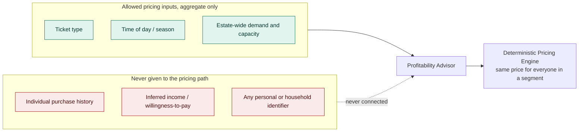

# ADR-002: Refusal of Individualised and Profiling-Based Pricing

## Status
Accepted

## Context
- The Profitability Advisor already has, or could easily be given, enough signal (visit history, spend, device, timing) to price a specific visitor differently from the person standing next to them.
- Individualised pricing would very likely increase short-term revenue. That's exactly why it needs its own explicit decision instead of being something the system drifts into by accident.
- The EU AI Act and the Digital Fairness Act both treat pricing that discriminates based on a person's inferred characteristics or behaviour profile as a real regulatory risk, not a hypothetical one.
- A family park is a place people bring children. A pricing model that quietly charges one family more than another for the same tickets, based on data neither family can see, is a reputational risk on top of a legal one.
- The brief asks the estate to grow profitability. This ADR exists to say plainly that we chose not to take the most direct route to more revenue, and why.

## Decision

| Aspect | Decision | Rationale |
|---|---|---|
| **Pricing varies by segment, time, and demand only** | Every price the Deterministic Pricing Engine can apply varies by ticket type, time of day/season, and estate-wide demand. It never varies based on who a specific visitor is. | These are all legitimate business variables that don't require identifying or profiling an individual. |
| **No individual-level pricing inputs** | The Profitability Advisor's inputs are aggregate: zone occupancy, estate-wide revenue, season, weather, and capacity. Visitor-level purchase history is never a pricing input, even in anonymised or aggregated form. | Removes the capability at the input level, rather than relying on a policy that says "don't use it" while the data sits there available. |
| **No inferred sensitive traits anywhere near pricing** | The system never attempts to infer income, willingness-to-pay, family status, or any other personal characteristic for pricing purposes. | These are exactly the categories the EU AI Act and Digital Fairness Act are concerned with. |
| **The refusal is enforced, not just documented** | This boundary is enforced by what data the Pricing Engine and Advisor are given access to, not by a policy a future engineer could quietly work around. | Matches this platform's general principle that controls are enforced in code, not requested in a prompt or a style guide. |
| **Loyalty and repeat-visit rewards stay non-monetary or flat** | Where the estate wants to reward a returning visitor (see [003](003-adr-consent-gated-personalisation.md)), it does so through non-price mechanisms (recommendations, early access, content) or a flat, published discount available to anyone in that same segment, never a personally-computed price. | Retention doesn't require individualised pricing to work, and keeps the reward mechanism inside the same non-discriminatory boundary. |

## Diagram

| Symbol | Meaning |
|---|---|
| Green | Inputs the pricing path is allowed to see. |
| Red | Data that's never connected to pricing at all, not filtered out, never wired in. |
| Dashed arrow | The connection that deliberately doesn't exist. |

## Alternatives Considered

| Alternative | Why Rejected |
|---|---|
| Per-visitor dynamic pricing based on browsing/purchase behaviour | This is exactly the individualised pricing this ADR exists to refuse. It's a real regulatory exposure under the EU AI Act and Digital Fairness Act, and a reputational one with families. |
| Loyalty-tier discounting keyed to personal purchase history | Still ties a price to who the person is rather than what they're buying and when, and it would require retaining and using individual-level spend data specifically for pricing. |
| Algorithmic price discrimination disguised as "personalised offers" | Renaming the mechanism doesn't change what it does. If it changes the price a specific person pays based on data about them, it's covered by this refusal regardless of what the feature is called. |
| Publish a disclaimer and allow individualised pricing anyway | A disclaimer doesn't reduce the regulatory or reputational risk, and it treats a real ethical boundary as a legal formality rather than a design constraint. |

## Consequences and Tradeoffs

| Type | Point | Detail |
|---|---|---|
| ✅ Positive | Lower regulatory exposure | The estate isn't building the exact capability the EU AI Act and Digital Fairness Act are watching for. |
| ✅ Positive | Pricing is explainable to a visitor | Every price can be justified by ticket type, timing, and demand, things a visitor can be told without revealing anything about how they were profiled. |
| ✅ Positive | No incentive to collect more personal data than needed | Since visitor-level data can't be used for pricing, there's no pressure to gather it "just in case" for that purpose. |
| ⚠️ Trade-off | Leaves real revenue on the table | Individualised pricing would very likely increase short-term revenue, and this decision explicitly forgoes that upside. |
| ⚠️ Trade-off | Segment-based pricing is a blunter instrument | Demand and season-based pricing captures less nuance than a per-visitor model would, so some pricing opportunities go unaddressed. |
| ⚠️ Trade-off | Requires ongoing discipline | A future feature that looks like personalisation (see [003](003-adr-consent-gated-personalisation.md)) has to be checked against this boundary, since the two can look similar from a product perspective. |

## Conclusion
Pricing varies by ticket type, timing, and demand, never by who a specific visitor is, and the visitor-level data that would make individualised pricing possible is never given to the pricing path in the first place. We accept the revenue this forgoes as the cost of staying clearly on the right side of the EU AI Act, the Digital Fairness Act, and the trust of families bringing children to the park.
