# ADR-003: Consent-Gated Personalisation for Repeat Visits

## Status
Proposed

## Context
- The Countess wants more returning visitors, but doesn't yet have a mechanism for it. Nothing else in this platform currently proposes one.
- The estate already has real signal about a visitor's interests: what they bought, which zones their ticket scans show they visited, and whatever preferences they've explicitly given the Guide concierge.
- Using that signal to bring someone back is genuinely useful. Using it without permission, or to infer things about a visitor they never told the estate, is the same overreach [002](002-adr-refusal-of-individualised-pricing.md) already refuses for pricing, just applied to marketing instead.
- Family visitors are especially sensitive to being tracked, and a recommendation that feels like surveillance drives people away rather than back.
- Guide, the GenAI concierge, already talks to visitors during their visit. Reusing that same relationship for a post-visit nudge is simpler than building a second channel.

## Decision

| Aspect | Decision | Rationale |
|---|---|---|
| **Consent is a first-class record, not a checkbox** | A visitor's consent to be contacted or to have their visit history used for recommendations is stored as its own record, tied to their account, checked before every use, and as easy to withdraw as it was to give. | Makes consent something the system actively checks, not a one-time box ticked at purchase and forgotten. |
| **Only consented, approved signals are used** | Recommendations use ticket-scan history (from the local redemption ledger in `platform/ADR-002-offline-ticket-signing.md`) and explicitly stated preferences only. No inferred traits, no third-party data. | Keeps the signal set to things the visitor actually did or said, not things guessed about them. |
| **No contact without valid, current consent** | A visitor who hasn't opted in, or who has withdrawn consent, receives no personalised offers or return-visit messaging at all. | The absence of consent is a hard stop, not a lower-priority case. |
| **Recommendations are advisory and suppressible** | Guide's return-visit suggestions and offers are just that, suggestions. A visitor can dismiss, mute, or opt out of them entirely at any time, and that choice takes effect immediately. | Personalisation that can't be turned off is the thing that makes it feel like surveillance. |
| **Same non-discrimination boundary as pricing** | Whatever a returning visitor is offered (early access, content, a flat published discount) follows [002](002-adr-refusal-of-individualised-pricing.md)'s rule: never a personally-computed price, only non-price rewards or a flat rate available to anyone in the same segment. | Retention doesn't require crossing the boundary already drawn for pricing. |
| **Guide is the single surface for this** | Return-visit nudges and personalised recommendations are delivered through Guide, the same concierge visitors already talk to, not a separate marketing channel. | One consent-aware surface is easier to keep honest than several. |

## Diagram

| Symbol | Meaning |
|---|---|
| Amber | The consent gate, checked before every use, not just once. |
| Pink | The AI/concierge surface, advisory and suppressible. |
| Red | The hard stop when consent is missing or withdrawn. |
| Dashed arrow | The opt-out path, which always exists and takes effect immediately. |

## Alternatives Considered

| Alternative | Why Rejected |
|---|---|
| Opt-out by default (contact everyone unless they object) | Puts the burden on the visitor to notice and act, and treats silence as consent, which is the opposite of what "first-class" consent should mean. |
| Infer interests from browsing or third-party data | Would recommend based on things a visitor never told the estate, crossing into the same profiling this platform already refuses for pricing in [002](002-adr-refusal-of-individualised-pricing.md). |
| A separate marketing app or channel outside Guide | Splits the visitor relationship across two surfaces with two different consent experiences, and duplicates the same consent-checking logic. |
| Permanent consent with no easy withdrawal path | Consent that's hard to take back isn't meaningful consent, and it's also the kind of dark pattern that damages trust with exactly the family audience the estate depends on. |

## Consequences and Tradeoffs

| Type | Point | Detail |
|---|---|---|
| ✅ Positive | Directly answers the brief's open question | Gives the estate an actual mechanism for repeat visits, where none existed before. |
| ✅ Positive | Reuses an existing trusted surface | Guide already has a relationship with the visitor, so this doesn't introduce a new channel to build trust in from scratch. |
| ✅ Positive | Consent is enforced, not assumed | Every recommendation checks current consent, so a withdrawal takes effect immediately rather than after the next campaign cycle. |
| ⚠️ Trade-off | Reach is limited to those who opt in | A visitor who never consents gets no return-visit nudges at all, which caps how much this mechanism can move the numbers by itself. |
| ⚠️ Trade-off | Weaker signal than full behavioural tracking would give | Ticket-scan history and stated preferences are a narrower signal than an unconstrained profiling approach would use, so recommendations will sometimes be less sharp. |
| ⚠️ Trade-off | Consent records are another thing to maintain correctly | A bug that fails to honour a withdrawal is a real trust failure, not just a technical one, so this needs the same rigor as the payment path. |

## Conclusion
Recommendations and return-visit nudges run only on consented, approved signals, delivered through Guide, and can be turned off by the visitor at any moment. This gives the estate a real answer to "how do we get more returning visitors" without touching the individual-profiling boundary [002](002-adr-refusal-of-individualised-pricing.md) already refuses for pricing.
