# ADR-004: Growth Measured by Controlled Experiments, Not Correlation

## Status
Proposed

## Context
- A pricing change, an upsell offer, or a return-visit nudge from [001](001-adr-pricing-and-investment-advisor.md) and [003](003-adr-consent-gated-personalisation.md) will roll out into a world that's already noisy: weather, school holidays, a new ride opening, and plain seasonal swings all move visitor numbers and revenue on their own.
- "We changed the price and revenue went up the next week" is not evidence the price change caused it. The same week might have been sunnier, or a school half-term.
- The estate-wide eval harness (`platform/ADR-AI-002-validation-and-verification.md`) already answers "is the AI output itself correct." It doesn't answer a different question this domain needs answered: "did this business decision actually work."
- Investment decisions in particular are expensive and hard to reverse. A wrong read on whether a change helped compounds if the next investment decision is based on it.
- The estate doesn't have the visitor volume of a major theme park chain, so an experiment design that needs huge sample sizes to detect an effect isn't realistic here.

## Decision

| Aspect | Decision | Rationale |
|---|---|---|
| **Changes ship with a held-out comparison where possible** | Where a change can be applied to some zones, ticket types, or visitor segments and not others (a price change in one zone, an offer to a randomly selected subset of consented visitors), it is, and the untouched group is the baseline. | Gives a real comparison against what would have happened anyway, instead of comparing this week to last week. |
| **Confounders are recorded alongside every outcome** | Weather, school holiday status, any concurrent change (new ride, marketing push, other price changes) are logged against the same time window as every experiment's outcome. | Lets an analysis account for the obvious confounders instead of silently assuming they didn't matter. |
| **A proposal states its own success criteria before it ships** | Every pricing, upsell, or retention proposal from the Advisor states up front what outcome and threshold would count as working, before the change goes live. | Stops the criteria for "did it work" from being chosen after the fact to match whatever happened. |
| **Where a true holdout isn't possible, say so explicitly** | Some changes (an estate-wide price change, a one-off investment) can't have a clean untouched control group. In those cases the report explicitly states that the result is a before/after comparison with named confounders, not a controlled experiment. | Being honest about a weaker evidence standard is better than presenting correlation as if it were a controlled result. |
| **Minimum effect size, not minimum sample size, drives the call** | Given the estate's visitor volume, experiments are designed around the smallest effect worth acting on, and a result smaller than that is reported as inconclusive rather than as a negative result. | Avoids overreading a small, noisy estate's worth of data as if it were a large chain's. |
| **Investment decisions require the strongest evidence bar** | A one-off capital decision only proceeds on a completed, reviewed experiment result, or an explicit acknowledgment from Finance that it's proceeding on weaker evidence and why. | Matches the evidence bar to how expensive and hard-to-reverse the decision is. |

## Diagram

| Symbol | Meaning |
|---|---|
| Amber | A decision point in the evaluation process. |
| Gray | The stronger evidence path, a real controlled comparison. |
| Purple | The weaker, before/after path, used only when a holdout genuinely isn't possible, and always labelled as such. |

## Alternatives Considered

| Alternative | Why Rejected |
|---|---|
| Judge every change by before/after revenue alone | This is exactly the correlation-as-causation trap this ADR exists to avoid. A busy week after a price change proves nothing on its own. |
| Require a full randomised controlled trial for every change | The estate's visitor volume doesn't support the sample sizes a rigorous RCT would need for small or fast-moving decisions, and it would slow down routine pricing changes to an impractical degree. |
| Skip measurement for anything that isn't a major investment | Leaves routine pricing and retention changes unaccountable, and misses the chance to catch a change that's quietly not working. |
| Let the Advisor itself judge whether its proposal succeeded | The same model proposing a change shouldn't be the sole judge of whether it worked, for the same reason the eval harness never lets a model grade its own output. |

## Consequences and Tradeoffs

| Type | Point | Detail |
|---|---|---|
| ✅ Positive | Growth claims are backed by evidence, not a good week | Ops, Finance, and the Countess can trust a "this worked" claim because it accounts for the obvious alternative explanations. |
| ✅ Positive | Weak evidence is labelled as weak | A before/after comparison is never presented as if it were a controlled result. |
| ✅ Positive | Investment decisions get the strongest scrutiny | The most expensive, hardest-to-reverse decisions require the best evidence the estate can produce. |
| ⚠️ Trade-off | Some changes can't get a clean holdout | An estate-wide price change affects everyone at once, so there's no untouched comparison group for it. |
| ⚠️ Trade-off | Small effects are reported as inconclusive, not proven-negative | A real but small improvement below the minimum-effect threshold won't be confidently confirmed, which can undersell a genuinely useful change. |
| ⚠️ Trade-off | More upfront design work per proposal | Stating success criteria and defining a holdout before shipping is more work than just watching the numbers afterward. |

## Conclusion
Every pricing, upsell, or retention change states its success criteria before it ships, gets a held-out comparison group where one is possible, and logs the confounders (weather, holidays, concurrent changes) that could otherwise explain the result. Where a true holdout isn't possible, the report says so plainly rather than presenting a good week as proof.
