# The Warden Platform:  C4 Container Diagram

**Client:** Von Digitalis Estates
**Notation:** C4 Container diagram (Level 2) with a deterministic/advisory plane overlay 
**Style:** Service-based core + event-driven edge + CQRS

---

## C4 Level 2 (Container)

 
---
 
## Key (notation)
 
| Notation | Meaning |
|---|---|
| **`[Person]` dark rounded node** | Human actor, outside the boundary. |
| **`[External]` dashed node** | System Warden depends on but doesn't own. |
| **Outer box "Warden Platform"** | System boundary, every box inside is a `[Container]`. |
| **Solid arrow →** | Deterministic path: money, access, entitlements, identity, audit. |
| **Dotted arrow ⇢** | Advisory / AI path: inference, recommendations, analytics. |
| **Blue** | Transactional plane container (deterministic). |
| **Amber dashed** | Advisory plane container (AI). |
| **Green** | On-estate edge container. |
| **Green dashed** | Edge AI (Lookout). |
| **Red hexagon** | Decision gate, the only place AI can influence money/access, after rules approve. |
| **Grey cylinder** | Data / read store (CQRS read side). |
 
---
 
## Container legend (full descriptions)
 
| Node | Container | What it does |
|---|---|---|
| PWA | Visitor Web / PWA | Buy, plan, concierge UI; holds the signed ticket. |
| PORTAL | Operations Portal | Estate, animal, and commercial dashboards for staff. |
| APIGW | API Gateway / BFF | Auth, routing, throttling. |
| IDC | Identity & Consent | Profile, consent record, returning-visitor ID. |
| CART | Booking / Cart | Order assembly. |
| TICK | Ticketing | Tickets, family/season pass, N-admit entitlement token. |
| PAY | Payments | Charges via external gateway. |
| ACC | Access & Entitlement | Issues Ed25519-signed tickets; validates & reconciles admissions. |
| PAPPLY | Pricing | Applies approved price within guardrails. |
| GATE | Decision Gate | Deterministic rules engine: bounds & policy on AI proposals. |
| OBS | Observability & Audit | Logs, metrics, traces, model calls, gated decisions, eval evidence, immutable. |
| ING | Ingestion Bridge | Cloud MQTT ingestion from the estate. |
| BUS | Event Backbone | Messaging; CQRS commands & events. |
| CAM | Cameras | On-estate capture for footfall and welfare CV; raw frames never leave this node. |
| LOOK | Lookout (Edge AI) | On-estate CV: footfall count, dwell, piranha count, behaviour. |
| ANON | Edge Anonymiser | On-node de-identification; no faces leave the edge. |
| SENS | MQTT Sensors | Feed-weight, water quality, environment. |
| RDR | Gate Readers | QR / RFID / BLE. |
| VAL | Offline Validator | Ed25519 verify + local cache; works offline. |
| BRK | Edge MQTT Broker | Store-and-forward, QoS 1. |
| SYNC | Edge Gateway / Sync | Aggregates & resumes on connectivity. |
| AUG | Augur (LLM Gateway) | Model-agnostic routing, fallback, cost caps. |
| GUIDE | Guide (Concierge) | Agentic cart; human-gated checkout. |
| PAI | Dynamic Pricing Advisor | Demand-based; no individual profiling. |
| ARK | Ark (Animal Welfare) | Health anomaly, feeding analysis, piranha population. |
| FOOT | Footfall Analytics | Popularity, occupancy, dwell. |
| RET | Retention & Personalisation | Consent-checked offers. |
| PROFIT | Profitability / Investment Advisor | Fuses revenue, care cost, footfall. |
| EVAL | Eval & Validation Harness | Golden sets, LLM-as-judge, shadow/canary, drift. |
| STREAM / LAKE / READ | Data platform | Stream processing → data lake / feature store → CQRS read models. |
 
---
 
## Sub-problem coverage (traceability)
 
| Sub-problem | Primary path |
|---|---|
| Tickets & family passes, access | `VIS → PWA → APIGW → IDC → TICK → PAY → PSP`; `ACC` signed tickets; `VAL` offline; reconcile via `BUS` |
| Footfall / popularity | `CAM → ANON → LOOK → FOOT → READ → PORTAL` |
| Animal welfare | `SENS/CAM → ANON → LOOK/BRK → LAKE → ARK → NOTIF → KEEP` |
| Piranha population | `CAM → ANON → LOOK → ARK → READ` |
| Growth / profitability / retention | `RET → NOTIF → VIS`; pricing `FOOT → PAI → GATE → PAPPLY → TICK`; `PROFIT → READ → PORTAL` |
| Identity & consent | `APIGW → IDC → TICK`; `RET ⇢ IDC` |
| Model portability | all AI `⇢ AUG ⇢ LLM` |
| V&V + monitoring + feedback | `EVAL ⇢ {GUIDE, ARK, PAI, FOOT, RET, PROFIT}`; `KEEP/STAFF ⇢ EVAL`; `AUG/GATE/EVAL → OBS` |
 
---

<a href="../README.md">↑ Back to README</a>
