# The Warden Platform: Deployment Diagram

**Client:** Von Digitalis Estates · 
**Notation:** C4 Deployment diagram (Level 3: deployment view) · Companion to the System Container diagram.

This view maps each container onto infrastructure and shows the single governed estate → cloud crossing. Rule of thumb it encodes: **the edge does perception, the cloud does cognition**; only Lookout (CV inference) runs on-estate, every other AI service runs in the cloud.

---

## Deployment diagram: C4 Level 3

```mermaid
flowchart TB
  %% ===================== ON-ESTATE =====================
  subgraph ESTATE["ON-ESTATE  ·  physical site  ·  patchy WiFi / cellular backhaul"]
    direction TB

    subgraph ZONE["Edge Cluster  ·  ~10–12 clusters cover 55 enclosures + 40 rides  ·  small-form-factor GPU/NPU node"]
      direction TB
      IPCAM["IP cameras<br/>[device]"]:::device
      SENS["MQTT sensors<br/>feed-weight · water · environment<br/>[device]"]:::device
      RDR["Gate readers / kiosks<br/>[device]"]:::device
      ANON["Edge Anonymiser<br/>[container]"]:::edge
      LOOK["Lookout: Edge AI<br/>CV inference<br/>[container]"]:::advedge
      VAL["Offline Ticket Validator<br/>[container]"]:::edge
      BRK["Edge MQTT Broker<br/>store-and-forward · QoS 1<br/>[container]"]:::edge
    end

    subgraph ESTGW["Estate Gateway  ·  ruggedised server  ·  ×1 site aggregation + uplink"]
      direction TB
      SYNC["Edge Gateway / Sync<br/>[container]"]:::edge
    end
  end

  %% ===================== CLOUD =====================
  subgraph CLOUD["CLOUD REGION  ·  single region · multi-AZ · managed"]
    direction TB

    subgraph INGEST_N["Ingestion  ·  managed"]
      ING["Cloud MQTT Ingestion / Bridge<br/>[container]"]:::tx
    end

    subgraph MSG_N["Messaging  ·  managed event streaming"]
      BUS["Event Backbone<br/>CQRS commands &amp; events<br/>[container]"]:::tx
      STREAM["Stream processing<br/>[container]"]:::data
    end

    subgraph TX_N["Container platform: Transactional namespace"]
      direction TB
      APIGW["API Gateway"]:::tx
      IDC["Identity &amp; Consent"]:::tx
      CART["Cart"]:::tx
      TICK["Ticketing"]:::tx
      PAY["Payments"]:::tx
      ACC["Access &amp; Entitlement"]:::tx
      PAPPLY["Pricing"]:::tx
      GATE{{"Decision Gate"}}:::gate
      AUDIT["Decision &amp; Audit Log"]:::tx
    end

    subgraph ADV_N["Container platform: Advisory namespace"]
      direction TB
      AUG["Augur: LLM Gateway"]:::adv
      GUIDE["Guide"]:::adv
      PAI["Pricing Advisor"]:::adv
      ARK["Ark: Welfare"]:::adv
      FOOT["Footfall Analytics"]:::adv
      RET["Retention"]:::adv
      PROFIT["Profitability Advisor"]:::adv
      EVAL["Eval &amp; Validation"]:::adv
    end

    subgraph DATA_N["Data stores  ·  managed"]
      OLTP[("Operational DBs<br/>per service")]:::data
      LAKE[("Data Lake / Feature Store")]:::data
      READ[("Read Models / BI")]:::data
    end

    subgraph SEC_N["Secrets  ·  managed KMS"]
      KMS["KMS<br/>Ed25519 PRIVATE signing key · secrets"]:::gate
    end
  end

  %% ===================== EXTERNAL =====================
  PSP["Payment Gateway<br/>[external system]"]:::ext
  LLM["LLM Providers<br/>[external system]"]:::ext
  NOTIF["Email / Push / SMS<br/>[external system]"]:::ext

  %% ---------- LOCAL EDGE WIRING (on-node / on-cluster) ----------
  IPCAM -->|local| ANON
  ANON -->|de-identified frames| LOOK
  LOOK -->|counts / events| BRK
  SENS -->|MQTT local| BRK
  RDR -->|local| VAL
  VAL -->|admission events| BRK
  BRK -->|MQTT local| SYNC

  %% ---------- THE GOVERNED ESTATE <-> CLOUD CROSSING ----------
  SYNC ==>|"uplink · MQTT/TLS · QoS1 · store-and-forward<br/>telemetry · counts · admissions"| ING
  ING ==>|"downlink · MQTT/TLS · QoS1<br/>entitlement cache · revocations"| SYNC

  %% ---------- CLOUD INTERNAL (infra links) ----------
  ING -->|publish| BUS
  BUS <-->|commands &amp; events| TX_N
  BUS -->|events| STREAM
  STREAM -->|batch / stream| LAKE
  TX_N -->|reads / writes · TLS| OLTP
  ADV_N -->|reads features · TLS| LAKE
  ADV_N -->|writes read models| READ
  READ -->|serves dashboards| APIGW
  ACC -->|fetch signing key · TLS| KMS

  %% ---------- CROSS-BOUNDARY DEPENDENCIES (HTTPS) ----------
  PAY -->|HTTPS| PSP
  AUG -->|HTTPS · routed + fallback| LLM
  ADV_N -->|HTTPS| NOTIF

  %% ===================== STYLES =====================
  classDef device fill:#e8f5e9,stroke:#2e7d32,stroke-dasharray:3 2,color:#1b5e20;
  classDef edge fill:#e8f5e9,stroke:#2e7d32,color:#1b5e20;
  classDef advedge fill:#fff3e0,stroke:#2e7d32,stroke-dasharray:4 3,color:#4e342e;
  classDef tx fill:#e3f2fd,stroke:#1565c0,color:#0d47a1;
  classDef adv fill:#fff3e0,stroke:#e65100,stroke-dasharray:4 3,color:#4e342e;
  classDef data fill:#f5f5f5,stroke:#616161,color:#212121;
  classDef gate fill:#ffebee,stroke:#c62828,stroke-width:2px,color:#b71c1c;
  classDef ext fill:#fafafa,stroke:#9e9e9e,stroke-dasharray:2 2,color:#424242;

  style ESTATE fill:#f1f8e9,stroke:#33691e,stroke-width:2px;
  style CLOUD fill:#e8eaf6,stroke:#283593,stroke-width:2px;
```

---

## Key

| Notation | Meaning |
|---|---|
| **Green outer zone "On-Estate"** | Physical estate infrastructure, runs offline through WiFi outages. |
| **Blue outer zone "Cloud Region"** | Managed cloud, single region, multi-AZ. |
| **Inner subgraph** | A deployment node (edge cluster, estate gateway, k8s namespace, managed service). |
| **`[device]` dashed node** | Physical hardware (camera, sensor, reader). |
| **`[container]` / plane-coloured box** | A deployable container, coloured by plane (blue = transactional, amber = advisory, green = edge). |
| **Thick arrow ⇒** | The estate↔cloud crossing: MQTT/TLS, QoS 1, store-and-forward. The only path over the wire. |
| **Thin arrow →** | Local wiring or in-cloud infra link; protocol on the label. |
| **Red node** | KMS / Decision Gate, trust-critical. |

---

## Hardware & sizing notes (indicative, exact counts belong in the hardware-budget ADR)

- **Edge Cluster node:** small-form-factor GPU/NPU (Jetson-class) per area cluster; runs Lookout CV, the Anonymiser, the local MQTT broker, and validator cache. ~10–12 clusters cover the 55 enclosures + 40 rides, grouped by proximity, not one node per enclosure.
- **Sensors:** MQTT-capable microcontrollers (feed-weight, water quality, environment), the "MQTT hardware budget" the brief provides for.
- **Estate Gateway:** one ruggedised on-site server aggregating all zone brokers into a single backhaul uplink.
- **The crossing:** MQTT over TLS, QoS 1, store-and-forward is the **only** estate→cloud path. During a WiFi outage the edge keeps admitting visitors and buffering telemetry; it drains on reconnect. Uplink carries telemetry/counts/admissions; downlink carries entitlement cache + revocations.
- **Key custody:** the Ed25519 **private** signing key never leaves cloud KMS; edge validators hold only the **public** key, so offline ticket verification works with zero secret exposure on-site.
- **Cloud:** managed event streaming, managed OLTP per service, object-store data lake; transactional and advisory containers run in separate namespaces so an advisory failure can't affect the money/access path.

<a href="../README.md">↑ Back to README</a>

